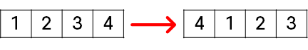

# 1차원 배열

## 🤔 배열이란?

일정한 자료형의 변수들을 하나의 이름으로 열거하여 사용하는 자료구조

```java
int num0; int num1; int num2; int num4; ... int num8;
```

8개의 개별적 변수를 사용해야 하는 경우, 아래와 같이 배열로 바꾸어 사용한다.

```java
int[] num = new int[8];
```

### 📌 배열의 필요성

프로그램 내에서 여러 개의 변수가 필요할 때, 일일이 다른 변수명을 이용하여 자료에 접근하는 것은 매우 **비효율적**이다. 배열을 사용하면 **하나의 선언을 통해서** 둘 이상의 변수 선언이 가능하다.

👉 즉, 단순히 다수의 변수 선언을 의미하는 것이 아닌, 다수의 변수로는 하기 힘든 작업을 배열을 활용해 쉽게 처리 가능!!

## 1차원 배열의 선언

- 자료형 : 배열을 이루는 원소(변수)의 자료형
- 이름 : 프로그램에서 사용할 배열의 이름
- 길이 : 배열을 이루는 원소의 수


## 1차원 배열의 접근

**배열 순회** <br/>
1 x N 배열의 n개의 모든 원소를 빠짐없이 조사하는 방법

```java
for(int i=0; i<N; i++) {
    arr[i] = i+1; // 필요한 연산 수행
}
```


배열 원소 **오른쪽 Shift** <br/>
오른쪽으로 한 칸 밀어보자. 단, **마지막 원소**는 **처음**으로 이동한다.

```java
int tmp = arr[arr.length-1];
for(int i = arr.length - 1; i > 0; i--) {
    arr[i] = arr[i-1];
}
arr[0] = tmp; // 맨 뒤에 있는 녀석이 맨 앞으로 이동
```



배열 원소 **왼쪽 Shift** <br/>
왼쪽으로 한 칸 밀어보자. 단, **첫번째 원소**는 다시 **마지막**으로 이동

```java
int tmp = arr[0];
for(int i = arr.length - 1; i > 0; i--) {
    arr[i] = arr[i-1];
}
arr[arr.length-1] = tmp; // 맨 앞에 있는 녀석이 맨 뒤로 이동
```


> 💡 알아두기! <br/>
> **시뮬레이션 문제 유형에서 자주 적용되는 부분이다.**

## 📍 예제풀기


**[풀이 / 접근방법]**

1. 1000명의 데이터를 읽으면서 카운팅을 처리한다면? <br/>
  => 굳이 1000명의 성적이 필요하지 않다.

2. count배열의 크기는 101 <br/>
  왜냐하면 점수의 범위가 0 ~ 100 이기 때문이다.
  
3. 각 배열의 공간은 cnt변수가 들어가는 공간으로 배열의 인덱스를 점수로 본다.
    ```java
    int[] scores = new int[101]; // int형은 선언 & 생성과 동시에 0으로 값 초기화
    ```

4. 입력받은 점수를 배열의 인덱스로 처리해서 누적된 합을 구하고, 그 중 최대값을 찾는다.

5. 최대값이 여러개면 가장 큰 점수를 출력하라 했으므로 배열을 거꾸로 접근한다.