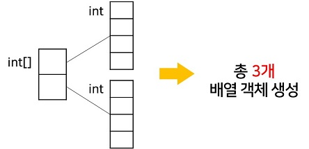
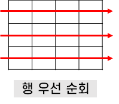
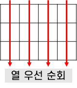
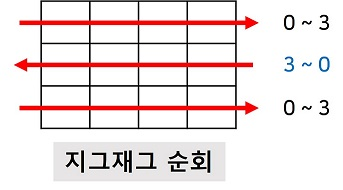
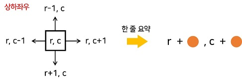
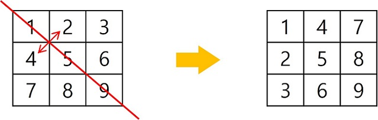

# 2차원 배열

## 🤔 2차원 배열이란?

**배열의 원소가 배열인 것**

> 💡 Java에서 배열은 **객체**이다.

2차원 배열의 생성은 **세로길이(행의 개수), 가로길이(열의 개수)** 를 필요로 한다.

그렇다면 아래 코드에서 **배열 객체는 몇 개가 생성될까?**

```java
int arr[][] = new int[2][4]; // 2행 4열 2차원 배열 생성
```

`int[]` 타입인 **주배열**은 크기가 2인 객체로 만들어진다. 그리고 각 칸에는 `int` 타입의 크기가 4인 **부분배열** 객체가 생성되므로 **총 3개의 배열 객체**가 생성되었다.



배열은 한번에 모든 객체가 만들어지지 않고 **크기가 주어진 경우에만** 만들어진다. 즉, **별도의 객체로 동적 생성**된다. <br/>
👉 2차원 이상의 다차원 배열은 **각 차원에 따라 크기를 명시**한다. 

```java
int arr = new int[2][];
arr[0] = new int[2];
arr[1] = new int[3];
```

## 배열의 순회

n X m 배열의 n * m개의 **모든 원소를 빠짐없이 조사**하는 방법

### 행 우선 순회

행을 고정하고 모든 열을 보는 것

```java
for(int i=0; i<n; i++) // 행의 좌표
    for(int j=0;j<n;j++) // 열의 좌표
        Array[i][j]; // 필요한 연산 수행
```


### 열 우선 순회

열을 고정하고 모든 행을 보는 것

```java
for(int j=0; j<n; j++) // 열의 좌표
    for(int i=0;i<n; i++) // 행의 좌표
        Array[i][j]; // 필요한 연산 수행
```



### 지그재그 순회

**쉬운 방법**

```java
for(int i=0; i<n; i++) 
    if(i%2==0)
        for(int j=0;j<n;j++) 
            Array[i][j];	// 필요한 연산 수행
    else
        for(int j=n-1;j>=0;j--)
            Array[i][j];	// 필요한 연산 수행
```

**한문장으로 표현**

```java
for(int i=0; i<n; i++) 
    for(int j=0;j<m;j++) 
        Array[i][j + (m-1-2*j) * (i%2)]; // 필요한 연산 수행
```

**행이 홀/짝인 열 = n-1**

```java
for(int i=0; i<n; i++) 
    for(int j=0;j<n;j++)
        int temp = (i%2==0)? j:n-1-j; // 필요한 연산 수행
		Array[i][temp];
```



> 📌 만약 코테를 본다면 시간이 적기 때문에 코드가 길더라도 **빨리 작성 가능한 코드**로 작성하자.

## 델타를 이용한 2차 배열 탐색 (4방 탐색)

2차 배열의 한 좌표에서 **4방향**의 인접 배열 요소를 탐색하는 방법

```java
arr[0..n-1][0..n-1]
dr[] = {-1, 1, 0 ,0}; // 상하좌우
dc[] = {0, 0, -1, 1};

for(r=0; r<n; r++)
    for(c=0; c<n; c++)
        for(d=0; d<4; d++)
            nr = r + dr[d]; 
            nc = c + dc[d];
            if(nr<0 || nr>=n || nc<0 || nc>=n) continue;
            arr[nr][nc];
```



> 💡 알아두기<br/>
> 다만, **속도면**에서는 반복문 사용 보다는 풀어쓴 것이 더 빠르다.

## 전치행렬

대각선을 기준으로 **행과 열을 서로 맞바꾼 행렬**

```java
int arr[3][3] // 3*3 행렬

for(int i=0; i<3; i++) 
    for(int j=0;j<3;j++)
        if(i < j)
            swap(arr[i][j], arr[j][i]);
```



## 📍 예제풀기

5x5 2차 배열에 무작위로 25개의 숫자로 초기화 한 후 25개의 각 요소에 대해서 그 요소와 이웃한 요소와의 **차의 절대값**을 구하시오.

예를 들어 아래 그림에서 7 값의 이웃한 값은 2, 6, 8, 12 이며 차의 절대값의 합은 12이다.

`|2-7|+|6-7|+|8-7|+|12-7|=12`

<table>
    <tr align=center>
        <td>...</td>
        <td>2</td>
        <td>...</td>
    </tr>
    <tr align=center>
        <td>6</td>
        <td>7</td>
        <td>8</td>
    </tr>
    <tr align=center>
        <td>...</td>
        <td>12</td>
        <td>...</td>
    </tr>
</table>

**[풀이 / 접근방법]**

1. 배열의 모든 위치에 대해 처리해야 한다. 
   즉, 모든 원소를 순회해야 한다. (행 우선)
2. 반복문으로 구현한다.
3. 현 위치의 4방 이웃을 체크한다.
   각 이웃과의 차의 절대값을 구하여 합을 구한다.
4. 그리고 모든 위치의 총합을 구한다.