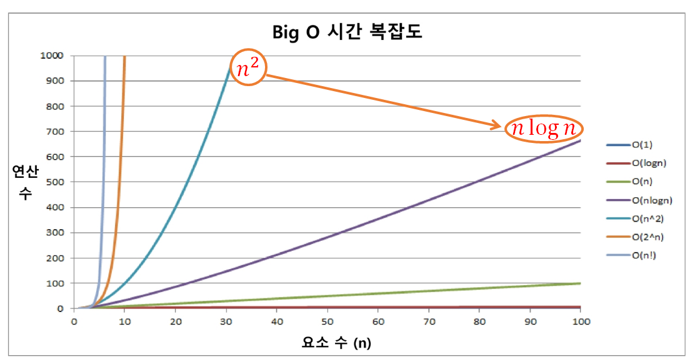

# SW문제해결

## 🤔 SW 문제 해결 역량이란 무엇인가?

프로그래머가 사용하는 언어나 라이브러리, 자료구조, 알고리즘에 대한 지식을 적재적소에 퍼즐을 배치하듯 이들을 **연결하여 큰 그림을 만드는 능력** <br/>
한마디로 **프로그래밍을 하기 위한 많은 제약 조건과 요구사항을 이해하고 최선의 방법을 찾아내는 능력**이라고 할 수 있다.

문제 해결 역량은 **추상적인 기술**이다.
  - 프로그래밍 언어, 알고리즘처럼 명확히 정의된 실체가 없다.
  - 무작정 알고리즘을 암기하고 문제를 풀어본다고 항상되지 않는다.
- 문제 해결 역량을 향상시키기 위해서는 훈련이 필요하다.

👉 즉,  **프로그래머로서의 소양을 가지고 있는가?** 를 테스트 하는 것

### 🤔 그렇다면 문제 해결 역량을 키우기 위해 무엇을 해야 할까?

📍 **자료구조를 잘 이해**하고 있어야 한다. 

- `ArrayList` vs `HashMap` <br/>
  => 둘을 사용했을 때의 코드가 동일한가? No! 다르다! <br/>
    주어진 문제를 해결할 때 선택한 **자료구조가 코드 구현에 영향을 준다.** 그렇기 때문에 자료구조의 성질을 잘 파악하고 있는 것이 문제를 푸는 것에 도움이 된다.
  
  ```java
  List list = new ArrayList();
  List list = new LinkedList();
  ```

  예를 들어 `ArrayList()`와 `LinkedList()`는 공통으로 List 라는 상위 타입을 가지고 있다. 그래서 위의 코드와 같이 List 인터페이스를 참조변수 타입으로 한다면 자료구조가 `ArrayList()`에서 `LinkedList()`로 바뀌어도 **전체 코드는 바뀌지 않는다.**

  왜냐하면 두 자료구조는 List 인터페이스에 정의된 메소드를 구현하고 있는 **구현 클래스**이기 때문에 사용 방법이 똑같다.
  
  아래와 같이 선언해보자.

  ```java
  ArrayList() list = new ArrayList();
  LinkedList list = new LinkedList();
  ```
  만약 이와 같이 선언해서 사용한다면 `LinkedList()`에만 있는 메소드가 있을 수 있기 때문에 사용방법이 달라진다.(= 코드가 다르다는 의미)
  그러므로 같은 타입의 자료구조로 바꾸어도 코드를 수정하지 않게하려면 **참조 변수 타입을 공통 상위 타입**으로 한다.

## 문제 해결 과정

1. 문제를 읽고 이해한다.
    > 💡 **문제는 총 3번 읽어본다!** <br/>
    > 1번: 빠르게 훑어보면서 **유형 파악**<br/>
    > 2번: 파악한 유형이 맞는지 **확인**<br/>
    > 3번: **제약사항, 조건**을 꼼꼼히 읽어보면서 파악한 유형으로 풀어도 되는지 체크
2. 문제를 **익숙한 용어로 재정의**한다. <br/>
  👉 특히 **손**으로 **로직을 작성**해본다. (시뮬레이션 문제는 반드시!)
3. 어떻게 해결할지 **계획을 세운다.** <br/>
  **큰 덩어리로** 문제를 보고, 각 절차를 구체화한다.
4. 계획을 **검증**한다. <br/>
  테스트 케이스를 하나하나 대입해보면서 **맞는지 확인**한다.
5. 프로그램으로 **구현**한다.
6. 어떻게 풀었는지 돌아보고, 개선할 방법이 있는지, **최적화할 수 있는지** 찾아본다.

## 문제 해결 전략

- 직관과 체계적인 접근
- 체계적인 접근을 위한 질문들
  - **비슷한 문제**를 풀어본 적이 있는가?
  - **단순한 방법**에서 시작할 수 있을까?
    **덩어리로 크게** 본 다음에 시작하자.
  - 문제를 **단순화** 할 수 있을까?
  - **그림으로 그려** 볼 수 있을까?
  - **수식으로 표현** 할 수 있을까?
    > 그러나 이것은 어려운 부분이다. 그래도 가능하다면 표현해보자.
  - 문제를 **분해** 할 수 있을까?
  - **뒤에서부터 생각**해서 문제를 풀 수 있을까?
  - **정렬**을 해보는게 어떨까? (그러나 순서를 유지해야 한다면 정렬 X)
  - 특정 형태의 답만을 고려할 수 있을까?

## (명)알고리즘

유한한 단계를 통해 문제를 해결하기 위한 절차나 방법이다. 주로 컴퓨터용어로 쓰이며, 컴퓨터가 어떤 일을 수행하기 위한 단계적 방법을 말한다.

👉 간단하게 다시 말하며 **어떠한 문제를 해결하기 위한 절차**라고 볼 수 있다.

### 📍 <u>1부터 100까지의 합</u>을 구하는 문제를 생각해 보자.


위의 수식은 1씩 증가하는 등차수열로, **등차수열의 합 공식**을 이용하면 다음과 같은 코드가 나온다.


위 알고리즘을 생각했다면 **이제 코드를 작성**해야 한다.

### 알고리즘 표현 방법(2가지)

코드를 작성하기 전, **논리적으로 검증**하기 위해 생각을 표현하는 방법으로 2가지가 존재한다.

- 순서도 <br/>
  : **전체적**으로 돌아가는 **맥락을 파악**할 수 있다.

- **의사코드** (or 수도코드)
  - 코드에 가까운 형태.
  - **명확**하고 **간단**하다.
  - 언어에 상관없이 생각하는 바를 **논리적으로 표현**한 코드
  - 딱히 정해진 형식은 없다. 본인이 이해하기 쉬운 방법으로 작성


## 알고리즘 성능

### 🤔 무엇이 좋은 알고리즘인가?

다음의 5가지를 고려해본다.

1. **정확성** : 얼마나 정확하게 동작하는가
2. **작업량** : 얼마나 적은 연산으로 원하는 결과를 얻어내는가? <br/>
   **시간적은 측면**. 수행되는 **시간복잡도**와 연관성이 있다.
3. **메모리 사용량** : 얼마나 적은 메모리를 사용하는가
   - **공간 복잡도** 관련
4. **단순성** : 얼마나 단순한가 (단, 단순성 < 가독성)
   - 그러나 너무 단순하게, 함축적으로 작성하면 오히려 **가독성이 안좋다!**
     본인만 알아보거나, 다른 사람이 읽기 불편하다.
   - 유지보수를 하는데 불편하기 때문에 **성능적으로 이득**이 있다면 **단순하게 작성**하지만, 그렇지 않다면 **가독성이 좋도록 한다.**
5. **최적성** : 더 이상 개선할 여지없이 최적화되었는가?

### 📌 알고리즘 성능 분석의 필요성

주어진 문제를 해결하기 위해 여러 개의 다양한 알고리즘이 가능하다. <br/>
**그렇다면 우리는 어떤 알고리즘을 사용해야 할까?**

많은 문제에서는 **성능 분석**의 기준으로 **알고리즘의 작업량 비교**하는데, 이때 사용하는 것이 **시간 복잡도와 공간 복잡도**이다. 둘다 고려해서 푸는 것도 좋지만 <u>보통 문제를 풀 때에는 **시간복잡도**를 더 따지고 푼다.</u>

> 💡 개념 알아두기
> - 시간 복잡도: 알고리즘의 수행시간을 평가
> - 공간 복잡도: 알고리즘 수행에 필요한 메모리 양을 평가

아래와 같이 만약 `1 ~ 100`이 아닌 `1 ~ 10000`까지의 합을 구한다고 한다면, 
[알고리즘1]은 연산을 10000번 해줘야 하지만 [알고리즘2]는 여전히 3번의 연산을 한다.

[알고리즘1] <br/>
**덧셈을 100번하는 경우** <br/>
 

[알고리즘2] <br/>
**3번 연산하는 경우(덧셈 1번, 곱셈 1번, 나눗셈 1번)** <br/>


### 복잡도의 점근적 표기

시간(또는 공간) 복잡도는 **입력 크기에 대한 함수로 표기**하는데, 이 함수는 주로 여러 개의 항을 가지는 다항식이다. 이를 단순한 함수로 표현하기 위해 **점근적 표기(Asymptotic Notaion)을 사용**한다.

> 💡 **점근적 표기**란?
> 
> 입력 크기 N이 무한대로 커질 때의 **복잡도를 간단히 표현**하기 위해 사용하는 표기법을 의미한다.

**시간 복잡도**, 즉 수행시간은 다양한 변수(cpu, 프로그램언어, 컴파일러 등)에 따라 시간측정이 달라진다.
그래서 시간을 숫자로 정확하게 작성하는 것이 아닌 **너프하게** **연산의 횟수**로 표기한다.

## 빅-오(O) 표기법

시간 복잡도 함수 중에서 가장 큰 영향력을 주는 **N에 대한 항만을 표시**한다.<br/>
계수(Coefficient)는 생략하여 표시


📍 **N개의 데이터를 입력받아 저장한 후 각 데이터에 1씩 증가시킨 후 각 데이터를 화면에 출력하는 알고리즘의 시간복잡도는 어떻게 될까?** <br/>
👉 `O(N)`


### 시간 복잡도별 연산 수

요소 수가 증가함에 따라 각기 다른 시간 복잡도의 알고리즘은 아래와 같은 연산 수를 보인다.



가장 선망하는 것은 `O(1)`이지만 이것은 굉장히 어렵다. <br/>
👉 **그래서 <u>n²을 nlogn 정도로만</u> 바꾸는 것을 목적으로 한다.**

### 시간 복잡도별 실제 실행 시간 비교


