# 단순 연결 리스트(Singly Linked List)

## 🤔 단순 연결 리스트란?

링크를 **1개만** 유지하는 리스트(`next`)로, 다른 연결 리스트 보다 상대적으로 **쉽게** 연결리스트를 만들 수 있다.


### 연결 구조

노드가 **하나의 링크 필드에 의해 다음 노드와 연결**되는 구조를 가진다.

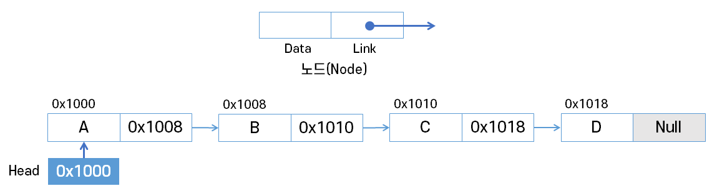

`Head`가 **가장 앞의 노드**를 가리키고, 링크 필드가 연속적으로 다음 노드를 가리킨다.<br/>
링크 필드가 **Null인 노드**가 연결 리스트의 가장 **마지막 노드**이다.

> 💡 **`Head` 노드는 첫번째 노드!!**

> 📌 **노드**는 [여기](리스트.md#노드node)를 참고

## 삽입 연산 1 : 첫번째 노드로 삽입

### 공백 리스트의 첫번째에 'A' 노드를 삽입할 때

1. 새로운 노드 `new` 생성<br>
  데이터로 표현하고 싶은 원소가 있을 때마다 노드를 생성한다.
  
    

2. 새로운 노드 `new`의 데이터 필드에 **'A' 저장**

    

3. `Head`가 가지고 있는 참조값을 새로운 노드 `new`의 링크 필드에 저장한다.

    

4. `Head`에 새로운 노드 `new`의 참조값을 저장

### 'A'를 원소로 갖고 있는 리스트의 <u>첫번째</u>에 'C'노드를 삽입할 때

1. 새로운 노드 `new` 생성

    

2. 새로운 노드 `new`의 데이터 필드에 'C' 저장

    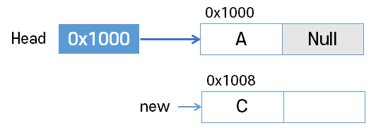

3. `Head`에 저장된 참조값을 새로운 노드 `new`의 링크 필드에 저장

    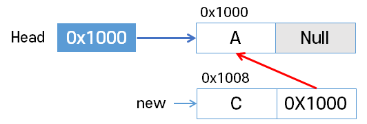

4. `Head`에 새로운 노드 `new`의 참조값을 저장<br>
  👉 원래 첫번째였던 'A' 노드는 두번째 노드가 된다.

    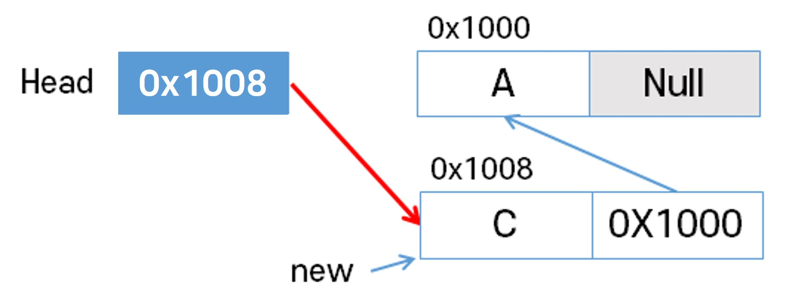

### 알고리즘

```java
addtoFirst(L, i)		// 리스트 헤드 L, 원소 i
    new <- createNode();// 새로운 노드 생성
  new.data = i; 		// 데이터 필드 작성
  new.link = L;		// 링크 필드 작성
  L = new;			// 리스트의 처음으로 지정
```

## 삽입 연산 2 : 마지막 노드로 삽입

### 'C', 'A'를 원소로 갖고 있는 리스트의 마지막에 'D' 노드를 삽입할 때

1. 새로운 노드 `new` 생성

    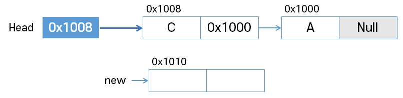

2. 새로운 노드 `new`의 데이터 필드에 'D', 링크 필드에는 `Null` 저장

    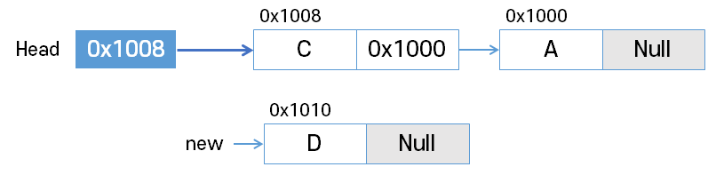

3. 리스트의 마지막 노드의 링크 필드에 새로운 노드 `new`의 참조값을 저장

    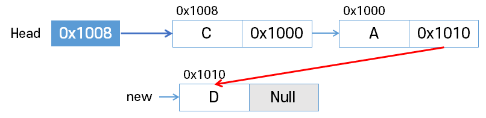

> 📌 **마지막 노드를 탐색하는 작업**이 필요하다.

### 알고리즘
```java
addtoLast(L, i)					// 리스트 헤드 L, 원소 i
    new <- createNode();		// 새로운 노드 생성
    new.data = i;
  new.link = Null;
  if(L == Null) {				// 빈 리스트일 때, 최초 노드 추가
        L = new;
        return;
    }
  temp = L;					// 노드 링크 이용하여 리스트 순회
  while(temp.link != Null) {	// 마지막 노드 찾을 때까지 이동
        temp = temp.link;
    }
  temp.link = new;			// 마지막 노드 추가
```

## 삽입 연산 3 : 가운데 노드로 삽입

### 'C', 'A', 'D'를 원소로 갖고 있는 리스트의 두번째 'B' 노드를 삽입할 때

1. 새로운 노드 `new` 생성

    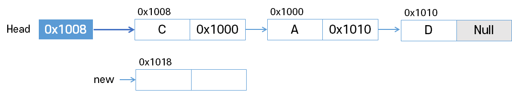

2. 새로운 노드 `new`의 데이터 필드에 'B' 저장

    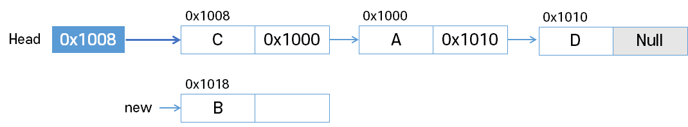

3. 삽입될 위치의 바로 앞에 위치한 노드의 링크 필드를 `new`의 링크 필드에 복사

    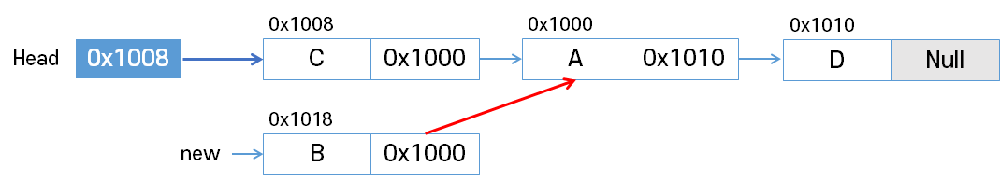

4. 새로운 노드 `new`의 참조값을 바로 앞의 노드의 링크 필드에 저장

    

### 알고리즘
```java
add(L, pre, i)				// 리스트 헤드 L, 노드 pre, 원소 i
  new <- createNode();	// 새로운 노드 생성
    new.data = i;			// 데이터 필드 작성
  if(L == Null) 
        L = new;
    new.link = Null;
    }else {
        new.link = pre.link;
        pre.link = new;
    }
```

## 삭제 연산

### 'A', 'B', 'C', 'D'를 원소로 갖고 있는 리스트의 <u>'B' 노드를 삭제</u>할 때

1. 삭제할 노드의 **앞 노드(선행노드) 탐색**

    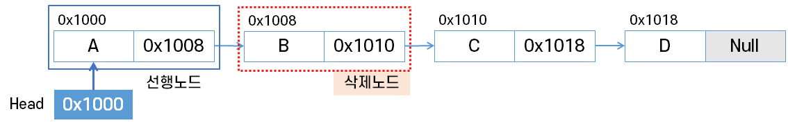

2. 삭제할 노드의 링크 필드를 선행노드의 링크 필드에 복사

    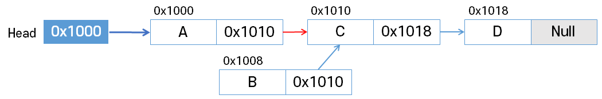

3. 삭제할 노드의 링크 필드에 `Null` 저장<br/>
  참조가 끊기게 된다.

    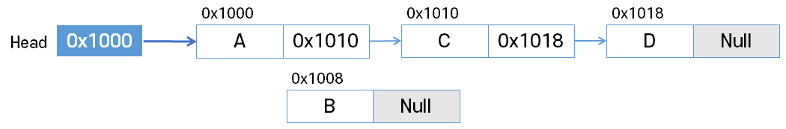

### 'A',  'C', 'D'를 원소로 갖고 있는 리스트의 <u>'A' 노드를 삭제</u>할 때

1. 삭제할 노드의 앞 노드(선행노드) 탐색 : 선행노드 없음

    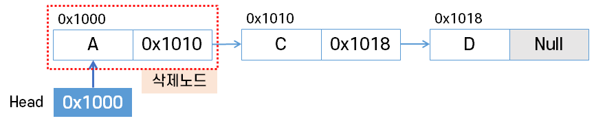

2. 삭제할 노드의 링크 필드의 리스트의 **`Head`에 복사**

    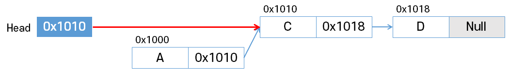

3. 삭제할 노드의 링크 필드에 `Null` 저장

    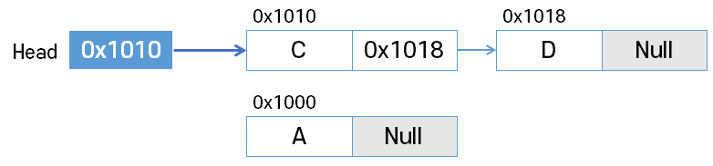

### 알고리즘

target 노드를 삭제한다.

```java
delete(L, target)				// 리스트 헤드 L, 삭제노드 target
    if (L == null || target == Null) return;
  pre = getPreNode(target);	// 선행노드 탐색
  if(pre == Null) {			// 선행노드가 없다면, 첫 노드임
        L = target.link;
    } else {
        pre.link = target.link;
    }
  target.link = null;
```

## 📍 단순 연결 리스트 구현

다음은 Java로 구현한 단순 연결 리스트의 소스 코드이다.

```java
public class SinglyLinkedList {

	private Node head;  
	// 헤드는 무조건 첫번째 노드로.
	// 첫번째 노드를 저장
	// 더미노드가 아닌, 그저 연결리스트의 첫번째 노드를 그냥 헤드로 저장하는 것.
	
	// 첫번째 노드로 삽입하기
	public void addFirstNode(String data)
	{
		Node newNode = new Node(data, head);
		head = newNode;		
	}
	
	// 마지막 노드 찾기
	public Node getLastNode() {
		// 첫째노드부터 ~ 링크필드가 Null인 곳까지
		// 링크필드가 Null 이란 것은 마지막 노드라는 의미
		for(Node currNode = head; currNode != null; currNode = currNode.link) {
			if(currNode.link == null) {
				return currNode;
			}
		}
		return null;
	}
	
	// 마지막 노드로 삽입하기
	public void addLastNode(String data)
	{
		if(head == null) { // 공백리스트이면..
			addFirstNode(data);
			return;
		}
		
		Node lastNode = getLastNode();
		Node newNode = new Node(data);
		
		lastNode.link = newNode;
	}
	
	public void insertAfterNode(Node preNode, String data) {
		
		if(preNode == null) {
			System.out.println("선행노드가 없어 삽입이 불가능합니다.");
			return;
		}
		
		Node newNode = new Node(data, preNode.link);
		preNode.link = newNode;
	}
	
	// data를 데이터로 갖고 있는 처음 만나는 노드 리턴
	public Node getNode(String data) {
		
		for(Node currNode=head; currNode != null; currNode = currNode.link) {
			if(currNode.data.equals(data)) 
				return currNode;
		}
		return null;
	}
	
	// target의 이전노드 찾기
	public Node getPreviousNode(Node target) {
		for(Node currNode=head; currNode != null; currNode = currNode.link) {
			if(currNode.link == target) 
				return currNode;
		}
		return null;
	}
	
	// data를 갖고 있는 첫번째 노드 찾아 삭제
	public void deleteNode(String data) {
		
		Node targetNode = getNode(data);
		
		if(targetNode == null) { //삭제할 노드가 없다는 것은 null을 의미한다.
			System.out.println("삭제할 노드가 없어서 삭제가 불가능합니다.");
			return;
		}
		
		Node preNode = getPreviousNode(targetNode);
		
		if(preNode == null) { // target이 첫번째 노드인 상황
			head = targetNode.link;
		}else {
			preNode.link = targetNode.link;
		}
		targetNode.link = null;	//연결 끊기
	}
	
	public void printList() {
		
		System.out.print("L = ( ");
		for(Node currNode=head; currNode != null; currNode = currNode.link) {
			System.out.print(currNode.data + " ");
		}
		System.out.println(" ) ");
	}
	
}
```

## 📍 단순 연결 리스트로 스택 구현

🤔 `Push`와 `Pop`에 적합한 삽입/삭제 알고리즘은 무엇일까?
  - `head`를 이용해서 `push`, `pop`이 구현이 가능하다. <br/>
    👉 즉, `head`는 곧 **top**이 된다.
  - 마지막에 넣어야 한다고 `Tail`을 사용하기 보다는 **첫번째로 넣은 것이 뒤로 밀려난다는 것**에 주목한다.

```java
public class Stack {
	private Node top;
	
	public void push(String data) {
		Node newNode = new Node(data, top);
		top = newNode;
	}
	
	public boolean isEmpty() {
		return top == null;
	}
	
	public String pop() {
		if(isEmpty()) {
			System.out.println("스택이 비어 있어 pop이 불가 합니다.");
			return null;
		}
		// 스택의 맨 위에 있는 노드(리스트의 맨 앞에 있는 노드)
		Node popNode = top;	
        
		// 스택의 두번째에 있는 노드로 변경(리스트의 두번째에 있는 노드) 
		top = popNode.link;	// top의 위치 변경
        
		// top = top.link;로 해도 된다. 
		//단, 이렇게 할 경우 String 변수를 따로 두고(data 반환때문) 작성 순서를 다르게 해야한다는 걸 유의하자.
		popNode.link = null;
		return popNode.data;
	}
	
	public String peek() {
		if(isEmpty()) {
			System.out.println("스택이 비어 있어 pop이 불가 합니다.");
			return null;
		}
		return top.data;
	}
	
	@Override
	public String toString() {
		StringBuilder sb = new StringBuilder();
		sb.append("S ( ");
		
		for(Node currNode=top; currNode != null; currNode=currNode.link) {
			sb.append(currNode.data).append(",");
		}
		
		//마지막 ',' 제거하기
		if(!isEmpty()) 
			sb.setLength(sb.length()-1); 
		sb.append(" ) ");
		
		return sb.toString();
	}
}
```