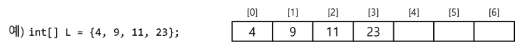

# 리스트 (List)

## 🤔 리스트(List)란?

**순서를 가진 데이터의 집합**을 가리키는 추상자료형(abstract data type)

> 💡 여기서 순서란? 
> **원소를 관리하는 순서**를 의미 (개발자가 저장해둔 순서대로 관리한다)

구현 방법에 따라 크게 2가지로 나뉜다.
- 순차 리스트: **배열**을 기반으로 구현된 리스트
- 연결 리스트: 메모리의 **동적할당**을 기반으로 구현된 리스트

## 1️⃣ 순차 리스트 (Sequential List)

### 구현 방법

1차원 **배열**에 항목들을 순서대로 저장한다. 
데이터의 종류와 구조에 따라 구조화된 자료구조를 만들어 배열에 저장할 수도 있다.

### 접근 방법

배열의 인덱스를 이용해 **원하는 위치의 데이터에 접근**할 수 있다. 
첫번째 원소(=[0]) 기준으로 인덱싱해서 특정 위치의 원소에 접근한다.

### 삽입/삭제 연산

삽입 위치 다음의 항목들을 **뒤로 이동**시킨 다음, 확보된 위치에 원하는 원소를 삽입한다.

삭제 위치 다음의 항목들을 **앞으로 이동**해야 한다.

### 📌 순차 리스트 문제점

**단순 배열로 구현한 순차리스트**를 사용하는 경우, 자료의 삽입/삭제 연산 과정에서 연속적인 메모리 배열을 위해 **원소들을 이동시키는 작업**이 필요하다.

👉 이것은 **원소의 개수가 많고 삽입/삭제 연산이 빈번하게 일어날수록 작업에 소요되는 시간이 크게 증가한다**는 것을 의미한다.

또한, 배열의 크기가 **정해져** 있는 경우, 실제로 사용될 메모리보다 크게 할당하여 메모리의 낭비를 초래할 수도 있고, 반대로 할당된 메모리보다 많은 자료를 사용하여 새롭게 배열을 만들어 작업을 해야 하는 경우가 발생할 수도 있다.

왜냐하면 **배열**은 **크기가 고정**되어 있는 것에는 **최적**이지만, **가변적**인 것에는 **불편함**이 존재하기 때문이다.

## 2️⃣ 연결 리스트 (Linked List)

### 특성

자료의 논리적인 순서와 메모리 상의 물리적인 **순서가 일치하지 않고**, 개별적으로 위치하고 있는 **각 원소를 연결**하여 하나의 전체적인 자료구조를 이룬다.

무엇보다 자료구조의 **크기를 동적으로 조정**할 수 있어, **메모리의 효율적인 사용이 가능**하다.

### 접근 방법

**링크**를 통해 원소에 접근하므로, 순차 리스트에서처럼 물리적인 순서를 맞추기 위한 작업이 필요하지 않다.

### 삽입/삭제 연산

삽입/삭제가 발생한다면 **연결해주는 링크만 변경**하면 된다.

### 기본 구조

#### 노드(Node)

- 연결 리스트에서 하나의 원소를 표현하는 building block

| 구성 요소    | 설명                                                         |
| :----------- | :----------------------------------------------------------- |
| 데이터 필드  | - **원소의 값을 저장**   &nbsp; 궁극적으로 Data는 자료구조에 저장해야하기 때문에 Node는 데이터를 저장하는 필드가 반드시 필요하다.  - 저장할 **원소의 종류나 크기**에 따라 구조를 정의하여 사용함   &nbsp; 숫자, 문자열, 클래스 객체 등 다양한 Data가 들어갈 수 있다. **(한정적 X)**|
| 링크 필드    | 다음 노드의 참조값을 저장|

#### 헤드(Head)
- 연결 리스트의 **첫 노드에 대한 참조값**을 갖고 있다.
- Head는 **첫번째 노드에 대한 포인터 역할**을 한다.
- Head를 가지고 있으면 **리스트 전체를 쉽게 순회**할 수 있다.

#### 테일(Tail)
- 간혹 관리하는 것에 따라 **맨 마지막 노드에 접근**해야 하는 경우가 있다.
- 마지막 노드를 자주 접근한다면 가장 **마지막 노드를 가리키는 Tail 노드**를 둬서 관리한다.
- 연결 리스트의 마지막 노드에 대한 참조값을 가진다.

### 종류

#### 단순 연결 리스트
- 링크를 **1개만** 유지하는 리스트(`next`)
- 다른 연결 리스트 보다 상대적으로 **쉽게** 연결리스트를 만들 수 있다. 
  👉 연결에 있어서 **단순하기** 때문에 **단순** 연결 리스트!
- BUT!! 노드 **삭제 시 어려움**이 있다. (**삭제를 하기 위한 탐색 작업** 필요)  
  삭제 노드의 이전 노드를 알 수 없기 때문에 **이전 노드를 탐색한 후 삭제**한다. 
  > 💡 계속 리스트가 연결되려면 이전 노드의 링크 필드가 삭제 노드의 다음 노드를 가리켜야 한다.

#### 이중 연결 리스트
- 링크를 **2개** 유지하는 리스트(`prev`, `next`)
- 단일 연결 리스트의 삭제 시 어려움을 간단히 해결한다. 
  👉 이전 노드를 탐색할 필요도 없이 **바로 삭제하는 노드의 다음 노드를 가리킨다.**
- 연결리스트를 만드는 것에서 **가장 중요한 것**은 **링크관리**
  - 링크관리가 **잘못되면 순서가 꼬이거나 리스트가 끊어질 수 있다.**
  - 링크가 2개인 만큼 **관리를 빡세게 해야 한다.**

#### 원형 연결리스트
- 리스트의  **끝과 처음을 연결**하는 리스트
- **어떤 위치에서도 전체 노드 탐색이 가능**하다.

> 이런 연결리스트가 있다고만 알아두자.