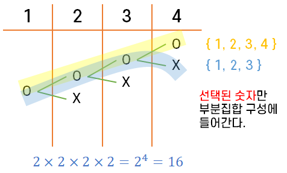
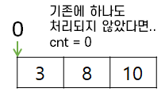
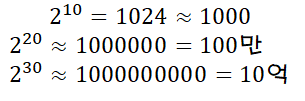
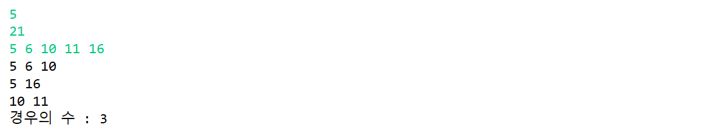
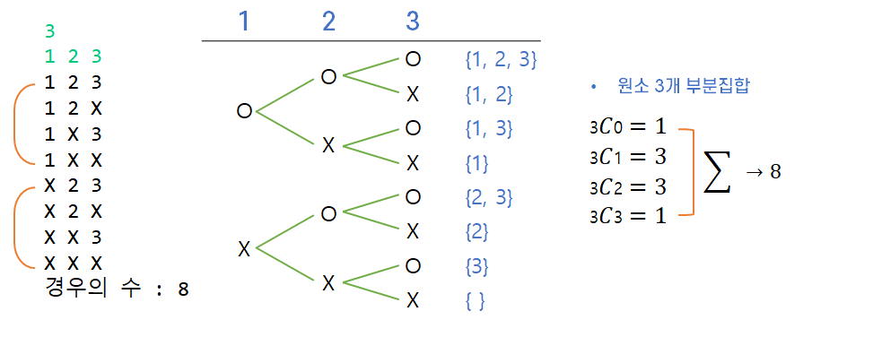

# 부분 집합

## 🤔 부분 집합이란?

**집합에 포함된 원소들을 선택하는 것**

다수의 중요 알고리즘들이 원소들의 그룹에서 최적의 부분 집합을 찾는 것이다.

> Ex) 배낭 짐싸기(knapsack)<br/>
> 무게가 정해져 있는 배낭에 최대한 **많은 금액**을 남기는 물건을 넣으려고 할 때, 어떤 물건을 넣어야 하는가?

### 부분 집합의 수

집합의 원소가 n개일 때, 공집합을 포함한 **부분집합의 수**는 **2ⁿ개**이다. <br/>
이는 각 원소를 부분집합에 **포함시키거나 포함시키지 않는** 2가지 경우를 모든 원소에 적용한 경우의 수와 같다.

> Ex) {1, 2, 3, 4} => 2 x 2 x 2 x 2  = 16가지



## 부분 집합 생성 방법

### 📍 {1,2,3} 집합의 모든 부분집합(Power Set) 생성해보자

**반복문을 통합 부분집합 생성**

```java
for i=1; i<=N; i++
	selected[1] = i;	//원소1
	for j=1; j<=N; j++
		selected[2] = j;	//원소2
		for k=1; k<=N; k++
			selected[3] = k;	//원소3
			for m=1; m<=N; m++	//생성된 부분집합 출력
				if selected[i] == 1 then
					print i
```

**재귀적 구현을 통해 생성하는 방법**

각 원소를 부분집합에 포함/비포함의 형태로 재귀적 구현을 함

```java
input[] :  숫자 배열
isSelected[] : 부분집합에 포함/비포함의 형태로 재귀적 구현을 함

generateSubSet(cnt) // cnt: 현재까지 처리한 원소개수
	if(cnt == 4) // 전체 원소 개수에 도달
		부분집합 완성
	else
		isSelected[cnt] = true
		generateSubSet(cnt+1) // 현재 원소 부분집합 넣기(선택)
		isSelected[cnt] = false // 방금 전 선택한 숫자를 취소하기
		generateSubSet(cnt+1) // 현재원소 부분집합 넣지 않기(비선택)
```
`cnt`는 현재의 원소를 부분집합에 포함할지 말지 고려했던 원소들의 개수를 의미한다. 이러한 `cnt`를 사용하면 현재 다뤄야 하는 원소의 index에 효과가 있다.



### 🤔 재귀를 사용하는 이유는 무엇일까?

순열을 `for` 반복문으로 표현하는 것은 옳지 않다. 3자리 수(=R)를 뽑기 위해 `for`문을 3개 쓴다고 가정하면 <u>집합의 원소의 개수 R이 달라질 때마다 `for`문의 개수도 변해야 하기 때문에</u>, **R의 값이 가변적이라면 적절하지 않다.**

그렇기 때문에 **얼마나 깊게 들어가는지 알 수 없는 재귀**를 사용하는 것이다. (만약 R의 값이 정해져 있다면(R=2)  `for`문으로 표현해도 된다.)

마찬가지로 부분집합도 같은 이유로 `for`문은 사용하지 않는다.

## 부분 집합의 시간 복잡도

하나의 메소드에서 **2개씩 재귀가 파생**이 되며, 이 2개 재귀가 **N번 반복**된다. <br>
👉 즉, **시간복잡도**는 `O(2ⁿ)`

만약 n = 30이라 했을 때 얼마나 걸릴까?



<u>**1억 연산 = 1초**</u>이므로 N = 30이면 **10초**에 가깝게 걸린다.<br/>
👉 그래서 **N=30인 경우는 부분집합에 사용하지 않는다.**

> 📌 **주의하기**<br>
> **조합, 순열, 부분집합**은 **경우의 횟수만큼** 재귀호출이 발생한다. 그렇기 때문에 문제를 보고 유형을 파악했다면 **경우의 수를 따져봐야 한다**. 따져봤을 때 **숫자가 크다면** 해당 방법으로 **풀지 않는다**. <br/>
> 👉 그러므로 조합, 순열, 부분집합은 **풀기 전 경우의 수를 먼저 따진 다음 문제를 푼다**.

> 💡 부분 집합 문제를 **완전 탐색**으로 했을 때 **시간이 너무 오래걸린다면**, **그리디**로 푸는 방법을 생각해보자.

## 📍 예제 풀기
유한 개의 정수로 이루어진 집합이 있을 때, 이 집합의 부분집합 중에서 그 집합의 원소를 모두 더한 값이 0이 되는 경우가 있는지 알아내는 문제이다.

예를 들어, {-7, -3, -2, 5, 8}라는 집합이 있을 때, {-3, -2, 5}는 이 집합의 부분집합이면서 `(-3) + (-2) + 5 = 0`이므로 이 경우의 답은 참이 된다.

**[데이터 입력 및 출력]**



- 목표합이 정수이면(음수, 양수, 0) 새로운 조건이 필요하다.
- **공집합은 원소가 없는 것**이다. <br/>
  그러나 <u>합이 0</u>이라고 하면 **공집합**도 고려되는데,  **이 경우는 빼야한다!**

**[풀이/접근방법]**

<u>완전 탐색 기법</u>으로 부분집합 합 문제를 풀기 위해서는, 우선 **집합의 모든 부분집합을 생성한 후**에 각 부분집합의 합을 계산해야 한다.

1. 부분 집합을 생성 (재귀로 구현)
2. 각 부분 집합이 완성됐을 때 **합을 계산**한다.<br/>
	 그리고 그 합이 기저조건에서 **0인지 확인**

```java
public class Main {

	static int N, totalCnt, S;
	static int[] input;
	static boolean[] isSelected;
	
	public static void main(String[] args) {
		Scanner sc = new Scanner(System.in);
		N = sc.nextInt();
		S = sc.nextInt(); //목표 합
		input = new int[N];
		isSelected = new boolean[N]; //부분집합에 포함했는지 안했는지 체크
		totalCnt = 0;
		
		for(int i = 0; i < N; i++) {
			input[i] = sc.nextInt();
		}
		
		generateSubSet(0);
		System.out.println("경우의 수 : " + totalCnt);
	}
	
	private static void generateSubSet(int idx) { 
		/* idx:
		 *  부분집합을 처리하기 위해 고려된 원소수
		 *  처리할 다음원소를 가리키는 거
		 *  어디까지 처리했는지에 대한 수
		 *  부분집합에 포함된 원소의 개수 X
		 */
		if(idx==N) { //모든 마지막 부분집합까지 고려되어서 끝났다면..
			// 부분집합의 합의 계산
            //Point!! 공집합은 고려하지 않는다!!!
			int sum = 0;
			for (int i = 0; i < N; i++) {
				if(isSelected[i]) sum += input[i];
			}
			
			// 부분집합의 합 == 목표합 체크
			if(sum == S) {
				totalCnt++;
				for (int i = 0; i < N; i++) {
					if(isSelected[i]) System.out.print(input[i] + " ");
				}
				System.out.println();
			}
			return;
		}
		
		// 현재 원소를 부분집합에 넣기
		isSelected[idx] = true;
		generateSubSet(idx+1); // 선두에 idx가 포함된 상황을 모두 체크
        
		// 현재 원소를 부분집합에 넣지 않기
		isSelected[idx] = false; // 선두에 idx가 없는 모든 부분집합 상황 체크
		generateSubSet(idx+1);
	}
}
```

### 💡 부분 집합 ≈ 조합 ?



그림은 <u>배열의 크기와 배열의 원소</u>를 입력받았을 때의 모습이다. 그림을 통해 **부분 집합의 논리**는  **일종의 조합**이라고 생각할 수 있다. 	<br/>
👉 So, 조합을 풀 때 부분 집합으로도 처리가 가능하다.