# 스택 (Stack)

## 스택(Stack)의 특성

물건을 쌓아 올리듯 **자료를 쌓아 올린 형태**의 자료구조로, 스택에 저장된 자료는 **선형 구조**를 갖는다.

### 🤔 선형 구조란?

- 선형구조: 자료 간의 관계가 1대1의 관계를 갖는다.(한 줄로 세우기)
- 비선형구조: 자료 간의 관계가 1대N의 관계를 갖는다.(예: tree, graph)

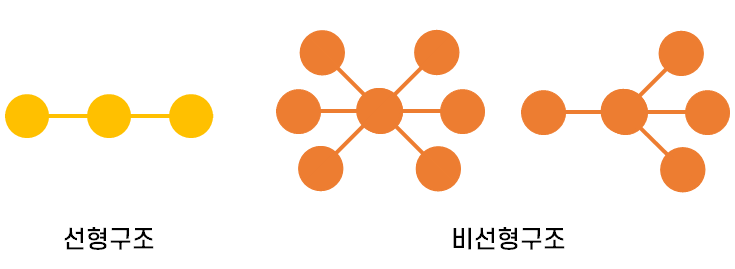

스택은 한 쪽 끝에서만 자료를 넣고 뺄 수 있는 **후입선출구조(LIFO, Last-In-First-Out)** 형식의 자료 구조이다. <br/>
👉 즉, **마지막에 삽입한 자료가 가장 먼저 제거될 항목**이다.

> Ex) 스택에 `1,2,3` 순으로 자료를 삽입한 후 꺼내면 `3,2,1` 순(역순)으로 꺼낼 수 있다.

## 스택의 연산

스택(Stack)는 **후입선출(LIFO, Last In First Out)** 을 따른다.

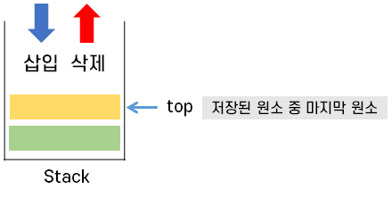

- `push(itme)`: 스택에서 가장 윗 부분에 자료를 저장한다. (삽입)
- `pop()`: 스택에서 가장 위에 있는 자료를 제거한다. (삭제)<br/>
  꺼낸 자료는 삽입한 자료의 역순으로 꺼낸다.
- `peek()`: 스택의 가장 위에 있는 item(원소)를 반환한다. (삭제X)
- `isEmpty()`: 스택이 비어 있을 때에 true를 반환한다.

### 스택의 삽입/삭제 과정

다음은 빈 스택에 원소 A, B, C를 차례로 삽입 후 한번 삭제하는 연산과정을 나타낸 코드이다.

```java
import java.util.Stack;

public class Main {
	public static void main(String[] args) {
		Stack<String> stack = new Stack<String>();
		
		stack.push("A");
		stack.push("B");
		stack.push("C");
		
		System.out.println(stack.isEmpty()+"/"+stack.size()); 	//출력: false/3
		System.out.println(stack.peek()); 						//출력: C
		System.out.println(stack.size()); 						//출력: 3
		
		System.out.println(stack.pop()); 						//출력: C
		System.out.println(stack.pop()); 						//출력: B
		System.out.println(stack.pop()); 						//출력: A
        
		System.out.println(stack.isEmpty()+"/"+stack.size()); 	//출력: true/0
		
		if(!stack.isEmpty()) { //statck이 비어있지 않다면..
			System.out.println(stack.pop());
		}
  }
}
```

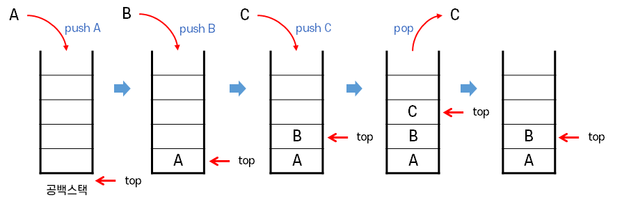

> 📌 모든 자료구조의 특징을 잘 파악하여 문제를 보고 어떤 자료구조가 유리한지 파악하여 적재적소에 이용한다.

## 📍 예제 풀기

### 괄호 검사

스택을 이용해서 괄호쌍을 검사해보자. 여러 가지 종류의 괄호들로 이루어진 문자열이 올바른 괄호 문자열인지 확인한다.

**[괄호 종류]**

대괄호 `[ ]`, 중괄호 `{ }`, 소괄호 `( )`

**[검사 조건]**
1. 왼쪽 괄호의 개수와 오른쪽 괄호의 개수가 같아야 한다.
2. 같은 괄호에서 왼쪽 괄호는 오른쪽 괄호보다 먼저 나와야 한다.
3. 괄호 사이에는 **포함 관계**만 존재한다.

**[입력 예시]**
- 올바른 괄호 사용의 예: `[{a+b*(4/3)}*2]+1`
- 잘못된 괄호 사용의 예: `(a(b) a(b)c) a(b(c[d]e}f)`

**[접근 방법 / 알고리즘]**
- 문자열에 있는 괄호를 차례대로 조사하면서 왼쪽 괄호를 만나면 스택에 삽입하고, 오른쪽 괄호를 만나면 스택에서 top 괄호를 삭제한 후 오른쪽 괄호와 짝이 맞는지를 검사한다.
- 이때, 스택이 비어 있으면 조건1 또는 조건2에 위배되고 괄호의 짝이 맞지 않으면 조건3에 위배된다.
- 마지막 괄호까지 조사한 후에도 스택에 괄호가 남아 있으면 조건1에 위배된다.

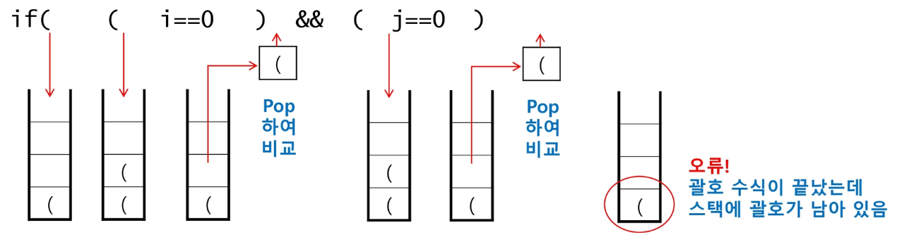

```java
public boolean checkPair(String str) {
	Stack<String> stack = new Stack<String>();
	
	for(int i = 0; i < str.length();i++){			
		char tmp = str.charAt(i);
		
		switch(tmp){
			// 여는 괄호에 해당하면 push
			case '[': case '{': case '(':
				stack.push(tmp); break;
				
			// 닫는 괄호에 해당하면 pop
			case ']': case '}': case ')':
				if (stack.isEmpty()) return false;
				else {
					char open = stack.pop();
					
					if ((tmp != '[' && open == ']') 
							|| (tmp != '{' && open == '}') 
							|| (tmp != '(' && open == ')')) {
							return false;
					} else {
						break;
					}
				}
		}
	}
	
	// stack에 있던 수식이 pop되어 올바르게 pairing되었다면 스택은 비어있다.
	if (stack.isEmpty()) return true;
	else return false;
}
```

> 📌 괄호쌍 검사하기 문제는 스택을 사용하는 대표적인 문제 중 하나이다.

### Function Call

[재귀](재귀.md#📍-재귀-함수-구현-과정)에서 간단히 언급했듯이 스택은 프로그램에서의 **함수 호출과 복귀에 따른 수행 순서**를 관리한다.

👉 왜냐하면 재귀는 **가장 마지막에 호출된 함수가 가장 먼저 실행**을 완료하고 복귀하는 **후입선출 구조**이므로, 후입선출 구조의 스택을 이용하여 수행순서 관리하는 것.

**[함수 호출 실행 과정]**

1. 함수 호출이 발생하면 호출한 함수 수행에 필요한 지역변수, 매개변수 및 수행 후 복귀할 주소 등의 정보를 스택 프레임(stack frame)에 저장하여 시스템 스택에 삽입한다.
2. 함수의 실행이 끝나면 시스템 스택의 top 원소(스택 프레임)을 삭제(pop)하면서 프레임에 저장되어 있던 복귀주소를 확인하고 복귀한다.
3. 함수 호출과 복귀에 따라 이 과정을 반복하여 전체 프로그램 수행이 종료되면 시스템 스택은 공백 스택이 된다.

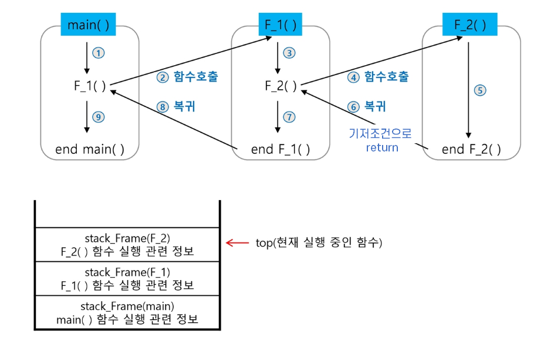

### 계산기

스택을 이용하여 문자열로 된 계산식의 값을 계산해보자.

- 중위 표기법(infix notation) <br/>
: 연산자를 피연산의 가운데 표기하는 방법 Ex) `A + B`
- 후위 표기법(postfix notation) <br/>
: 연산자를 피연산자 뒤에 표기하는 방법 Ex) `AB+`

**[문자열 수식 계산의 일반적 방법]**

Step1. 중위 표기법의 수식을 **후위 표기법으로 변경**한다. (스택 이용)

  1. 수식의 각 연산자에 대해서 **우선순위에 따라** 괄호를 사용하여 다시 표현한다.
  2. 각 연산자를 그에 대응하는 오른쪽괄호의 뒤로 이동시킨다.
  3. 괄호를 제거한다.

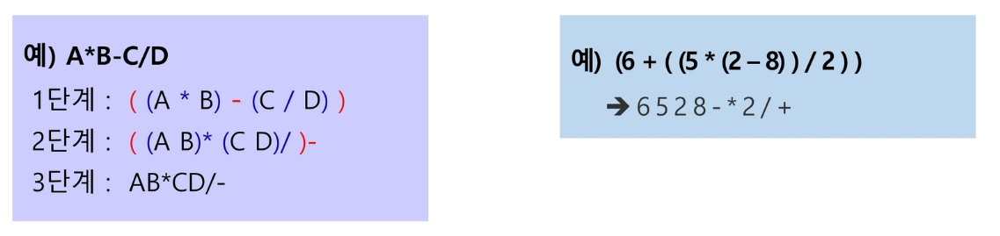

Step2. 후위 표기법의 수식을 스택을 이용하여 계산한다.

  1. 피연산자를 만나면 스택에 push 한다.
  2. 연산자를 만나면 필요한 만큼의 피연산자를 스택에 pop하여 연산하고, 연산결과를 다시 스택에 push한다. <br/>
    👉 특히 **피연산자를 꺼냈을 때 위치를 잘 둬야 한다.** <br/>
    피연산자의 순서에 따라 결과가 달라지기 때문에 피연산자의 순서가 중요하다!! <br/>
      Ex) `6 - 2 = 4`  vs  `2 - 6 = -4
     > 계산이 언제 끝나는지 알 수 없고, 그 뒤에 또다른 연산의 피연산자가 될 수 있기 때문에 스택에 push해야 한다.
  3. 수식이 끝나면, 마지막으로 스택을 pop하여 출력한다.

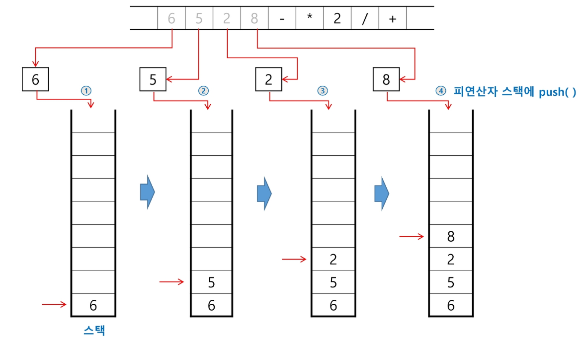

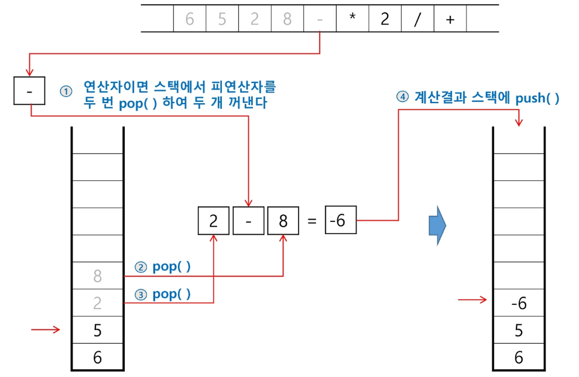

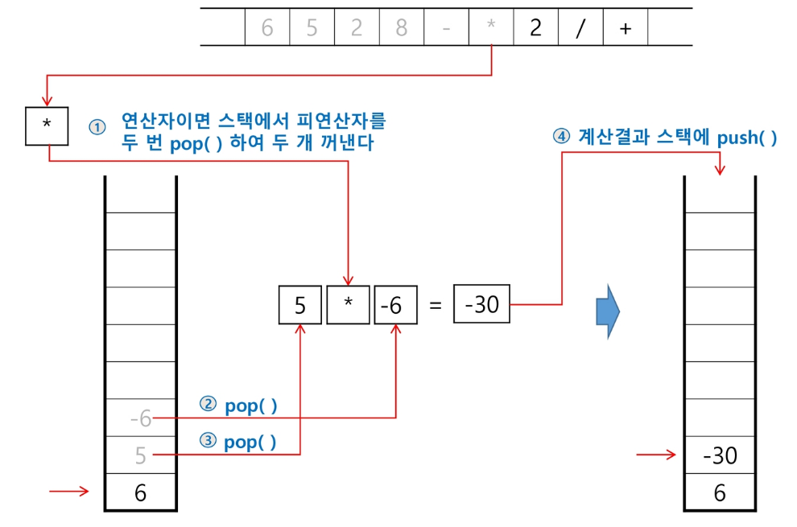

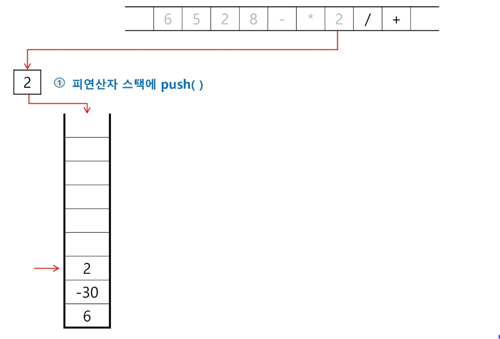

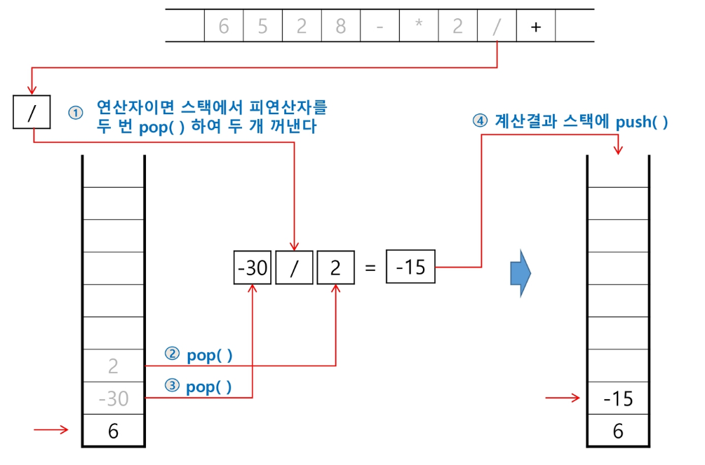

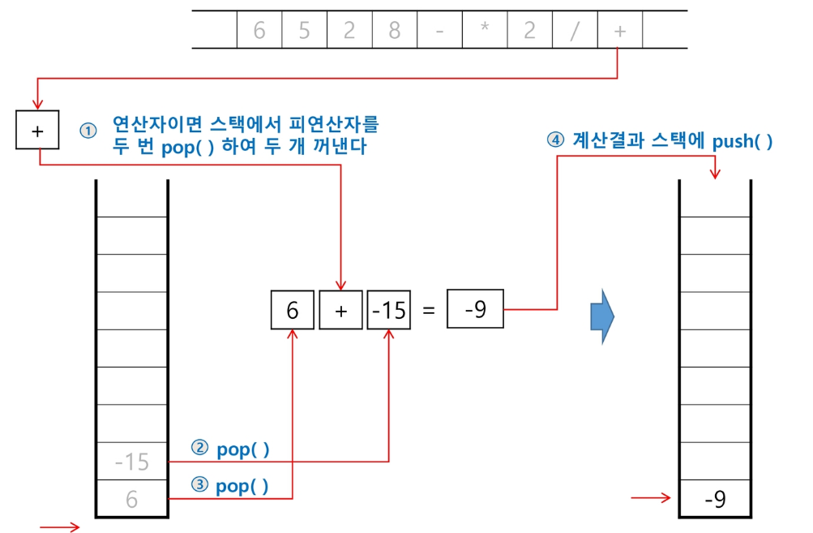

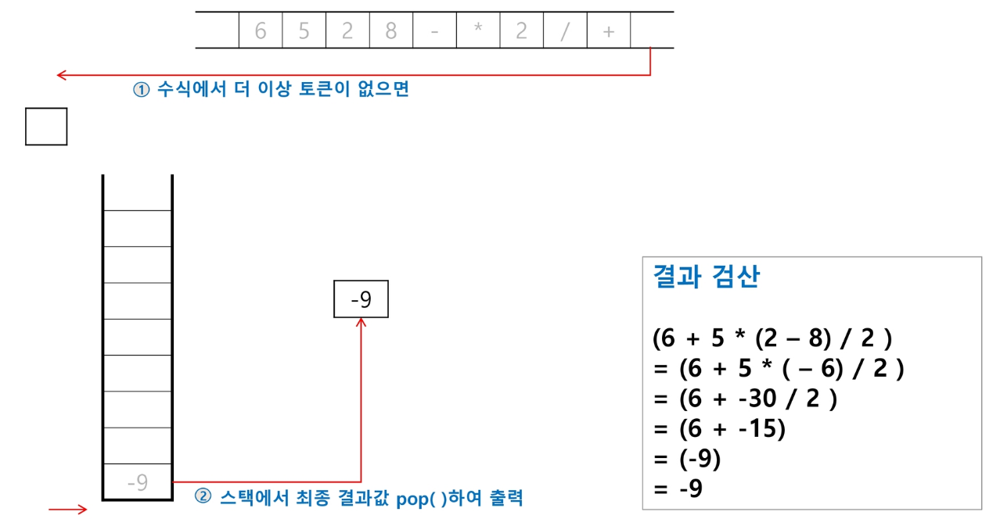

### 브라우저

표준 웹 브라우저는 방문한 페이지들 내에서 이전, 이후 페이지를 방문하는 기능이 있다.<br/>
 기본 홈페이지는 다음과 같다고 가정한다.<br/> 
http://www.ssafy.com

입력은 V, B, F, Q 중 하나이고, 다음을 의미한다.
- V(isit) : url로 방문
- B(ack) : 뒤로
- F(orward) : 앞으로
- Q(quit) : 종료

**[입력 예시]**

```
V http://www.google.com
V http://www.naver.com
B
V http://edu.ssafy.com
F
B
F
B
B
B
Q
```

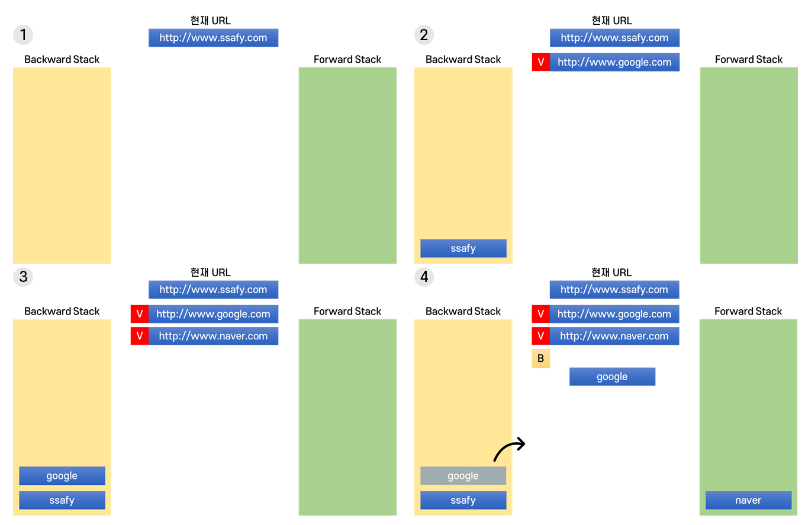

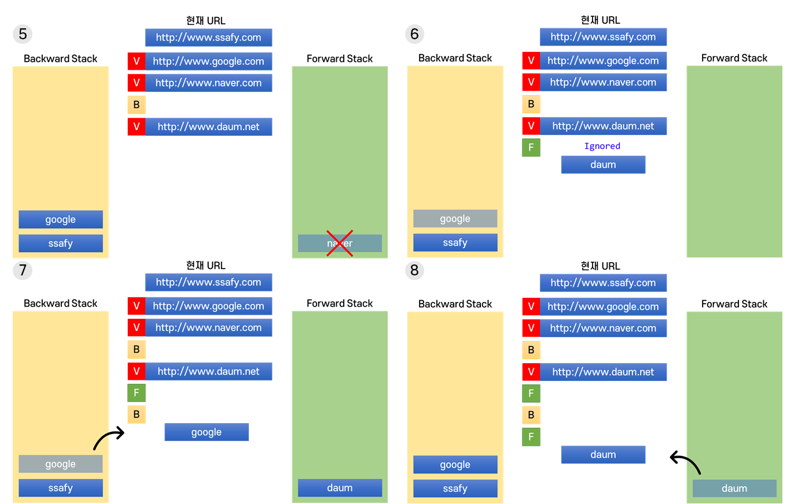

```java
public class Main {
	
	public static void main(String[] args) throws IOException {
		BufferedReader br = new BufferedReader(new InputStreamReader(System.in));
		StringTokenizer st = null;
		
		String input = null;
		String current = "http://www.ssafy.com";
		
		Stack<String> back = new Stack<String>();
		Stack<String> forward = new Stack<String>();
		
		while(true) {
			input = br.readLine();
			if(input.charAt(0) == 'Q') break;
			
			st = new StringTokenizer(input, " ");
			switch(st.nextToken()) {
			case "V":
				forward.clear(); // 스택을 전부 비우는 것
				back.push(current);
				current = st.nextToken();
				System.out.println(current);
				break;
			case "B":
				if(back.isEmpty()) {
					System.out.println("Ignored.");
				}else {
					forward.push(current);
					current = back.pop();
					System.out.println(current);
				}
				break;
			case "F":
				if(back.isEmpty()) {
					System.out.println("Ignored.");
				}else {
					back.push(current);
					current = forward.pop();
					System.out.println(current);
				}
				break;
			}
		}
	}
}
```