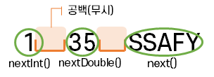
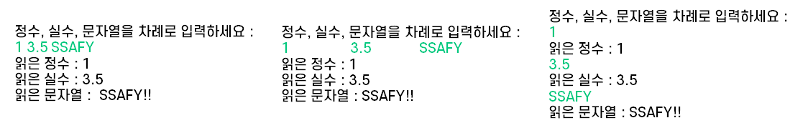
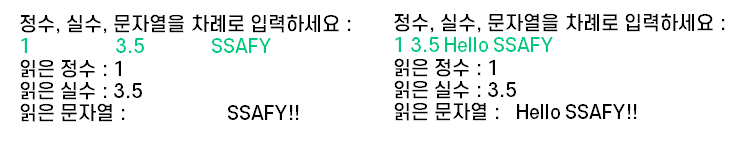
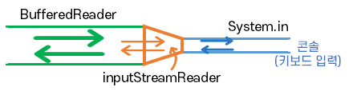
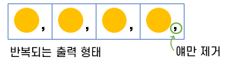

# 입/출력 처리

## 표준 입출력

### 🤔 Stream이란?

통로를 의미하며 일반적으로 **data 흐름**을 말한다.

입/출력을 도와주는 stream이 각각 존재하는데, 자바 프로그램이 구동되면 기본적으로 **3개의 stream**이 열린다. 이것은 따로 생성하지 않아도 **기본으로 주어지는 것**이다.

- System.in : 표준 입력
- System.out  : 표준 출력
- System.err  : 표준 에러출력

## 표준 입출력의 대상 변경

입력값을 받을 때는 2가지 방법이 있는데, 다음과 같다.

- 콘솔창에 직접 Test Case를 입력하는 방법
- 파일로 Test Case를 읽어들이는 방법

여기서 **파일로 Test Case를 읽을 때**는 `System.setIn()`을 자주 사용한다. Test Case 파일을 **표준 입력**으로 바꾸고 싶다면 `System.setIn()`을 통해 **원하는 stream을 지정**하여 표준 입력으로 변경할 수 있다.

> 💡 **출력**의 경우도 알아두자!
> - System.setOut()
> - System.setErr()

Test Case 입력 파일이 표준 입력으로 바뀌었어도 코드의 변경은 없다! 

👉 즉, **코드 수정이 최소화 라는 것**

단순히 표준 입력을 파일에서 읽어들이는 걸로 바꾸었기 때문에, 백준과 같은 코딩테스트 시스템에 제출할 때는 파일을 읽어들이는 부분만 지워도 된다.

```java
import java.io.FileInputStream;
import java.io.FileNotFoundException;

public class Main {
	public static void main(String[] args) throws FileNotFoundException {
		System.setIn(new FileInputStream("input.txt")); 
		// 코드를 제출할 때는 위 코드를 주석처리 하면 된다.
        // 표준입력을 input.txt로 수정
  }
}
```

## Java.util.Scanner

### 정의

파일, 입력 스트림 등에서 데이터를 읽어 **구분자로 Token화**하고 **다양한 타입으로 형변환**하여 return해주는 것 등 알아서 처리해주는 클래스

👉 즉, 일종의 **입력 도우미**로 생각하면 된다.

Scanner 생성자가 다양하게 **오버로딩**되어 있어서 stream으로 **한정짓지 않아도 된다.**
  - Scanner(**File** source)
  - Scanner(**InputStream** source)
    - 표준입력으로 **System.in**이 들어간다. (가장 많이 사용)
  - Scanner(String source)

### 🙂 장점
입력 스트림을 다루는 방법을 몰라도 **손쉽게 입력처리가 가능**하다.
  - 데이터의 **입력처리에 대한 추상화 제공**
  - 입력소스가 **무엇이 됐든** 데이터를 읽을 수 있다.
  - 다양한 `nextXXX()`를 제공

입력받는 시점에 데이터의 타입이 결정되므로 별도의 데이터의 형변환이 필요 없다. (편리함)

### 🙁 단점
대량의 데이터 처리 시 **수행시간이 비효율적**이다.
  - 사용자가 편리함을 갖는 대신 **Scanner 내부적으로 많은 low적인 일**을 한다.

  - **많은 양의 데이터**를 읽을 때는 **최대 30% 정도**의 속도 차이가 난다. <br>
    (단, 데이터양이 적으면 bufferedReader와 별 차이 없음)

그러므로 문제 종류에 따라 입력하는 법을 잘 고르자!
> Scanner vs BufferedReader

### 주요 메소드

  | 메소드       | 설명                                                         |
  | :----------- | :----------------------------------------------------------- |
  | nextInt()    | **int** 타입 반환<br />유효 문자열 후 White space 문자를 만나면 처리 |
  | nextDouble() | **double** 타입 반환<br />유효 문자열 후 White space 문자를 만나면 처리 |
  | next()       | 문자열 반환<br />유효 문자열 후 White space 문자를 만나면 처리 |
  | nextLine()   | 문자열 반환<br />개행(Enter) 문자를 만나면 처리<br />next()와 달리 문자열 안에 띄어쓰기를 할 수 있음(space, tab 포함) |

`nextInt()`, `nextDouble()`, `next()`
  - 문자 사이 **공백(= 중간 구분자)** 는  scanner가 알아서 처리한다. <br/> (원래라면 사용자가 따로 구분해줘야 함)
  - 유효 문자(data)만을 처리하며 **다음 구분자 앞까지만** 읽는다.
  - **항상 구분자가 남아있다**는 것을 알아서 **앞 구분자는 제거/무시**하고 남은 **나머지만 형변환**을 한다.
  - **앞 부분 구분자**는 <u>다음에 읽어오는 메소드가 무엇이냐</u>에 따라 **제거(무시)** 되거나 혹은 **남아있을** 수 있다. 



`nextLine()`
  - 구분자인 개행문자(`\n`)까지 읽는다.
  - 그리고 출력할 때는 개행문자를 제거하고 준다.
  - nextInt()와 같이 구분자 직전까지 읽는 메소드 후에 **바로 사용하면** 그리고 이 구분자가 **\n** 이라면 **개행문자만 받고 끝난다.**
  


### 🤔 주요 메소드 기능에 대해 알아보자

📍 **nextInt(), nextDouble(), next()의 기능을 확인하기 위해 아래 입력 데이터를 해보고 각 출력이 어떤지 살펴보자**

- 띄어쓰기: 1 3.5 SSAFY
- Tab: 1　　3.5　　SSAFY
- Enter: 1 \n 3.5 \n SSAFY 



모두 결과가 똑같다!

띄어쓰기, Tap, Enter를 **똑같은 구분자**로 보는 것을 알 수 있다. <br/>
👉 그래서 **white space**라고 부른다.

📍 **그렇다면 next() 대신 nextLine()의 기능을 확인해보자**

- Tap: 1　　3.5　　SSAFY
- 띄어쓰기: 1 3.5 Hello SSAFY



`next()`와 다르게 띄어쓰기, Tap을 구분자로 보지 않고 문자열로 인식하여 받아들인다! <br/>
만약 "Hello SSAFY"를 `next()`로 입력했다면 "Hello"까지만 출력된다. 물론 앞의 공백도 안나온다.

📍 **다만, nextLine() 사용 시 주의할 점이 있다**

- 나이: 20
- 이름: 홍길동

```java
Scanner sc = new Scanner(System.in);

System.out.println("나이: ");
int no = sc.nextInt();

System.out.println("이름: ");
sc.nextLine(); // 개행문자 처리. 처리하지 않으면 이름을 받지 못한다.
String msg = sc.nextLine();
```

개행문자(`\n`)를 무시하고 입력만 받는 `next()`와 다르게 `nextLine()`은 한 줄 단위로 입력받기 때문에 개행문자까지 읽는다. 

처음 사용자가 입력한 뒤에 버퍼에는 `20\n`가 존재하게 된다. 이때 `nextInt()`가 버퍼 내용을 가져올 때 `20`만 가져오기 때문에 버퍼에는 `\n`만 남게 된다. 그리고 `nextLine()`은 남은 개행문자 `\n`만 받고 끝나게 되는 것이다.

👉 그러므로 구분자 직전까지 읽는 메소드를 앞에서 사용했다면 **개행문자 처리** 코드를 반드시 작성해야 한다.

## java.io.BufferedReader

### 정의

필터 스트림 유형으로 **Reader계열**은 **character 단위**의 입력을 지원하는 스트림

### 특징

**줄(line) 단위**(`readLine`)로 문자열 처리 기능을 제공한다. 
 - **개행문자**를 만나면 그 전까지의 문자들을 처리한다는 의미
 - 처리된 문자들은 **String 타입** 이다.

line 안 데이터를 구분자로 끊어서 원하는 데이터를 추출하고 형변환하여 사용해야 한다. (이 부분을 Scanner가 제공하고 있었던 것)

**대량의 데이터** 처리 시 **수행시간이 효율적**이다.

 ```java
BufferedReader br = new BufferedReader(new InputStreamReader(System.in));
```

기존의 `System.in`은 byte 단위로 키보드를 읽어왔으나 BufferedReader는 char 단위로 읽어오기 때문에 둘은 바로 사용할 수 없다.<br/>
그러므로 inputStream을 **reader 계열로 바꿔주는 필터**(= **InputStreamReader**)를 사용해서 BufferedReader에 넣어줘야만 line 단위로 읽을 수 있다.



### StringTokenizer

#### 정의
BufferedReader와 같이 **보조적**으로 쓰이는 것

#### 특징
**구분자**를 반드시 써줘야 한다.
 - 기본값이 존재하지만 **보통 공백으로 구분**되므로 표시해줘야 한다.

숫자를 Token화 해주지 않기 때문에 **형변환 작업이 필요**하다.

> 💡 **Token화란?**
>
> 읽어온 문자열 라인에 구분자가 여러개 있다면 **구분자**로 **나눠서** 각각을 가져오는 것으로 이때 사용하는 것이 바로 `StringTokenizer` 이다.

입력으로 들어온 전체 문자열을 **문자 배열**로 나누고 싶다면 `toCharArray()`를 사용한다.

#### 사용법

📍 **다음과 같은 입력이 주어질 때 StringTokenizer와 toCharArray()의 사용에 대해 알아보자**

```
4
1 2 3 4
```
`StringTokenizer`의 경우

```java
BufferedReader br = new BufferedReader(new InputStreamReader(System.in));

int N = Integer.parseInt(br.readLine());
StringTokenizer st = new StringTokenizer(br.readLine(), " "); // 공백으로 구분

for (int i = 0; i < N; i++) {
  int value = Integer.parseInt(st.nextToken());
  System.out.println(value);
}
```

`toCharArray()`의 경우

```java
BufferedReader br = new BufferedReader(new InputStreamReader(System.in));

int N = Integer.parseInt(br.readLine());
char ch[] = br.readLine().toCharArray(); // 문자열의 문자를 인덱스로 접근

for(char c : ch) {
	System.out.println(c);
}
```

## java.lang.StringBuilder

### 정의

기존의 문자열 출력은 기존의 문자열이 바뀌는 것이 아닌 **새로운 문자열 객체가 생성**되어서 출력된다. 

그러나 출력 시, **가장 마지막**에 생성된 문자열이 출력되기 때문에 중간 과정의 문자열은 필요없다. 그러므로 기존의 문자열에 **이어붙여서** 출력한다면 불필요한 문자열 객체가 생성되지 않는다. 

이러한 작업을 하는 것이 바로 `StringBuilder` 이다.

- 문자열의 조작을 지원하는 클래스
- 자바에서 상수로 취급되는 문자열을 조작 시마다 **새로운 문자열이 생성되는 것을 방지**해준다.

### 사용법

```java
StringBuilder sb = new StringBuilder();
sb.append("Hello ");
sb.append("SSAFY").append("!!");
System.out.println(sb.toString()); // Hello SSAFY!!

sb.setLength(sb.length() - 2);
System.out.println(sb.toString()); // Hello SSAFY
```

`append()`를 통해 문자열을 뒤로 이어붙이게 된다.

String Builder로 처리한 문자열을 String으로 변환하기 위해서는 `toString()`을 이용하여 출력한다.

`setLength()`는 반복되는 형태로 문자를 이어 붙일 때, 마지막 부분에서는 제거하고 싶은 경우에 사용한다.<br/>
**제거 방법**은 전체 길이에서 마지막에 **제거부분 길이**만큼만 빼면 된다.

