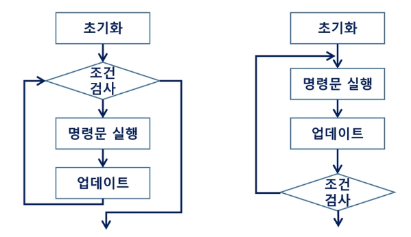
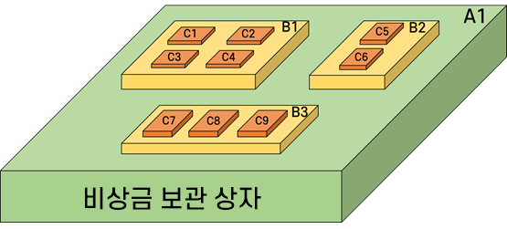
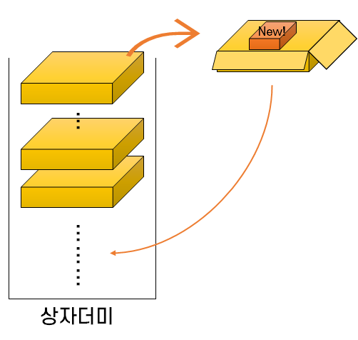
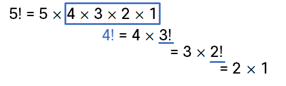
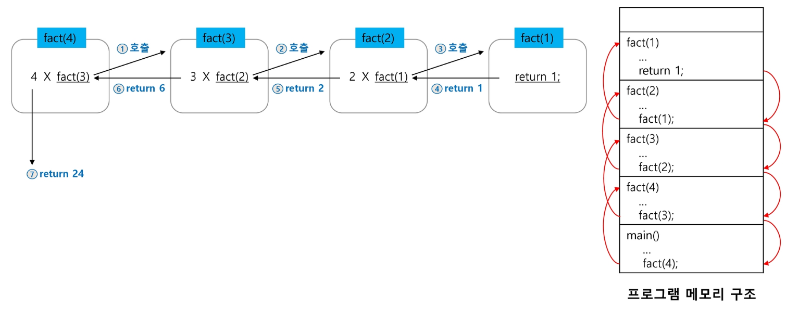

# 재귀

## 반복(Iteration)과 재귀(Recursion)

반복과 재귀는 자기자신을 **반복적으로 호출**하는 것으로 **유사한 작업을 수행**할 수 있다.

  - **단위 반복** : 반복을 처리하는 단위
  - **처리 단위** : 재귀에서 부르는 단위 반복

한 번 메소드가 실행될 때마다 **무엇을 계속 같은 모양으로 처리하는지(=단위 반복)** 찾는게 중요하다.

### 반복이란?
반복은 수행하는 작업이 완료될 때까지 계속 반복한다. <br/>
👉 이를 **루프(for/while, do~while 구조)** 라고 한다.



### 재귀란?
재귀는 주어진 문제의 해를 구하기 위해 **동일하면서 더 작은 문제의 해를 이용**하는 방법으로, **하나의 큰 문제를** 해결할 수 있는 (해결하기 쉬운) **더 작은 문제로 쪼개고** 결과들을 **결합**한다.

- 어떤 패턴으로 **반복적으로 처리**할 수 있는지 생각한다.
- 만약 재귀 작성이 안된다면 먼저 반복문으로 작성한다. 
- 그리고 반복문으로 작성한 것을 재귀로 풀어보도록 노력해보자.

재귀는  **Flat 하게 문제를 봐야 한다.** (= 평평하게..) <br/>
**전체의 일부분만** 내가 처리하고, 나머지는 **지금과 같은 방법**으로 처리하는 방향으로 생각하면 된다.


> 📌 Point!! **현재 시점**에서는, **현재의 내가 할 수 있는 일**을 한다.

### 반복 vs 재귀

나만 알 수 있는 상자에 보관한 비상금을 찾으려고 한다. <br/>
그냥 보관하는 것은 위험하므로 상자 안에 상자를 넣어 보관했었다. 비상금을 찾아보자.



**[반복의 경우]**

상자들을 더미에 다 쌓아놓고 계속해서 상자를 열어본다. <br/>
만약 그 상자안에 새로운 상자가 있다면 더미에 그 상자를 다시 쌓아놓고 더미에 쌓여있는 순대로 상자를 확인한다.



**[재귀의 경우]**

`A1` 상자를 열면 `B1`, `B2`, `B3` 상자가 있다. <br/>
`B1`을 열어보니 `C1`,`C2`, `C3`, `C4`상자가 있다. 이 중 `C1` 상자를 열어본다. <br/>
비어있다면 `C2` 상자를 열어본다. `C2`에 돈이 있다면 종료

## 🤔 재귀 함수란? (recursive function)

**함수 내부에서 직접 혹은 간접적으로 자기 자신을 호출하는 함수** 를 말한다.

일반적으로 **재귀적 정의**를 이용해서 **재귀 함수를 구현**한다.

### 📍 재귀 함수 구현 과정
1. **메소드 함수에 대한 정의를 명확히!!한다.**

2. 작업을 처리하기 위한 <u>결정적 요인</u>, 즉 **매개체에 해당하는 값**을 식별해야 한다. (바뀌는 부분 vs 바뀌지 않는 부분)

3. **바뀌는 부분**을 **매개변수**로 설계한다.

4. **기본 부분(basis part)와 유도 파트(inductive part)** 로 구성
    > 💡 개념 알기
    > - 기본 부분 : **재귀의 끝**. 더 이상 호출하지 X
    > - 유도 파트 : **재귀 파트**. **유한반복**으로 재귀를 작성한다. (무한 ㄴㄴ)

재귀적 프로그램은 **반복 구조에 비해 간결하고 이해하기 쉽다.** <br/> 그러나, 재귀에 대해 익숙하지 않은 개발자들은 재귀적 프로그램이 어렵다고 느낀다.

재귀 호출은 **스택을 반복적으로 사용**하며, 이는 **메모리 및 속도의 성능저하**를 발생시킨다.

  - 스택 공간은 유한적이다.. 무한으로 재귀하면 스택 오버플로우 에러 발생
  - 재귀의 끝은 만들었으나 깊이(depth)가 너무 깊어도 에러 발생

> 💡 **함수 호출 시** 프로그램 메모리 구조에서 **스택을 사용**한다.

## 팩토리얼 재귀 함수



### 재귀적 정의
```
Basis rule:
		N ≤ 1 경우, n = 1
Inductive rule:
		N > 1, n! = n × (n - 1)!
```

### N!에 대한 재귀함수
N이 바로 구해야하는 값의 결정적 요인으로, 바뀌는 값은 매개변수로 설계한다.

```java
int	fact (int n) 
{
	if (n <= 1)						// Basis part
		return 1; //재귀X - 기저조건이라고 부른다.
	else
		return n * fact( n - 1 );	// Inductive part
    	// n * n-1 * (n-2)! 이런거 생각ㄴㄴ.
      // 단순히 n이 해야하는 일만 생각한다. flat!!
} 
```

아래 그림은 팩토리얼 함수에서 N=4인 경우의 실행 과정이다.



## 🙂 재귀의 장점
**단순한 코드**는 재귀 보다는 **반복문**이 나을 수 있다. <br/>
  그러나 **복잡한 코드**에서는 재귀가 **데이터 관리가 더 편하기** 때문에 **재귀를 사용**한다.

재귀를 이용하면 현재 **내가 처리해야 하는 단위작업에만 집중**할 수 있다. (다른 애들의 상태를 기억할 필요 X)

2중 반복문이면 i, j 를 신경써야 하지만, 재귀는 **자신에게 주어진 공간에서의 상태에만 집중**하면 된다.