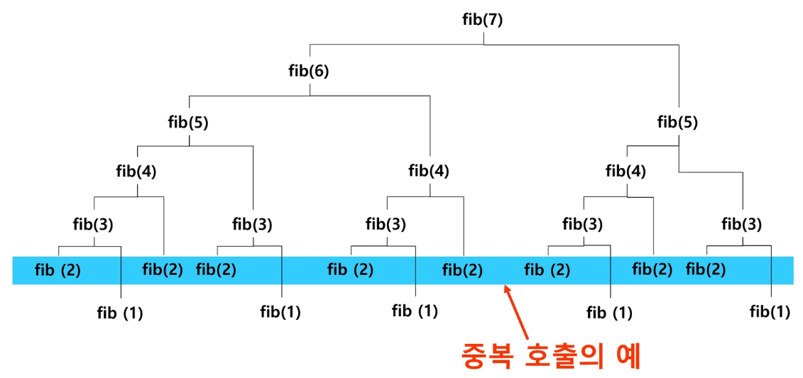
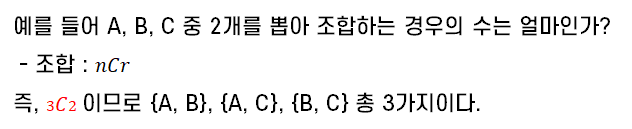

# 재귀

## 반복(Iteration)과 재귀(Recursion)

반복과 재귀는 자기자신을 **반복적으로 호출**하는 것으로 **유사한 작업을 수행**할 수 있다.

  - **단위 반복** : 반복을 처리하는 단위
  - **처리 단위** : 재귀에서 부르는 단위 반복

한 번 메소드가 실행될 때마다 **무엇을 계속 같은 모양으로 처리하는지(=단위 반복)** 찾는게 중요하다.

### 🤔 반복이란?
반복은 수행하는 작업이 완료될 때까지 계속 반복한다. <br/>
👉 이를 **루프(for/while, do~while 구조)** 라고 한다.


### 🤔 재귀란?
재귀는 주어진 문제의 해를 구하기 위해 **동일하면서 더 작은 문제의 해를 이용**하는 방법으로, **하나의 큰 문제를** 해결할 수 있는 (해결하기 쉬운) **더 작은 문제로 쪼개고** 결과들을 **결합**한다.

1. 어떤 패턴으로 **반복적으로 처리**할 수 있는지 생각한다.
2. 만약 재귀 작성이 안된다면 먼저 반복문으로 작성한다. 
3. 그리고 반복문으로 작성한 것을 재귀로 풀어보도록 노력해보자.

재귀는  **Flat 하게 문제를 봐야 한다.** (= 평평하게) <br/>
**전체의 일부분만** 내가 처리하고, 나머지는 **지금과 같은 방법**으로 처리하는 방향으로 생각하면 된다.


> 📌 Point!! **현재 시점**에서는, **현재의 내가 할 수 있는 일**을 한다.

### 연습 문제

나만 알 수 있는 상자에 보관한 비상금을 찾으려고 한다. <br/>
그냥 보관하는 것은 위험하므로 상자 안에 상자를 넣어 보관했었다. 비상금을 찾아보자.


**[반복의 경우]**

상자들을 더미에 다 쌓아놓고 계속해서 상자를 열어본다. <br/>
만약 그 상자안에 새로운 상자가 있다면 더미에 그 상자를 다시 쌓아놓고 더미에 쌓여있는 순대로 상자를 확인한다.


**[재귀의 경우]**

`A1` 상자를 열면 `B1`, `B2`, `B3` 상자가 있다. <br/>
`B1`을 열어보니 `C1`,`C2`, `C3`, `C4`상자가 있다. 이 중 `C1` 상자를 열어본다. <br/>
비어있다면 `C2` 상자를 열어본다. `C2`에 돈이 있다면 종료

## 🤔 재귀 함수란? (recursive function)

**함수 내부에서 직접 혹은 간접적으로 자기 자신을 호출하는 함수** 를 말한다.

일반적으로 **재귀적 정의**를 이용해서 **재귀 함수를 구현**한다.

### 📍 재귀 함수 구현 과정
1. **메소드 함수에 대한 정의를 명확히!!한다.**

2. 작업을 처리하기 위한 <u>결정적 요인</u>, 즉 **매개체에 해당하는 값**을 식별해야 한다. (바뀌는 부분 vs 바뀌지 않는 부분)

3. **바뀌는 부분**을 **매개변수**로 설계한다.

4. **기본 부분(basis part)와 유도 파트(inductive part)** 로 구성
    > 💡 개념 알기
    > - 기본 부분 : **재귀의 끝**. 더 이상 호출하지 X
    > - 유도 파트 : **재귀 파트**. **유한 반복**으로 재귀 작성 (무한 ㄴㄴ)

재귀적 프로그램은 **반복 구조에 비해 간결하고 이해하기 쉽다.** <br/> BUT, 재귀에 대해 익숙하지 않은 개발자들은 재귀적 프로그램이 어렵다고 느낀다.

재귀 호출은 **스택을 반복적으로 사용**하며, 이는 **메모리 및 속도의 성능저하**를 발생시킨다.

  - 스택 공간은 유한적이다. 무한으로 재귀하면 스택 오버플로우 에러 발생
  - 재귀의 끝을 만들었으나 깊이(depth)가 너무 깊어도 에러 발생

> 💡 **함수 호출 시** 프로그램 메모리 구조에서 **스택을 사용**한다.

## 팩토리얼 재귀 함수


### 재귀적 정의
```
Basis rule:
		N ≤ 1 경우, n = 1
Inductive rule:
		N > 1, n! = n × (n - 1)!
```

### N!에 대한 재귀함수
N이 바로 구해야하는 값의 결정적 요인으로, 바뀌는 값은 매개변수로 설계한다.

```java
int	fact (int n) 
{
	if (n <= 1)						// Basis part
		return 1; //재귀X - 기저조건이라고 부른다.
	else
		return n * fact( n - 1 );	// Inductive part
    	// n * n-1 * (n-2)! 이런거 생각ㄴㄴ.
      // 단순히 n이 해야하는 일만 생각한다. flat!!
} 
```

다음은 팩토리얼 함수에서 N=4인 경우의 실행 과정이다.


## 피보나치 수열
**이전의 두 수 합을 다음 항으로 하는 수열**로, 피보나치 수열의 i번째 값을 계산하는 함수 F를 정의하면 다음과 같다.


위의 정의를 통해서 피보나치 수열의 **i번째 항을 반환하는 함수**를 재귀 함수로 간단하게 나타낼 수 있다.

```
fibo(n)
	if (n <= 1) then
		return n;
	else
		return fibo(n-1) + fibo(n-2);
```

단 4줄의 코드로 N번 째의 피보나치 수열을 쉽게 계산할 수 있다.

하지만, 이 코드의 **시간 복잡도**는 어떨까? 



그림은 재귀 호출을 `Call Tree` 로 나타낸 것이다. 그림에서 보이는 것과 같이 **같은 연산이 불필요하게 많이 중복 호출되는 것**을 알 수 있다. (ex. `fibo(2)`)<br/>
👉 이것은 수행 속도를 떨어뜨리는 요인이 된다. (`O(2ⁿ)`의 시간 복잡도를 가지게 됨)

원래대로라면 이들은 한번씩만 호출되어도 이미 결과를 알기 때문에 다시 호출할 필요가 없다. 따라서 이러한 **문제를 해결하기 위한 몇가지 기법**(`Memoization`, `Dynamic Programming`)이 존재하는데, 이는 다음에 다시 소개하도록 한다.

## 🤔 언제 반복 or 재귀를 사용해야 할까?

👉 해결할 문제를 고려해서 <u>반복이나 재귀의 방법을 선택</u>한다.

**단순한 코드**는 재귀 보다는 **반복문**이 나을 수 있다.<br/>
그러나 **복잡한 코드** 이거나 **변수 관리가 힘들 때**는 **재귀**로 짜는 것이 **가독성이 좋고 심플**할 수 있다.

> 💡 재귀는 문제 해결을 위한 알고리즘 설계가 **간단하고 자연스럽다.** <br/>
특히, 추상 자료형(List, tree 등)의 알고리즘은 재귀적 구현이 간단하고 자연스러운 경우가 많다.

재귀는 **결정요인**만 받아서 처리하고 넘기기 때문에, 다른 애들의 상태에 의존적이지 않다. 즉, **현재 자신에게 주어진 처리해야 하는 단위 작업에만 집중**할 수 있다. <br/>
반면, 반복문이라면 (특히 **2중 반복문**) `i`, `j` 를 신경써야 한다. 

입력 값 **N이 커질수록** 재귀 알고리즘은 반복에 비해 **비효율적**일 수 있다. 일반적으로, 재귀적 알고리즘은 반복(Iterative) 알고리즘보다 **더 많은 메모리와 연산을 필요**로 하기 때문이다.

> 재귀는 알고리즘의 근간이 되기 때문에 연습을 많이 하는것이 좋다.


## 📍 재귀 연습하기

### 조합의 경우의 수 계산을 재귀로 표현



아래의 표를 통해 C를 기준으로 다음과 같은 경우를 고려할 수 있다.
 - 자신을 포함해서 2개가 되어야 한다면 C 앞의 문자 1개를 뽑는 경우
 - 자신을 포함하지 않는 C는 0개 이므로 앞의 문자 2개를 뽑는 경우


즉, r번째 요소를 **조합에 포함하는 경우**와 **포함하지 않는 경우**를 생각한다.
- r번째 요소가 **조합에 포함**되는 경우 <br/>
  : n-1개 중 **r-1개의 요소**를 선택하는 조합의 개수와 문제가 같아진다.
- r번째 요소가 **조합에 포함되지 않는**경우 <br/>
  : n-1개 중 **r개의 요소**를 선택하는 조합의 개수와 문제가 같아진다.

**아무것도 뽑지 않은 것 or 모두 뽑는 것**도 **하나의 경우**이므로 반드시 고려해야 한다.
- r = 0 (3개 중 0개 뽑기) --> 3C0 = 1개
- n == r (3개 중 3개 뽑기) --> 3C3 = 1개

```java
int comb(int n, int r) { // 전체 n개 중 r개를 뽑아 만드는 경우의 수
    if(r == 0 || n == r) return 1;
    
    // 자신을 포함한 r개 경우의 수 + 자신을 포함하지 않는 r개 경우의 수
    return comb(n-1, r-1) + comb(n-1, r);
}
```

### 💎 하노이의 탑

하노이의 탑 게임은 3개의 기둥과 서로 다른 크기의 N개의 원판으로 구성된다.<br/>
 원판을 세 번째로 모두 옮겨 놓아야 한다. <br/>
원판을 옮길 때는 반드시 한 번에 **한 개씩** 옮길 수 있고 두 번째 기둥을 이용할 수 있다.<br/>
옮기는 과정에서 절대로 <u>**큰 원판이 작은 원판 위에 놓이지 않아야 한다**.</u>

**[제약사항]**
- 원판 번호는 맨 위에서 1, 2, 3 순으로 부여
- 기둥은 3개로 가정한다.(기둥 번호는 왼쪽부터 1, 2, 3 순으로 부여)
- 시작은 N개의 원판이 1번 기둥에 쌓여져 있다.

**[입력]**
- 원판 개수인 N을 입력 받는다. (1 <= N <= 10)
- 원판 번호는 맨 위부터 1, 2, 3 순으로 부여

**[출력]**
- 옮겨지는 원판 번호 : 출발기둥번호 -> 목적기둥번호

> 📌 하노이의 탑 문제에서 Point는 **덩어리**로 보는 것!


**원판이 1개일 때의 이동**


**원판이 2개일 때의 이동**


**원판이 3개일 때의 이동**


```java
void hanoi(int n, int start, int temp, int dest) {
    /*기저조건**/
    // 움직일 원판이 없으면 그냥 리턴. - 어차피 n==0인 경우는 원판 1개일 때 뿐
    if(n == 0) return ;     
  
    /**유도조건**/
    // 자신의 위쪽의 n-1개 원판 들어내기 : 임시기둥으로 옮기기
    hanoi(n-1, start, dest, temp);
    // 자신의 원판 옮기기 : 목적기둥
    System.out.println(n+":"+start+">"+dest);
    // 들어냈던 임시기둥의 n-1개 원판 자신위에 쌓기 : 목적기둥으로 옮기기
    hanoi(n-1, temp, start, dest);
}
    
void main(String[] args) {
    hanoi(3, 1, 2, 3);
}
```