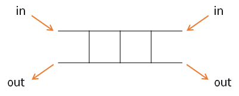

# 큐 (Queue)

## java.util.Queue

큐에 필요한 연산을 **선언**해 놓은 **인터페이스**<br/>
**`LinkedList` 클래스**를 **Queue 인터페이스의 구현체**로 많이 사용한다.


> 📌 `LinkedList`는 **다른 인터페이스의 구현체**로도 많이 사용한다.

## 큐(Queue)의 특성

큐는 뒤에서 삽입하고 앞에서 삭제가 이루어지는 **선입선출구조(FIFO: First In First Out)** 형식의 자료구조이다. <br/>
👉 즉, **가장 먼저 삽입(First In)된 원소는 가장 먼저 삭제(First Out)** 된다.

> 💡 스택과 마찬가지로 **선형 자료구조** 중 하나이다.

일상에서 **순서대로 처리**하는 모든 것들이 바로 큐 형식인 것.


### 🤔 큐의 활용: 버퍼(Buffer)란?

데이터를 한 곳에서 다른 한 곳으로 전송하는 동안 **일시적으로 그 데이터를 보관하는 메모리의 영역**으로 일반적으로 **입출력 및 네트워크**와 관련된 기능에서 이용된다.

**순서대로** 입력/출력/전달되어야 하므로 **FIFO 방식**의 자료구조인 **큐가 활용**된다.


**키보드 버퍼**는 **입력한 순서대로** 들어가고 출력하는 방식으로 수행한다.


## 큐의 연산

큐(Queue)는 **선입선출(FIFO: First In First Out)** 을 따른다.
- enQueue: 맨 오른쪽에 데이터 삽입
- deQueue: 맨 왼쪽의 데이터 추출


- `add(itme)`: 데이터 추가 (단, 넣을 공간 없으면 Exception 발생)
- `offer(item)`: 데이터 추가 (단, 넣을 공간 없으면 false 반환)
- `remove(item)`: 데이터 삭제 (단, 삭제 데이터가 없으면 Exception 발생)
- `poll(item)`: 데이터 삭제 (단, 삭제 데이터 없으면 null 반환)
- `isEmpty()`: 큐가 비어있다면 true 반환
- `size()`: 큐의 크기 반환

### 🤔 add vs offer, remove vs poll 무엇을 써야할까?

무엇을 사용하든 상관없다. 필요한 상황에 따라 사용자가 취사 선택하면 된다.

- 예외(Exception) 발생: `add()`, `remove()`
- false나 null 반환: `offer()`, `poll()`

### 큐의 삽입/삭제 과정

다음은 빈 큐에 원소 A, B, C를 차례로 삽입 후 한번 삭제하는 연산과정을 나타낸 코드이다.

```java
import java.util.LinkedList;
import java.util.Queue;

public class Main {
	
	public static void main(String[] args) {
		Queue<String> queue = new LinkedList<String>();
		
		queue.offer("A");
		queue.offer("B");
		queue.offer("C");
		
		System.out.println(queue.isEmpty()+"/"+queue.size());	 //출력: false/3
		System.out.println(queue.peek());						 //출력: A
		System.out.println(queue.size());	 					 //출력: false/3
		
		System.out.println(queue.poll());						 //출력: A
		System.out.println(queue.poll());						 //출력: B
		System.out.println(queue.poll());						 //출력: C
		System.out.println(queue.isEmpty()+"/"+queue.size());	 //출력" true/0
        
		//stack과는 다르게 예외가 발생하는 것이 아닌 null을 출력한다.
        System.out.println(queue.poll()); //출력: null
        System.out.println(queue.peek()); //출력: null
	}
}
```


## 📍 예제 풀기

### 마이쮸 나눠주기

Queue를 이용하여 **마이쮸 나눠주기 시뮬레이션**을 해 보자.


**[풀이 / 접근방법]**

위의 문제를 정리하면 다음과 같다.

1. 맨앞에서 대기하고 있는 사람의 개수만큼 마이쮸를 준다. (N빼기)
2. 대기열 맨뒤 추가(짝수+1)
3. 새로운 사람 대기열 맨뒤추가(개수1)


```java
public class Main {
	
	public static void main(String[] args) {
		
		int N = 20; // 지급할 마이쮸 개수
		Queue<int[]> queue = new LinkedList<>(); // 사람번호, 마이쮸개수
		// 몇번 사람이 가져가는지, 그 사람이 몇개의 마이쮸를 가져가는지 체크해야 함
        
		int person = 1; // 뉴페이스의 번호를 관리하는 변수
		
        // 1번이 1개를 가져가기 위해 기다리는 코드
		queue.offer(new int[] {person, 1}); 
		
		while(N>0) {
             // 지금상황에서는 언제나 큐에 사람이 있어서 굳이 작성하지 않아도 된다.
			if(!queue.isEmpty()) {
				int[] p = queue.poll(); // 대기열에서 꺼내기
                
                // 남아있는 마이쮸의 개수가 받아가려는 개수보다 작으면 남은거 만큼만 지급
				int availableCnt = (N>=p[1]) ? p[1]:N; 
				N -= availableCnt;
				
                // 남아있는 마이쮸를 방금전 사람이 다 가져감 (=마이쮸 소진)
				if(N==0) { 
					System.out.println("마지막 마이쮸를 가져간 사람: "+p[0]+"번, 가져간 개수: "+availableCnt);
				}else { // 마이쮸가 남아있음
					System.out.println(p[0]+"번이 "+availableCnt+"만큼 마이쮸를 가져갑니다. 남은 개수: "+N);
					p[1]++; // 받고자 하는 마이쮸개수 증가
					queue.offer(p); // 다시 줄서기
					queue.offer(new int[] {++person, 1}); // 뉴페이스 번호, 마이쮸개수
				}
				
			}
		}
	}
}
```

## 🤔 함께 알아보기: 덱/데크(Deque)란?

**양쪽 끝**에서 삽입과 삭제가 모두 가능한 자료 구조 <br/>
ex. 노래방 우선예약



스택, 큐 모두 사용할 수 있어 **자율성이 높다**. <br/>
단, 잘못 사용하면 데이터 순서가 꼬이기 때문에 잘 사용해야 한다.

> 💡 `LinkdedList`로 Deque 구현 가능!

### Deque의 연산


- `addFirst(item)` / `offerFirst(itme)`: 앞쪽부터 데이터 추가
- `addLast(item)` / `offerLast(item)`: 뒤쪽부터 데이터 추가
- `removeFirst(item)` / `pollFirst(itme)`: 앞쪽부터 데이터 삭제
- `removeLast(item)` / `pollLast(item)`: 뒤쪽부터 데이터 삭제

> 📌 `add()`/`offer()`와 `remove()`/`poll()`의 차이는 앞에 서술한 큐와 동일하다.

## 🤔 함께 알아보기: 우선순위 큐(Priority Queue)란?

선입선출(FIFO) 순서가 아니라 **우선순위가 높은 순서대로 먼저 나가는 형태의 자료구조** <br/>
👉 즉, **우선순위**를 가진 항목들을 저장하는 **큐**

> 📌 `java.util.PriorityQueue` 인터페이스 사용

우선순위 큐는 일반적으로 **힙(Heap)** 을 이용하는데, **힙의 키**를 우선순위로 활용하여 구현할 수 있다.

- 최대 힙(Max Heap): 가장 큰 값을 기준으로 먼저 나옴
- 최소 힙(Min Heap): 가장 작은 값을 기준으로 먼저 나옴

> 💡 간단하게 힙(Heap)에 대해 알아보자!
> 
> 힙은 **완전 이진 트리로 구현된 자료구조**이다.<br/>
키값이 가장 큰 노드(=최대값)나 가장 작은 노드(=최소값)를 찾기에 유용하다.
> 
> 아래의 그림은 **최소 힙(Min heap)** 으로서, 가장 작은 키값을 가진 노드가 항상 루트에 위치한다.
>
> 
>
> 힙과 관련된 내용은 Heap에서 다루도록 한다.