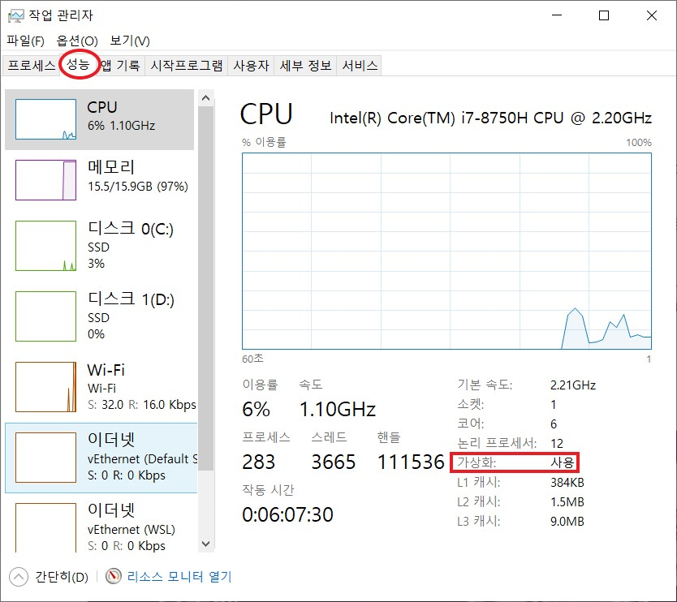
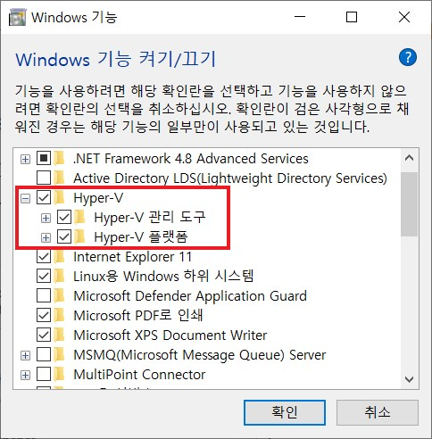

# Docker Install

## 목차

- [Windows10에 Docker 설치](#Windows10에-Docker-설치)
- [Ubuntu에 Docker 설치](#Ubuntu에-Docker-설치)

------

## Windows10에 Docker 설치

> Docker for windows 공식문서: https://docs.docker.com/desktop/windows/install/

### 0. 사전 체크

- Windows 버전이 Windows 7 이상인지 확인

- 컴퓨터 하드웨어의 BIOS 레벨에서 **가상화(Virtualization)** 지원과 **Hyper-V** 활성화

  - `작업 관리자 > 성능`에서 **'가상화: 사용'** 확인

    - **'가상화: 사용 안 함'**으로 되어 있다면, 컴퓨터를 재부팅하고 **BIOS**로 진입하여 해당 옵션을 **Enabled**로 설정한 다음 다시 확인한다.

    

  - `제어판 > Window 기능 켜기/끄기`에서 **Hyper-V** 체크

    - 만약 활성화 안되어 있다면 체크 후 리부팅
    - https://forbes.tistory.com/542 참고

    

  - WSL2 설치

### 1. Docker 설치

- 공식 문서에서 `Docker Desktop for Windows` 버튼 클릭

  - https://docs.docker.com/desktop/windows/install/

- 도커(Docker)를 사용하기 위해 **회원 가입** 진행

- **PowerShell**을 통해 도커(Docker) 설치 확인

  ```shell
  # 버전 확인
  docker -v
  
  # 테스트용 Hello world 받아서 실행
  docker pull hello-world 
  docker run hello-world
  
  ## 아래 결과가 나오면 성공!
  Hello from Docker! ⋯ ⋯
  ```

### 참고. Docker Compose 설치

> [공식 문서](https://docs.microsoft.com/ko-kr/visualstudio/docker/tutorials/use-docker-compose)에 따르면 Window 또는 Mac용 Docker Desktop을 설치한 경우 이미 Docker Compose가 있다. 따로 설치안해도 됨

<br/>

## Ubuntu에 Docker 설치

> Docker for Ubuntu 공식 문서 : https://docs.docker.com/engine/install/ubuntu/

### 0. 사전 체크

- 리눅스 커널 버전이 최소 3.10 버전 이상인지 확인

  ```bash
  $ uname -r
  ```

- `sudo` 권한 혹은 `root` 권한을 소유한 계정인지 확인

  - 없다면 권한 부여

  ```bash
  # sudo 권한 확인
  $ sudo cat /etc/sudoers
  ```

- 최신 배포판 OS인지 확인
  - 2020년 10월 기준 우분투 16.04, 18.04, 20.04 지원
- 64비트 운영체제인지 확인	

### 1. Docker 설치

- Docker 설치에 필요한 apt 패키지 설치

  ```bash
  $ sudo apt update
  
  # 의존성 패키지 설치
  $ sudo apt-get install apt-transport-https ca-certificates curl gnupg lsb-release
  
  # apt로 Docker 패키지를 설치하기 위해 인증키(GPG Key) 추가
  $ curl -fsSL https://download.docker.com/linux/ubuntu/gpg | sudo apt-key add -
  
  # Ubuntu 버전에 맞는 Docker를 설치하기 위해 repository에 추가
  $ sudo add-apt-repository "deb [arch=amd64] https://download.docker.com/linux/ubuntu $(lsb_release -cs) stable"
  
  # repository 업데이트
  $ sudo apt update
  
  # Docker 패키지 확인
  $ sudo apt-cache search docker-ce
  ```

- Docker 엔진 설치

  ```bash
  # Docker 설치
  $ sudo apt update
  $ sudo apt-get install docker-ce docker-ce-cli containerd.io
  ```

  > CE(Community Edition)은 기술지원 및 서비스 단계 시 각종 지원은 없지만, 개인 공부 및 개발 환경 사용에서 사용한다.(무료버전)

- 잘 설치되었는지 확인

  ```bash
  # Docker 버전 확인
  $ sudo docker --version
  
  # Docker 정보 확인
  $ sudo docker info
  ```

### 2. 사용자를 Docker 그룹에 포함시키기

- Docker 명령어를 sudo 권한 없이 실행하기 위해서 포함시킨다.

  ```bash
  # 현재 유저 확인
  $ echo $USER
  
  # docker 그룹에 현재 유저 추가
  $ sudo usermod -aG docker $USER
  
  # docker 재실행
  $ sudo service docker restart
  ```

### 참고. Docker Compose 설치

> Install Compose on Linux 공식문서 : https://docs.docker.com/compose/install/

- Docker compose 설치

  ```bash
   # Docker Compose 다운로드
   $ sudo curl -L "https://github.com/docker/compose/releases/download/1.29.2/docker-compose-$(uname -s)-$(uname -m)" -o /usr/local/bin/docker-compose

   # 실행 권한 적용
   $ chmod +x /usr/local/bin/docker-compose

   # 심볼릭 링크 설정
   $ ln -s /usr/local/bin/docker-compose /usr/bin/docker-compose
   ``` 
- 설치 확인
  ```bash
   $ docker-compose --version
   docker-compose version 1.28.5, build c4eb3a1f
  ```