# Docker를 활용한 Jenkins CI/CD

## 목차

1. [Docker 설치](#1.-Docker-설치)
2. [Jenkins 컨테이너 설치 및 설정](#2.-Jenkins-컨테이너-설치-및-설정)
3. [Dockerize Project](#3.-Dockerize-Project)
4. [DB 설정하기](#4.-DB-설정하기)
5. [Freestyle project 설정](#5.-Freestyle-project-설정)

------

> 해당 문서는 아래와 같은 환경에서 실행되었다.
>
> - UBUNTU 20.04
> - Spring Boot 2.5.3
> - MySQL 8.0.28
> - Vue

## 1. Docker 설치

- [Docker Install](Docker-Install.md) 를 참고하여 Docker 및 Docker-Compose를 설치한다.

## 2. Jenkins 컨테이너 설치 및 설정

> Jenkins 설치 시 `jdk`, `git`, `gradle`이 필요하다. 
>
> 그러나 `gradle`은 spring boot를 통해 build되는 프로젝트에서 포함하고 있는 `내장 gradle`을 사용할 예정이므로 별도 설치 안한다.

### 1) Jenkins 설치

#### Jenkins Dockerfile 작성

Docker Compose 파일을 저장할 compose 폴더 생성

```bash
mkdir compose
cd compose
```

jenkins 폴더 생성 후 해당 위치에서 `Dockerfile` 작성 

- jenkins 폴더 생성

  ```bash
  mkidr jenkins
  cd jenkins
  ```

- 커스텀한 jenkins 이미지 생성을 위한  `Dockerfile`

  ```bash
  # Java 11 버전인 jenkins 이미지
  # spring boot의 java 버전과 맞춘다.
  FROM jenkins/jenkins:jdk11
  
  ## root 권한으로 지정
  USER root
  
  ## jenkins 컨테이너 내부에서 docker를 사용할 수 있도록 셋팅 시작
  RUN apt-get update
  
  # docker 설치
  RUN curl -fsSL https://get.docker.com/ | sh
  
  # docker-compose 설치
  RUN curl -L "https://github.com/docker/compose/releases/download/1.25.4/docker-compose-$(uname -s)-$(uname -m)" -o /usr/local/bin/docker-compose && \
      chmod +x /usr/local/bin/docker-compose && \
      ln -s /usr/local/bin/docker-compose /usr/bin/docker-compose
      
  RUN apt-get update
  RUN apt-get install -y docker-ce-cli
  ```

#### docker-compose 작성

compose로 이동한 후 `docker-compose.yml` 작성

```bash
# compose로 이동
cd ..
```

```yml
version: "3" # 파일 규격 버전
services: # 이 항목 밑에 실행하려는 컨테이너 들을 정의
  jenkins:
    container_name: jenkins
    build: #./jenkins 경로에 있는 Dockerfile 빌드
      context: ./jenkins
      dockerfile: Dockerfile
    user: root # 접속 유저 root
    restart: always
    environment:
      - TZ=Asia/Seoul
    ports:
      - 9090:8080
      - 50000:50000
    volumes: # 공유할 volumn 지정 (내 서버의 경로 : 도커 컨테이너의 경로)
      - /home/ubuntu/compose/jenkins:/var/jenkins_home
      - /home/ubuntu/compose/.ssh:/root/.ssh
      - /var/run/docker.sock:/var/run/docker.sock #로컬에 설치된 Docker를 컨테이너 내부에서 사용할 수 있도록 세팅
```

>  #### [참고] Docker In Docker ??
>
>  - **jenkins 컨테이너 내부에 Docker를 설치해도 괜찮을걸까?** 
>
>    - 결론만 말하자면 **Docker daemon**이 아닌 **Docker CLI**는 설치해야 한다. <br/>[참고 블로그](https://postlude.github.io/2020/12/26/docker-in-docker/)
>
>    - `/var/run/docker.sock` 파일은 **Docker daemon**에게 명령을 내릴 수 있는 인터페이스. <br/>**Docker CLI**는 이 파일을 통해 daemon에게 명령어를 전달한다.<br/>[자세한 설명](https://medium.com/dtevangelist/docker-in-docker-fb54252e3188)
>

#### 실행

`docker-compose`파일이 있는 위치에서 실행한다.

```bash
$ docker-compose up --build -d

# 이미지와 컨테이너 확인
$ docker images
$ docker ps
```

### 2) Jenkins 설정

- `http://${ec2-public-dns}:9090`으로 Jenkins 접속

  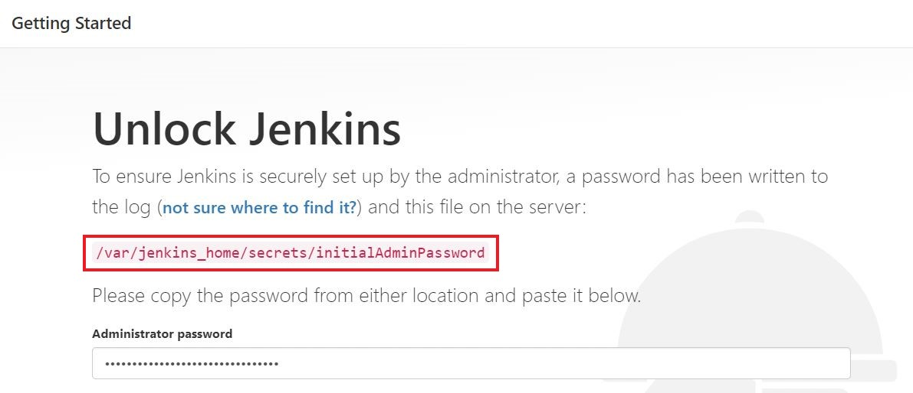

  - 초기 접속 비밀번호는 docker 컨테이너로 떠있는 jenkins의 **특정파일**안에 존재 (위 경로에 위치)
  - 실행 후 나온 패스워드를 복사해서 입력한 후 Continue 버튼 클릭

  ```bash
  # docker exec : 컨테이너로 접속
  $ sudo docker exec jenkins cat /var/jenkins_home/secrets/initialAdminPassword
  ```

- `Intall suggested plugins` 눌러 추천 플러그인 설치

- 사용자 계정 생성 & 로그인

  - 계정은 반드시 생성해야 한다. 후에 재접속 시 필요함!

  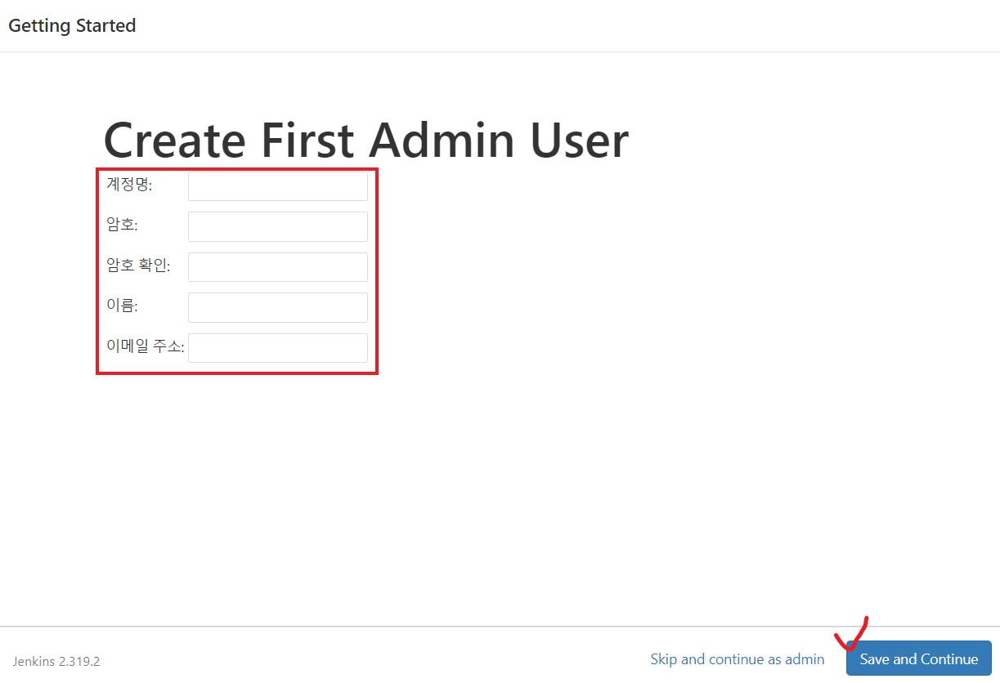

- Jenkins 플러그인 **추가** 설치

  - `Dashboard > Jenkins 관리 > 플러그인 관리` 클릭
  - `NodeJS`, `Blue Ocean`, `Gitlab` 관련된 것 모두 설치

- **Gitlab Token** 발급 받기

  - `Gitlab → Access Token`에서 발급받고 기억할 수 있는 장소에 저장한다.

    ```
    Name : access_token
    Scope : api 선택
    ```

- Jenkins에서 사용하게 될 타 어플리케이션(`jdk`, `git`, `nodeJS`)에 대한 설정하기

  - `Dashboard > Jenkins 관리 > Global Tool Configuration` 클릭

  - **JDK** 환경변수 설정하기

    > [참고] Docker 안에 있는 **java 11의 위치** 알기
    >
    > ```bash
    > # docker container 내부로 직접 접속하기
    > docker exec -it {container_id} /bin/bash
    > 
    > # java 위치 확인
    > whereis java
    > 
    > exit
    > ```

    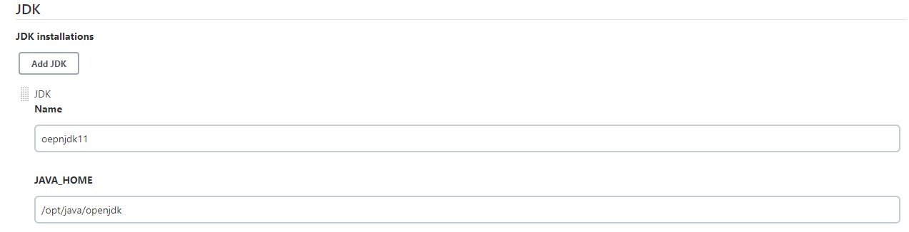

  - **NodeJS** 등록

    - FrontEnd의 Vue에서 사용하는 버전과 일치

      ```bash
      # nodeJS 버전 알기
      node -v
      
      # npm 버전 알기
      npm -v
      ```

  - `Dashboard > Jenkins 관리 > 시스템 설정` 클릭

  - **GitLab**과 연동

    - Connection name, host URL 적절히 작성
    - Credentials가 **none** 이라면 `Add > Jenkins` 클릭

    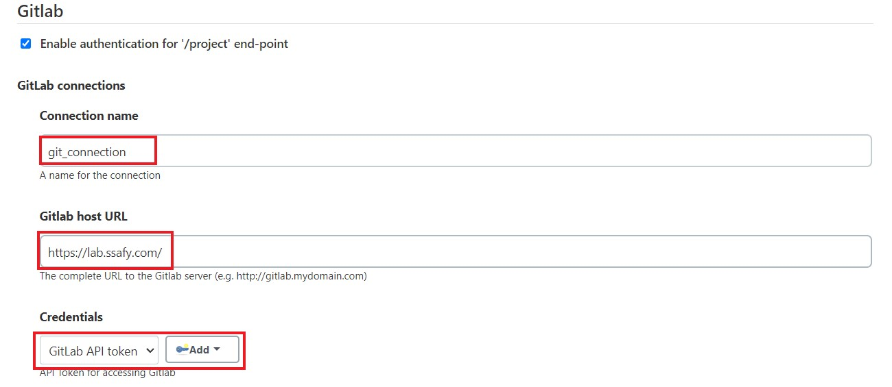

    - 아래 사진과 같이 발급받은 `API token`을 넣어준다.
    - `Test Connection` 클릭 후 **Success** 뜨면 성공

  - 저장한다.


## 3. Dockerize Project

[Dockerize Project](Dockerize-Project.md)를 참고하여 Frontend와 Backend 프로젝트 각각의 Dockerfile를 작성한다.

> 사용하는 port번호는 UFW가 허용되어 있어야 한다!

### 1) FrontEnd Dockerfile 작성

- FrontEnd 프로젝트 폴더 아래에 nginx 폴더를 만들고, 설정파일 `nginx.conf`를 작성한다. 

  - `jenkins-test/front/nginx/nginx.conf`

  > nginx는 vue 배포시 사용할 엔진

  ```nginx
  server {
    listen 80;
    client_max_body_size 5M;
  
    location / {
      alias /usr/share/nginx/html/;
      try_files $uri $uri/ /index.html;
    }
  }
  ```

- FrontEnd 프로젝트 폴더 아래에 **Dockerfile** 생성

  - `jenkins-test/front/Dockerfile`

  ```dockerfile
  FROM node:lts-alpine as build-stage
  WORKDIR /app
  COPY package*.json ./
  
  RUN npm install
  COPY . .
  RUN npm run build
  
  # production stage
  FROM nginx:stable-alpine as production-stage
  COPY  ./nginx/nginx.conf /etc/nginx/conf.d/default.conf
  
  COPY --from=build-stage /app/dist usr/share/nginx/html
  EXPOSE 80
  CMD ["nginx", "-g", "daemon off;"]
  ```

### 2) BackEnd Dockerfile 작성

- BackEnd 프로젝트 폴더 아래에 **Dockerfile** 생성

  - `jenkins-test/pet/Dockerfile`

  ```dockerfile
  # JDK11 기반으로 도커 이미지 생성
  FROM openjdk:11-jdk
  
  ARG JAR_FILE=./build/libs/pet-0.0.1-SNAPSHOT.jar
  COPY ${JAR_FILE} app.jar
  
  # ./gradlew clean build 실행
  CMD ["./gradlew", "clean", "build"]
  
  ENTRYPOINT ["java","-jar","/app.jar"]
  
  # 8080 포트 사용
  EXPOSE 8080
  ```

### 3) docker-compose 작성

- 프로젝트 root로 이동한 후 `docker-compse.yml`작성

  - `jenkins-test/docker-compose.yml`

  ```yml
  version: "3" # 파일 규격 버전
  services: # 이 항목 밑에 실행하려는 컨테이너 들을 정의
    frontend:
      container_name: front
      build:
        context: ./front
        dockerfile: Dockerfile
      ports:
        - "80:80"
      depends_on:
        - database
    
    database: # mysql 서비스명
      image: mysql:8.0.28 # 사용할 이미지
      container_name: mysql # 컨테이너 이름 설정
      environment: # -e 옵션
        MYSQL_DATABASE: petsns  # petsns란 이름의 DB 생성
        MYSQL_ROOT_PASSWORD: pet&meb106  # root 패스워드 설정 옵션
        TZ: Asia/Seoul
      command: # 명령어 실행
        - --character-set-server=utf8mb4
        - --collation-server=utf8mb4_unicode_ci
      ports:
        - "3306:3306" # 접근 포트 설정 (컨테이너 외부:컨테이너 내부)
        
    backend:
      container_name: back
      build: 
        context: ./pet
        dockerfile: Dockerfile
      depends_on:
        - database
      ports:
        - "8080:8080"
  ```

## 4. DB 설정하기

### 1) spring-boot에서 **application.properties **작성

```properties
spring.datasource.driverClassName=com.mysql.cj.jdbc.Driver
spring.datasource.url=jdbc:mysql://database:3306/petsns?serverTimezone=UTC&useUniCode=yes&characterEncoding=UTF-8&allowMultiQueries=true&validationQuery="select 1"
spring.datasource.username=root
spring.datasource.password=pet&meb106
```

> `database:3306` 부분을 주의해야한다.<br/>보통 이 부분에 localhost나 ip를 적지만, docker를 사용할 경우 **mysql 서비스 명**을 적어준다.

### 2) MySql Workbench에 연결하기

- MySQL WorkBench 접속해서 MySQL Connections 옆의 `+` 버튼 클릭

  - `Connection Name`: 사용자 계정명 입력
  - `Hostname`:  EC2 세부정보의 퍼블릭 IPv4 주소 입력
  - `Username`: 추가한 사용자 계정 입력

  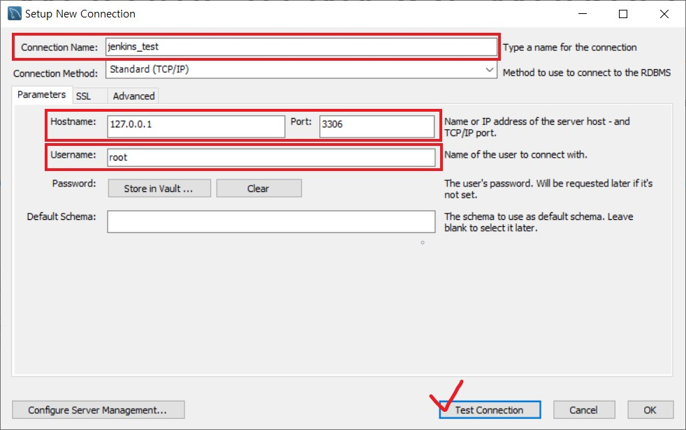

- `Test Connection` 을 눌러서 연결됐는지 확인하고 OK 클릭

- `docker-compse.yml`에서 작성한 `petsns` DB가 잘 생성되었는지 확인

  

## 5. Freestyle project로 간단히 배포하기

> jenkins로 돌아와서..

### 1) Freestyle project 생성

- Freestyle project 생성하기

  - `Dashboard > 새로운 Item > Freestyle project` 클릭

  > [참고] item 설명
  >
  > - Freestyle project : 자신이 원하는 형태 및 스크립트로 빌드 진행
  > - Pipeline : Jenkins Script를 직접 작성하거나 Jenkinsfile을 선택하여 빌드 진행

  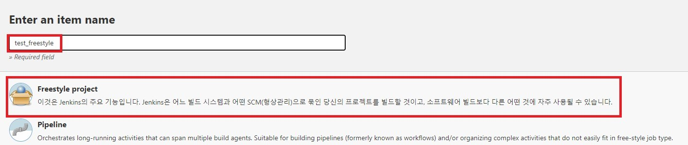

  - **소스 코드 관리**에서 git 선택
    
    - `Repository URL`에 gitLab 저장소 주소 적고, **Credentials**를 설정하기 위해 `Add` 버튼 클릭
    
    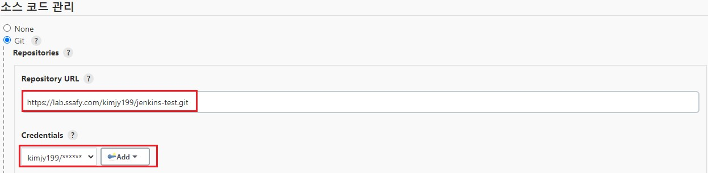
    
    - Gitlab의 유저 정보를 입력한다.
    
    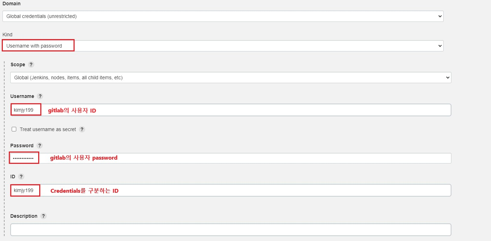
    
  - **Secret Token** 생성하기
    
    - `Build Trigger(or 빌드 유발) > Build when a change is pushed to GitLab.` 선택
    
    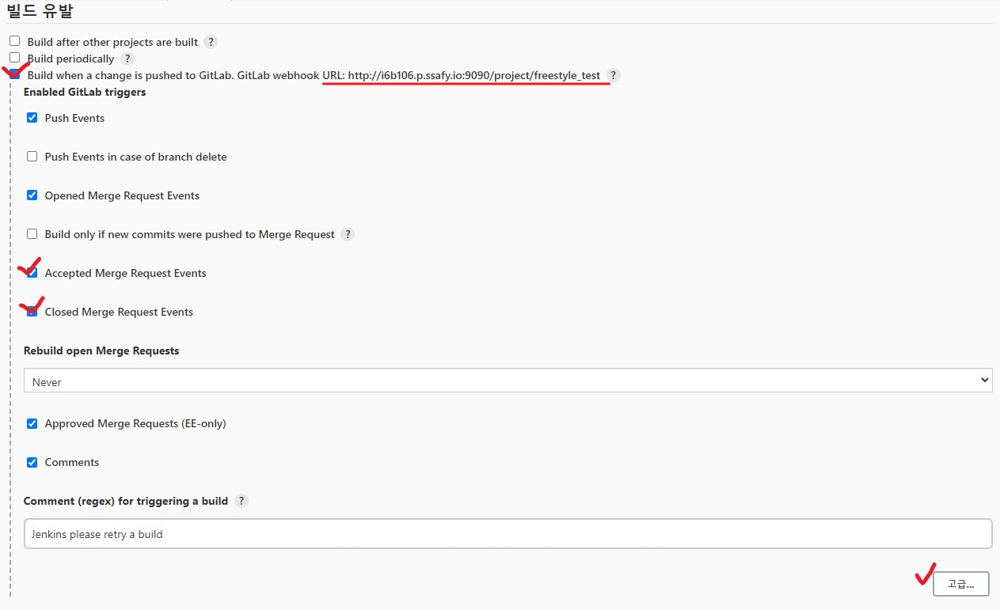
    
  - `고급 버튼 > Secret token의 Generate` 클릭 후 Secret Token생성

  - Secret Token를 저장한다

- **Gitlab Trigger** 생성

  - `Settings > Webhooks`에서 발급받은 Secret Toekn 입력
  - URL에 Jenkins 작업 item URL 입력

  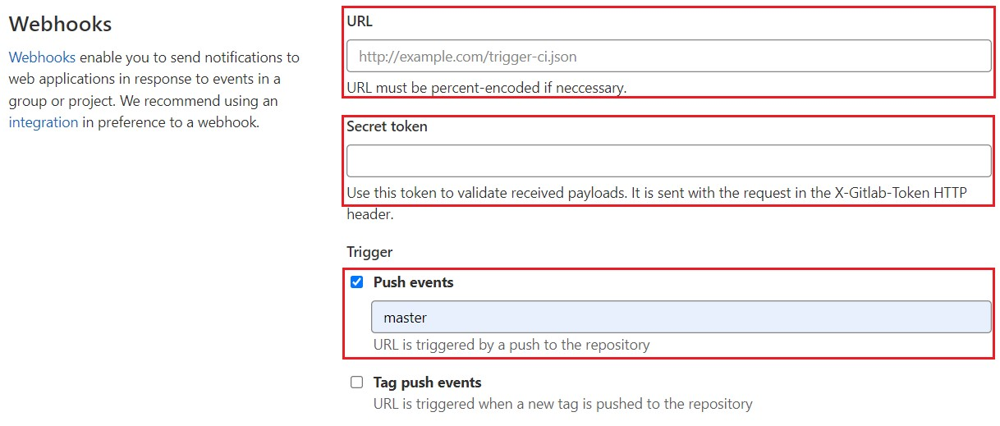

- 위 설정을 모두 마친 뒤 `Add Webhook`을 누르면 **Project Hooks**가 추가된다. 

  - `Test > Push events`를 눌러 잘 연결되었는지 확인한다.
  - 상단에 `Http 200`이 나오면 성공

  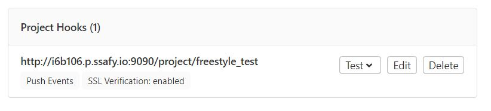

  > [참고] `Url is blocked: Requests to localhost are not allowed` 라는 오류가 발생한다면 **localhost**라서 보안상 거부가 된 것
  >
  > - admin 계정으로 접근 가능한 경우
  >   - Outbound requests 설정해준다.
  >   - 관련 공식문서 참고 : https://docs.gitlab.com/ee/security/webhooks.html
  > - admin 계정으로 접근 불가능한 경우
  >   - 윈도우라면 Linux나 macOS 명령어 사용할 수 있도록 해주는 패키지 관리자 `choco` 설치 ([참고](https://evandde.github.io/chocolatey/))
  >   - `ngrok`를 [다운](https://ngrok.com/download)받은 후 `ngrok http 9090` 실행
  >   - Forwarding 주소로 Webhook 걸기

### 2) Freestyle project 실행

- `Build > Add build step > Execute shell` 선택하고 **실행 명령어** 작성

  - `Build`란 코드를 어떻게 Build할 것인지 순서와 명령어를 입력한다.

    ```shell
    # 젠킨스가 잘 돌아가는지 확인용
    ls -al
    
    # BackEnd 프로젝트가 잘 Build되는지 확인
    cd pet
    chmod +x gradlew	# 권한 주기
    ./gradlew clean build
    
    # 프로젝트를 한번에 Build 하기위해서 docker-compose 실행
    docker-compose up --build -d
    ```

    > `bash: ./gradlew: Permission denied`와 같은 **Permission denied(권한거부)**가 발생하면 `chmod +x gradlew` 를 통해 권한을 주면 된다.

- `빌드 후 조치 > 빌드 후 조치 추가 > Publish build status to GitLab`으로 설정

  - `빌드 후 조치`란 빌드가 완료됐을 때 어떻게 할 것인가를 지정한다. 
  - Jenkins Build가 성공한다면 다음과 같이 Gitlab에 표시가 나타나게 된다.

  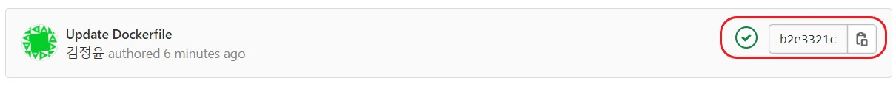

- 저장을 한 후 `Build Now`를 눌러 실행

- 실행이 완료되면 **이미지와 컨테이너**가 생성되었는지 확인 및 **웹 브라우저** 접속

  - `http://${ec2-public-dns}:80`
  
  ```shell
  # 이미지와 컨테이너 확인
  $ docker images
  $ docker ps
  ```

## 참고

- choco 설치 : https://evandde.github.io/chocolatey/
- ngrok 설치 : https://ngrok.com/download
- webhook 공식문서 : https://docs.gitlab.com/ee/security/webhooks.html
- Backend Dockerfile참고: https://skyblue300a.tistory.com/14

- Frontend Dockerfile 참고: [https://velog.io/@ba93love/Vue.js를-docker로-구축하기](https://velog.io/@ba93love/Vue.js%EB%A5%BC-docker%EB%A1%9C-%EA%B5%AC%EC%B6%95%ED%95%98%EA%B8%B0)

- springboot와 mysql 연결 참고 : [https://joont92.github.io/docker/docker-compose로-nginx-spring-boot-mysql-구성하기/](https://joont92.github.io/docker/docker-compose%EB%A1%9C-nginx-spring-boot-mysql-%EA%B5%AC%EC%84%B1%ED%95%98%EA%B8%B0/)
