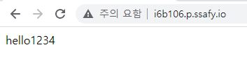

# Docker를 활용한 Jenkins CI/CD

## 목차

1. [Docker 설치](#1.-Docker-설치)
2. [Nginx 컨테이너 설치](#2.-Nginx-컨테이너-설치)
3. [Jenkins 컨테이너 설치 및 설정](#3.-Jenkins-컨테이너-설치-및-설정)

------

## 1. Docker 설치

- [Docker Install](Docker Install.md) 를 참고하여 도커 설치한다.

## 2. Nginx 컨테이너 설치

- 배포될 폴더 dist 생성

  ```bash
  mkdir dist
  ```

- Docker에 Nginx Container 설치

  ```bash
  # nginx image가 없으면 자동으로 설치됨
  docker run --name nginx -d -p 80:80 -v /dist:/usr/share/nginx/html:ro nginx
  ```

- 잘 설치되었는지 확인

  ```bash
  docker images
  docker ps
  ```

- dist 폴더에 index.html 파일 생성해 잘 작동하는지 확인

  > 바로 웹페이지를 들어가면 `403 Forbidden` 에러를 확인할 수 있는데, 이것은 마운트한 폴더에 아무런 웹 페이지가 없어서 나오는 에러이다.

  ```bash
  # root 계정으로 전환
  $ sudo su
  
  # 마운트한 경로(/dist)에 index.html 페이지 생성 
  $ touch /dist/index.html 
  
  # hello1234라는 내용 넣기
  $ echo hello1234 > /dist/index.html
  ```

  

## 3. MySQL 컨테이너 설치

- MySQL 설치

  ```bash
  docker pull mysql
  docker run --name mysql -p 3306:3306 -e MYSQL_ROOT_PASSWORD="pet&meb106" -e MYSQL_DATABASE=petsns -d mysql --character-set-server=utf8mb4 --collation-server=utf8mb4_unicode_ci
  ```

- 확인

  ```bash
  docker images
  docker ps
  ```

## 3. Jenkins 컨테이너 설치 및 설정

> Jenkins 설치 시 `jdk`, `git`, `gradle`이 필요하다. 
>
> 그러나 `gradle`은 spring boot를 통해 build되는 프로젝트에서 포함하고 있는 `내장 gradle`을 사용할 예정이므로 별도 설치 안한다.

### 1) Jenkins 설치

- Docker로 **java 11**버전인 Jenkins Image 받기

  ```bash
  # spring boot의 java 버전과 맞춘다.
  docker pull jenkins/jenkins:jdk11
  docker images
  ```

- Docker Container로 띄우기

  ```bash
  # docker 컨테이너로 등록 후 실행
  docker run --name jenkins -d -p 9090:8080 -p 50000:50000 -v ./dist:/var/jenkins_home -u root jenkins/jenkins:jdk11
  ```

  > `--name` : 컨테이너 이름 설정<br/>`-d` : detached mode 흔히 말하는 백그라운드 모드 <br/>`-p` : 호스트(앞)와 컨테이너(뒤)의 포트를 연결 (포트포워딩) 로컬 PORT: 컨테이너 PORT<br/>`-v` : 호스트(앞)와 컨테이너(뒤)의 디렉토리를 연결 (마운트) <br/>`-u` :실행할 사용자 지정

  > [참고] AWS EC2의 경우 **방화벽**으로 인해  IP주소로 접속했는데도 **사이트에 연결할 수 없음** 이 나올 수 있다.
  >
  > ```bash
  > # 인바운드 허용
  > ufw allow 9090
  > ```

- 정상적으로 실행중인지 확인

  ```bash
  docker ps
  #docker ps -a : 모든 컨테이너 조회
  ```

### 2) Jenkins 설정

- `http://${ec2-public-dns}:9090`으로 Jenkins 접속

  

  - 초기 접속 비밀번호는 docker 컨테이너로 떠있는 jenkins의 **특정파일**안에 존재 (위 경로에 위치)
  - 실행 후 나온 패스워드를 복사해서 입력한 후 Continue 버튼 클릭

  ```bash
  # docker exec : 컨테이너로 접속
  $ sudo docker exec jenkins cat /var/jenkins_home/secrets/initialAdminPassword
  ```

- `Intall suggested plugins` 눌러 추천 플러그인 설치

- 사용자 계정 생성 & 로그인

  

- Jenkins 플러그인 추가 설치

  - `Dashboard > Jenkins 관리 > 플러그인 관리` 클릭
  - `NodeJS`, `Blue Ocean`, `Gitlab` 관련된 것 모두 설치

- **Gitlab Token** 발급 받기

  - `Gitlab → Access Token`에서 발급받고 기억할 수 있는 장소에 저장한다.
  - Name : Access Token 으로 한다.<br/>Scope : api 선택

- Jenkins에서 사용하게 될 타 어플리케이션(`jdk`, `git`, `nodeJS`)에 대한 설정하기

  - `Dashboard > Jenkins 관리 > Global Tool Configuration` 클릭

  - **JDK** 환경변수 설정하기

    > [참고] Docker 안에 있는 **java 11의 위치** 알기
    >
    > ```bash
    > # docker container 내부로 직접 접속하기
    > docker exec -it {container_id} /bin/bash
    > 
    > # java 위치 확인
    > whereis java
    > 
    > exit
    > ```

    

  - **NodeJS** 등록
    - FrontEnd의 Vue 버전과 일치

  - `Dashboard > Jenkins 관리 > 시스템 설정` 클릭

  - **GitLab**과 연동

    - Connection name, host URL 적절히 작성
    - Credentials가 **none** 이라면 `Add > Jenkins` 클릭

    

    - 아래 사진과 같이 발급받은 `API token`을 넣어준다.
    - `Test Connection` 클릭 후 Success 뜨면 성공

  - 저장한다.

## 4. Pipeline 설정 및 배포

### 1) Pipeline 생성

- Pipeline 생성하기

  - `Dashboard > 새로운 Item > Pipeline` 클릭
    - item name : pipeline_test 으로 작성

  - **Secret Token** 생성하기
    - `Build Trigger > Build when a change is pushed to GitLab.` 선택
  - `고급 버튼 > Secret token의 Generate` 클릭 후 Secret Token생성
  - 저장한다

- Gitlab Trigger 생성

  - `Settings > Webhooks`에서 발급받은 Secret Toekn 입력
  - URL에 Jenkins 작업 item URL 입력

  > [참고] `Url is blocked: Requests to localhost are not allowed` 라는 오류가 발생한다면 **localhost**라서 보안상 거부가 된 것
  >
  > - admin 계정으로 접근 가능한 경우
  >   - Outbound requests 설정해준다.
  >   - 관련 공식문서 참고 : https://docs.gitlab.com/ee/security/webhooks.html
  > - admin 계정으로 접근 불가능한 경우
  >   - 윈도우라면 Linux나 macOS 명령어 사용할 수 있도록 해주는 패키지 관리자 `choco` 설치 ([참고](https://evandde.github.io/chocolatey/))
  >   - `ngrok`를 [다운](https://ngrok.com/download)받은 후 `ngrok http 9090` 실행
  >   - Forwarding 주소로 Webhook 걸기

### 2) Pipeline 작성

- `Dashboard > pipeline_test > 구성 > Pipeline` 클릭

- `Definition > Pipeline script` 선택하고 아래 내용을 작성한다

  - JenkinsFile

    ```sh
    pipeline {
        agent any
    
        stages {
            stage('Hello') {
                steps {
                    echo 'Hello World'
                }
            }
        }
    }
    ```

- 저장한 다음 `Build Now` 클릭
- 빌드 성공

### 3) 배포

- JenkinsFile

## 5. 프로젝트 실행

- pipeline_test의 빌드 완료된 dist 파일을 `/var/jenkins_home/dist`로 이동시켜주면 자동배포가 완료된다.

## 참고

- choco 설치 : https://evandde.github.io/chocolatey/
- ngrok 설치 : https://ngrok.com/download
- webhook 공식문서 : https://docs.gitlab.com/ee/security/webhooks.html
- 
