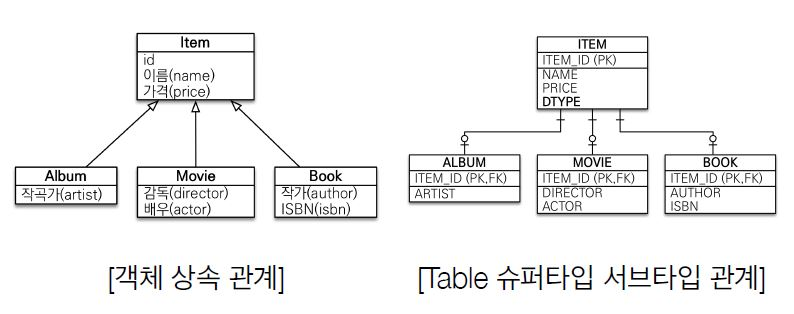
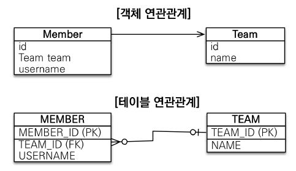
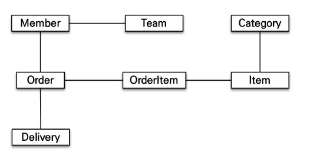

# JPA 소개 및 시작하기

## SQL 중심적인 개발의 문제점

- 현대는 **객체**를 **애플리케이션 객체 지향 언어(Java, Scala..)**와 **관계형 DB(Oracle, MySQL..)**를 주로 사용하여 관리한다.
- 그러나 **SQL 중심적 개발**에는 많은 **문제점**이 존재한다.

### 무한 반복과 지루한 코드

- 객체별 CRUD를 매번 작성해줘야 함

  - User 객체를 만들면 해당하는 CRUD 쿼리문 작성하기

  ```java
    public class User {
        private String userId;
        private String name;
        ...
    }
  ```

  ```mysql
  INSERT INTO USER(userId, name) VALUES (...);
  SELECT userId, name FROM USER;
  ```


- 객체가 수정되면 SQL문도 수정해야 한다! (귀찮음;;)

  User 객체에 `private String tel`를 추가하면, 쿼리문에도 `tel` 필드 넣어줘야 한다. **필요한 부분에 일일이 다 찾아서!**😱

> 즉, **SQL에 의존적인 개발을 피하기 어렵다**

### ★패러다임의 불일치: 객체지향 vs 관계형 DB(=RDB) 사상의 충돌

- 객체 지향: **추상화, 캡슐화, 정보은닉, 상속, 다형성**을 제공해서 **시스템 복잡성 제어**하는 것이 목표

- 관계형 DB: 데이터를 **정규화하여 보관**하는 것이 목표

> 쉽게 말하면, **어떻게 추상화하고 관리할까  vs 어떻게 잘 저장할까**

- 객체를 영구 보관하는 저장소로는 RDB, NoSQL, File 등이 있어 굳이 RDB를 사용하지 않아도 되지만, **현실적**으로 생각했을 때는 **RDB가 가장 적절**하다.<br/>왜냐하면 File의 경우 data를 검색하기 어렵고, NoSQL은 많이 사용되지 않기 때문이다.

- 결국 객체를 관계형 DB에 저장해야 하는데, 문제는 저장하려면 **객체를 SQL로 다 바꿔주야 한다!**<br/> `객체 -> [SQL 변환] -> RDB 저장` 이것이 바로 개발자의 역할.. 

  > 개발자 is SQL 매퍼 😂

### 객체(Object)와 관계형 데이터베이스(RDB)의 차이

- 상속

  

  -  **객체** : 상속 관계가 있다.
  -  **RDB** : 상속 관계가 없다.

  객체의 상속 관계와 유사한 물리 모델로, Table 슈퍼타입-서브타입 관계가 관계가 존재한다.

- Album 객체를 DB에 **저장**하는 과정
  - 객체 분해 (Album은 Item을 상속받음)
  
  - 각각 다른 테이블에 대한 INSERT 쿼리를 2개 만든다.
  
    ```mysql
    -- 테이블이 2개로 쪼개졌기 때문!
    INSERT INTO ITEM ...
    INSERT INTO ALBUM ...
    ```
  
- Album를 **조회**하는 과정
  
  - 각각의 테이블에 따른 Join SQL을 작성한다. (Item과 Album을 Join해서 데이터를 가져옴)
  - 각각의 객체를 생성하고 모든 필드 값을 세팅한다.(Item과 Album 각각 모든 필드값을 세팅)
  - Movie, Book을 조회하고 싶으면 위의 과정 반복한다.
  
  > 조회할 때마다 엄청 번잡해진다!!
  >
  > **그래서 DB에 저장할 객체에는 상속 관계를 안쓴다.** 그냥 item DTO 하나에 Album, Movie, Book 다 넣어서 사용한다.
  
- 자바 컬렉션에서 저장 및 조회하면? 
  
  - `list`를 이용하면 끝!
  
    ```java
    // 저장
    list.add(album);
    // 조회
    Album album = list.get(albumId); 
    // 다형성 활용: 심지어 객체여서 필요하면 부모 타입으로 조회 후 다형성 활용이 가능함
    Item item = list.get(albumId); 
    ```
  
  - 자바 컬렉션을 사용하면 문제가 **굉장히 심플**한 작업이 관계형 DB에 넣고 빼는 순간, 중간중간에 SQL 매핑 작업을 개발자가 다 해줘야 해서 굉장히 번잡하다!
  
- 연관관계
  
  
  
  - 객체
    - 참조를 사용하여 연관 관계를 찾음. <br/>ex) `member.getTeam()`
    - `team.getMember()`와 같이 Team에서 Member로 접근할 수 없다. (**단방향 관계**)
  - 테이블
    - 외래 키(FK)를 사용하여 연관 관계를 찾음 <br/>ex) `JOIN ON m.team_Id = t.team_Id`
    - Member에서 Team 정보를, Team에서 Member 정보를 조회할 수 있다. (**양방향 관계**)

- 데이터 타입
- 데이터 식별 방법

### 모델링 과정에서의 문제

- 객체를 테이블에 맞추어 모델링

  ```java
  class Member {
      String id; // MEMBER_ID 칼럼사용
      Long teamId;  // TEAM_ID PK 칼럼사용
      String username; //USERNAME 칼럼사용
  }
  
  class Team {
      Loing id; //TEAM_ID PK 사용
      String name; //NAME 칼럼사용
  }
  ```

  Member 클래스에 객체 Team team을 넣는 게 아니라, DB에서 썼던 것 처럼 teamId 외래 키를 그대로 넣는다.

  그러나.. 뭔가 객체 지향적이지 못한 것 같다. 객체의 참조값 자체가 필드에 들어가는 것이 더 객체지향스럽다고 할 수 있지 않을까?

- 객체다운 모델링

  ```java
  class Member {
      String id; // MEMBER_ID 칼럼사용
      Team team; // 참조로 연관관계를 맺는다.
      String username; //USERNAME 칼럼사용
      
      Team getTeam(){ return team; }
  }
  
  class Team {
      Loing id; //TEAM_ID PK 사용
      String name; //NAME 칼럼사용
  }
  ```

  - Team 객체의 참조값 자체를 Member에 넣는다.

  - 이렇게 설계된 객체를 DB에 **저장하려면** `TEAM_ID`에 바로 넣을 수가 없기 때문에 `member.getTeam().getId()` 로 값을 얻어와서 `TEAM_ID`에 넣는다.

    ```mysql
    INSERT INTO MEMBER(MEMBER_ID, TEAM_ID, USERNAME) VALUES ...
    ```

  - 그러나 가장 큰 문제는 **조회**

    - Member 객체를 **조회하려면** 다음과 같이 번거로워진다.

      ```mysql
      SELECT M.*, T.* 
      FROM MEMBER M 
      JOIN TEAM T ON M.TEAM_ID = T.TEAM_ID
      ```

      ```java
      public Member find(String memberId){ 
          //SQL실행 ... 
          Member member = new Member(); //데이터베이스에서 조회환 회원 관련 정보를 모두 입력 
          Team team = new Team(); //데이터베이스에서 조회한 팀 관련 정보를 모두 입력 
          
          //회원과 팀 연관 관계 직접 설정 
          member.setTeam(team);
          return member; 
      }
      ```

    **즉, 생산성이 안나온다!!**

> 이러한 문제 때문에 **쿼리문을 좀 더 쉽게 짜고 생산성을 높이기 위해서** `teamId`를 Member 객체에 넣는 **첫 번째 방식으로 작성**한다.

- 객체 컬렉션에서 다뤘다면 어땠을까?

  - 아래와 같이 list에 Team 객체를 가진 Member 객체를 그대로 저장할 수 있다.
  - TeamId가 필요하면 `getTeam().getId()`로 그대로 값을 가져올 수 있음

  ```java
  list.add(member); 
  Member member = list.get(memberId);
  Team team = member.getTeam();
  ```

  > 그러나 패러다임이 다른 관계로(RDB) 코드가 부득이하게 길어졌다.

### 객체 그래프 탐색에서의 문제




- 객체는 자유롭게 객체 그래프(연관 관계가 있는 객체 사이)를 탐색할 수 있어야 한다.
  - `meber.getTeam()`, `member.getOrder().getDelivery()` 등 ...

- 하지만, 실제로는 서비스 로직에서 **RDB와 연결된 데이터를 탐색**할 때 객체 그래프를 탐색할 수 없다!

  - 왜냐하면 **처음 실행하는 SQL에 따라 탐색 범위가 결정**되기 때문이다!

    ```mysql
    SELECT M.*, T.*
    FROM MEMBER M
    JOIN TEAM T ON M.TEAM_ID = T.TEAM_ID;
    ```

    ```java
    // SQL에서 Member와 Team을 가져왔다면, Order를 가져오지 않았기 때문에 getOrder()는 null이 된다.
    member.getTeam(); // OK
    member.getOrder(); // null
    ```

- **엔티티 신뢰 문제**도 발생한다.

  - 다른 사람이 만약 아래와 같이 코드를 작성해왔다면 과연 우리는 신뢰할 수 있을까? <br/> `memberDAO.find()`의 로직이 어떻게 되어 있는지 다 확인해봐야 사용할 수 있다. <br/>그냥 사용하다 nullPointException이 터지면.. 그냥 장애가 발생한다

    ```java
    class MemberService{ 
        ... 
        public void process(String id) { 
            Member member = memberDAO.find(id); 
            member.getTeam(); // ???
            member.getOrder().getDelivery(); // ??? 
        } 
    }
    ```

- 그렇다고 **모든 객체를 미리 로딩할 수는 없다.**
  
  - 상황에 따라서 필요한 모든 쿼리문을 생성해 놓아야 한다!!
  - EX) 회원 조회 메서드 관련 쿼리문 - `memberDAO.getMember()`, `memberDao.getMemeberWithTeam()`, `member.getMemeberWithOrderWithDelivery()` 등

> 물리적으로는 쪼개져 있지만 논리적으로는 엮어있기 때문에 계층형 아키텍처는 진정한 의미의 계층 분할이 어렵다.

### 비교하기에서의 차이

- 일반적인 SQL을 사용하는 경우

  - 식별자가 같아도 각각에 대해 **쿼리를 2번 던져서** 값을 가져오고 **객체를 따로 생성** 하여 셋팅했기 때문이다.

  ```java
  String memberId = "100"; 
  Member member1 = memberDAO.getMember(memberId); 
  Member member2 = memberDAO.getMember(memberId);
  
  member1 == member2; // 다르다!!! (서로 다른 객체)
  
  class MemberDAO { 
      public Member getMember(String memberId) { 
          String sql = "SELECT * FROM MEMBER WHERE MEMBER_ID = ?"; 
          ... 
          // JDBC API, SQL 실행 
          return new Member(...); 
      }
  }
  ```

- 자바 컬럭션에서 조회하는 경우

  - 식별자가 같을 때 컬렉션에서의 두 객체의 참조값은 같기 때문에 두 객체는 같다.

  ```java
  String memberId = "100";
  Member member1 = list.get(memberId);
  Member member2 = list.get(memberId);
  member1 == member2; // 같다!!! (참조값이 같다.)
  ```


> 객체답게 모델링 할수록 매핑 작업만 늘어난다.<br/>객체를 자바 컬렉션에 저장 하듯이 DB에 저장할 수는 없을까?
>
>  => 바로 **JPA(Java Persistence API)**의 등장

## JPA 소개

- Java Persistence API
- 자바 진영의 ORM 기술 표준
- JPA는 애플리케이션과 JDBC 사이에서 동작

## Hello JPA - 프로젝트 생성


## Hello JPA - 애플리케이션 개발
