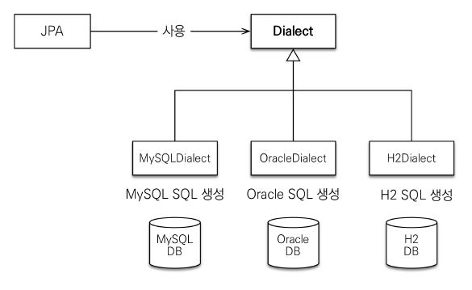
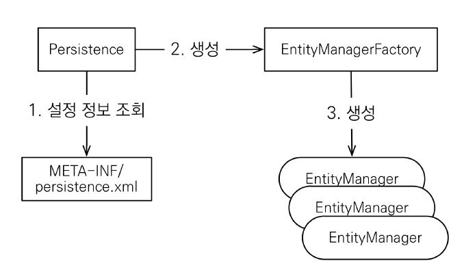

# Chapter02. JPA 시작하기

## *Contents*
- Hello JPA - 프로젝트 생성
- Hello JPA - 애플리케이션 개발

[실습한 프로젝트 바로가기](https://github.com/KJY97/JPA-Study/tree/main/ex1-hello-jpa)

<hr>

## Hello JPA - 프로젝트 생성

### pom.xml
- JPA hibernate-entitymanager는 JPA와 연관된 라이브러리(core, javax.persistence-api 등)를 모두 포함한다.

- H2는 실습용으로 최고의 DB (가벼움)
  - 라이브러리 설치 시 로컬에 설치된 H2 버전과 맞춘다.

```xml
<dependencies>
    <!-- JPA 하이버네이트 -->
    <dependency>
        <groupId>org.hibernate</groupId>
        <artifactId>hibernate-entitymanager</artifactId>
        <version>5.3.10.Final</version>
    </dependency>

    <!-- H2 데이터베이스 -->
    <dependency>
        <groupId>com.h2database</groupId>
        <artifactId>h2</artifactId>
        <version>1.4.200</version>
    </dependency>
</dependencies>
```

### 객체와 테이블 매핑하기

- **실습을 위한 DB 테이블**
  ```SQL
  create table Member (
    id bigint not null,
    name varchar(255),
    primary key (id)
  );
  ```

- **Member.java**

  - `@Entity` <br/>
     : JPA가 관리할 객체<br/>
     : 반드시 넣어줘야 한다! 그래야 처음 JPA가 처음 로딩할 때 인식할 수있다.
     
  - `@Id` <br/>
     : 데이터베이스 PK와 매핑

  - `@Table(name = "USER")` <br/>
     : 만약 DB의 Member 테이블이 다른 이름(ex.User)인 경우에 사용한다.
  
  - `@Column(name = "username")` <br/>
     : DB의 name 컬럼 이름이 다른 이름(ex.username)인 경우에 사용한다.

  > JPA는 매핑정보를 보고 알아서 DB에 넣기 때문에 DB와 이름이 다르다면 `@Table` 혹은 `@Column`으로 지정해줘야 한다.

  ```Java
  @Entity
  // @Table(name = "USER")
  public class Member {

    @Id 
    private Long id;
    // @Column(name = "username")
    private String name;
    ...
  }
    ```

### persistence.xml 

- JPA 설정 시 **반드시 필요한** 파일!
- DB에 접근하기 위한 접근정보 파일
- `/META-INF/persistence.xml`에 위치한다.

> `javax.persistence` : JPA 표준 속성 <br/>
> `hibernamte` : 하이버네이트 전용 속성

```xml
<?xml version="1.0" encoding="UTF-8"?>
<persistence version="2.2"
             xmlns="http://xmlns.jcp.org/xml/ns/persistence" xmlns:xsi="http://www.w3.org/2001/XMLSchema-instance"
             xsi:schemaLocation="http://xmlns.jcp.org/xml/ns/persistence http://xmlns.jcp.org/xml/ns/persistence/persistence_2_2.xsd">

    <persistence-unit name="hello"> <!-- name을 잘 기억하자! -->
        <properties>
            <!-- 필수 속성 -->
            <property name="javax.persistence.jdbc.driver" value="org.h2.Driver"/>
            <property name="javax.persistence.jdbc.user" value="sa"/>
            <property name="javax.persistence.jdbc.password" value=""/>
            <property name="javax.persistence.jdbc.url" value="jdbc:h2:tcp://localhost/~/test"/>
            <!-- 방언 설정 -->
            <property name="hibernate.dialect" value="org.hibernate.dialect.H2Dialect"/>

            <!-- 옵션 -->
            <property name="hibernate.show_sql" value="true"/>
            <property name="hibernate.format_sql" value="true"/>
            <property name="hibernate.use_sql_comments" value="true"/>
            <!--데이터베이스 스키마 자동 생성하기-->
            <!--<property name="hibernate.hbm2ddl.auto" value="create" />-->

            <!--
            show_sql: 쿼리가 그냥 보이는 것
            format_sql: 쿼리를 예쁘게 포맷팅해주는 것
            use_sql_comments: /*~*/ 부분을 의미
            -->
        </properties>
    </persistence-unit>
</persistence>
```

### 데이터베이스 방언

> dialect(방언) : SQL 표준을 지키지 않는 특정 DB만의 고유한 기능

- JPA는 특정 데이터베이스에 종속하지 않는다.
- 그러나 각각의 데이터베이스가 제공하는 SQL 문법과 함수는 조금씩 다르다.
  - 가변 문자 : `MYSQL-VARCHAR` vs `Oracle-VARCHAR2`
  - 페이징 :  `MYSQL-LIMIT` vs `Oracle-ROWNUM`
  - 문자열 자르기 : `SQL-SUBSTRING()` vs `Oracle-SUBSTR()`



- hibernate.dialect 속성을 지정해서 이러한 문제들을 해결!
  - 하이버네이트는 **40가지 이상**의 데이터베이스 방언 지원
  ```XML
  <property name="hibernate.dialect" value="org.hibernate.dialect.H2Dialect"/>
  ```

## Hello JPA - 애플리케이션 개발

### JPA 구동 방식

- `persistence`를 읽어 `EntityManagerFacory`를 만들어서 거기서 `Entity Manager`를 무수히 생성하여 관리한다.



### JpaMain.java

- **hello**는 `persistence.xml`에서 작성한 `<persistence-unit name="hello">`의 name이다.
- `EntityManagerFactory`는 로딩지점에서 **한번만** 만들어준다. 여기서 `Entity Manager`를 꺼내서 씀
  ```Java
  // entityManagerFacory의 약자 emf
  EntityManagerFactory emf = Persistence.createEntityManagerFactory("hello");
  ```

- 사용이 끝났으면 마지막에 `EntityManagerFactory`를 닫아준다.
  ```java
  emf.close();
  ```

- 일괄적인 단위를 처리할 때마다 `Entity Manager`를 반드시 생성한다.
  ```java
  // entityManager의 약자 em
  EntityManager em = emf.createEntityManager();
  ```

- JPA에서는 **트랜잭션** 단위가 굉장히 중요하다! 모든 데이터의 **변경/처리 작업**은 **트랜잭션 단위 안**에서 이루어져야 한다.
- 즉, **DB 커넥션 하나를 받은 것**과 다름없다.
  ```java
  EntityManager em = emf.createEntityManager();
  tx.begin(); // 데이터베이스 트랜잭션 시작
  ```

- 회원 등록
  ```JAVA
  Member member = new Member();
  member.setId(1L);
  member.setName("HelloA");

  em.persist(member); // JPA member를 DB에 저장
  ```

- 회원 조회
  ```JAVA
  Member findMember = em.find(Member.class, 1L); // PK가 1L인 회원 찾기
  System.out.println("findMember.id = " + findMember.getId());
  System.out.println("findMember.name = " + findMember.getName());
  ```

- 전체 회원 조회
  ```JAVA
  // JPA 입장에서는 Table을 대상으로 쿼리문을 작성하지 않는다.
  // 멤버 객체를 대상으로 쿼리문을 작성(select m 인 이유)
  List<Member> result = em.createQuery("select m from Member as m", Member.class)
            .setFirstResult(5) // 5번부터
            .setMaxResults(8) // 8개 가져오기
            .getResultList();

  for (Member member : result) {
      System.out.println("member.Name = " + member.getName());
  }
  ```

- 회원 수정<br>
  JPA에서 수정할 때는 `em.persist(memer)`를 할 필요가 없다!! 왜냐하면 JPA는 사용자가 **자바 컬렉션을 다루는 것**처럼 설계되었기 때문이다.<br>
  > JPA를 통해 엔티티를 가져오면 이것을 JPA가 관리한다. 그리고 JPA가 변경됐는지 **트랜잭션 커밋 시점**에서 모두 체크한다. 만약 변경됐다면 트랜잭션 커밋이 되기 전에 업데이트 쿼리를 먼저 날린다.
  ```JAVA
  Member findMember = em.find(Member.class, 1L);
  findMember.setName("HelloJPA");
  ```

- 회원 삭제
  ```JAVA
  Member findMember = em.find(Member.class, 1L);
  em.remove(findMember);
  ```

- 모든 작업이 끝나면 반드시 **커밋**과 함께 닫아줘야 한다
  ```JAVA
  tx.commit(); // 트랜잭션 종료
  em.close(); 
  emf.close();
  ```

- 그러나! 문제가 발생했을 때를 **대비**해서 예외처리를 해야 하기 때문에 ` try ~ catch`를 사용한다. (정석)
  ```JAVA
  try {
      // Memer 등록
      Member member = new Member();
      member.setId(2L);
      member.setName("HelloB");
      tx.commit(); // 트랜잭션 종료
  } catch (Exception e) {
      tx.rollback();
  } finally {
      em.close();
  }

  emf.close();
  ```
  > Member를 등록하는 위의 코드가 성공적으로 실행되면 다음과 같은 쿼리문이 나오는데 이것은 `persistence.xml`의 **옵션** 부분에 `show_sql`, `format_sql`, `use_sql_comments`를 추가했기 때문이다.
  >
  >  ```
  >  Hibernate: 
  >    /* insert hellojpa.Member
  >      */ insert 
  >      into
  >          Member
  >          (name, id) 
  >      values
  >          (?, ?)
  >  ```