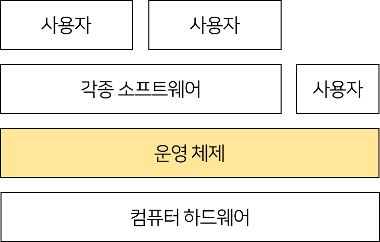
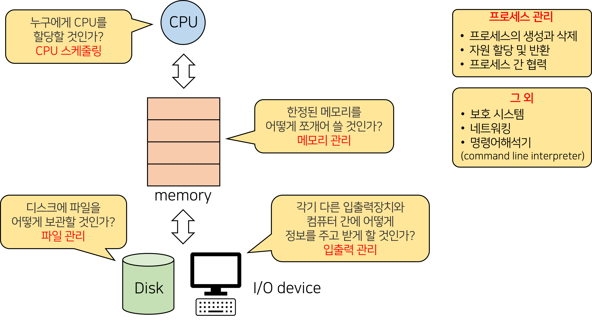

# 운영체제란?

> 컴퓨터 하드웨어 바로 위에 설치되는 소프트웨어 계층 
> 운영체제는 다른 모든 소프트웨어와 하드웨어를 연결한다.

### 좁은 의미의 운영체제

- **커널**
- **운영체제의 핵심 부분**으로 메모리에 상주하는 부분
- 컴퓨터의 켠다는 의미의 부팅(Booting)은 커널을 로딩(loading)함으로써 컴퓨터를 시작하는 것을 의미 
  시스템의 파워가 켜지면 처음 부트스트랩 프로그램이 위치한 메모리에서 실행히 시작된다.

### 넓은 의미의 운영체제

- 커널뿐만 아니라 각종 주변 시스템 유틸리티를 포함한 개념. 
- 메모리에 상주하는 않는 별도의 프로그램도 운영체제 범주에 포함

> 일반적으로 커널이 같으면 동일한 운영체제로 취급한다.

## 운영체제 목적

1. 컴퓨터 시스템을 편리하게 사용할 수 있는 환경을 제공
   - 운영체제는 동시 사용자/프로그램들이 각각 독자적 컴퓨터에서 수행되는 것 같은 환상을 제공
   - 하드웨어를 직접 다루는 복잡한 부분을 운영체제가 대행

2. <u>컴퓨터 시스템의 **자원을 효율적으로 관리**</u>
   - 자원
     - 하드웨어 : 프로세서, 기억장치, 입출력 장치
     - 소프트웨어 : 프로세스, 파일, 메시지 
   - 주어진 자원으로 **최대한의 성능을 내도록 관리**하나, 사용자간의 **형평성있는 자원 분배를 고려**해야 함
     - 실행중인 프로그램들에게 **짧은 시간씩 CPU를 번갈아가며 할당 & 메모리 공간을 적절히 분배**
   - 사용자 및 운영체제 자신의 보호
   

> 운영체제는 하드웨어 뿐만 아니라 소프트웨어도 관리해야될 책임을 가지고 있다

## 운영체제 분류

현재의 운영체제는 **multi tasking, multi user, time sharing** 방식을 지원하고 있다.

### 동시 작업 가능 여부

| 이름                          | 수행 능력                         | 특징                                         | 예시                |
| ----------------------------- | --------------------------------- | -------------------------------------------- | ------------------- |
| 단일 작업 (single tasking)    | 한 번에 하나의 작업만 처리        | 한 명령이 끝나기 전 다른 명령 수행 불가 | MS-DOS              |
| **다중 작업 (multi tasking)** | **동시에 두 개 이상의 작업 처리** | 한 명령 끝나기 전 다른 명령 수행 가능        | UNIX, MS Windows 등 |

### 사용자의 수

| 이름                         | 특징                                                         | 예시               |
| ---------------------------- | ------------------------------------------------------------ | ------------------ |
| 단일 사용자 (single user)    | 동시 접근 불가                                               | MS-DOS, MS Windows |
| **다중 사용자 (multi user)** | 계정 여러개 생성하여 **동시 작업 가능 여부** 사용자간 형평성 자원 분배와 보안이 고려되어야 함 | UNIX, NT server    |

### 처리 방식

| 이름                                   | 특징                                                         | 예시                                                         |
| -------------------------------------- | ------------------------------------------------------------ | ------------------------------------------------------------ |
| 일괄 처리 방식 (batch processing) | - 작업을 **모아서 한꺼번에 순차적으로 처리** - 작업이 **완전히 종료될 때까지 기다려야 함** | 초기   Punch Card  처리 시스템                                  |
| **시분할 (time sharing)**         | - 여러 작업 수행할 때 컴퓨터 처리 능력을 **일정한 시간 단위로 분할**하여 사용 - 일괄 처리 방식에 비해 **짧은 응답 시간**을 가지는 **interactive**한 방식  **※ 주의!**  **사용자가 느끼기에 빠르게 처리하면서 주어진 자원을 최대한 활용하는 것이 목적!**     so, 사용자가 제공 받는 시간이 정확하지는 않다.    ex) 사용자가 늘어날수록 받는 시간이 0.1초 or 0.5초 or 1초 (때때로 다름) | UNIX                                                         |
| 실시간 (Realtime OS)              | - **정해진 시간 안에 어떠한 일이 반드시 종료됨이 보장**되어야 함 - 일반적인 애플리케이션에서도 실시간 처리에 대한 수요가 증가   &nbsp; &nbsp; ex) 네비게이션, 블랙박스  # 개념 확장   - Hard realtime system(경성 실시간 시스템)   &nbsp; &nbsp; : 데드라인을 지키지 못하면 치명적인 경우   - Soft realtime system(연성 실시간 시스템)   &nbsp; &nbsp; : 데드라인은 존재하나 지키지 못하더라도 치명적이지 않은 경우 | 원자로/공장 제어, 미사일 제어, 반도체 장비, 로보트 제어 |

## 운영체제 예시

| 유닉스(UNIX)                                                 | MS사                                                         |
| ------------------------------------------------------------ | ------------------------------------------------------------ |
| -  c언어를 만들어서 유닉스를 개발함 -  소스 코드 공개(Linux) -  높은 이식성 -  최소한의 커널 구조 -  복잡한 시스템에 맞게 확장 용이 -  프로그램 개발에 용이 | # DOS(Disk Operating System)  -  MS사에서 1981년 IBM-PC를 위해 개발  -  단일 사용자용 운영체제, 메모리 관리 능력의 한계(주기억장치)  # MS Windows  -  MS사의 다중 작업용 GUI 기반 운영 체제  -  Plug and Play, 네트워크 환경 강화  -  DOS용 응용 프로그램과 호환성 제공  -  불완전성  -  풍부한 지원 소프트웨어 |

## 운영체제 구조

- **CPU 스케줄링**
  - 은행업무를 순차적으로 해결하면 어떻게 될까? 
    1시간 걸리는 손님과 1분 걸리는 손님이 차례로 있다고 했을 때, 순차적으로 하는 것이 과연 최선일까?
- **메모리 관리**
  - Q. 국가예산을 각 행정부처에게 1/N으로 부여하는게 가장 좋은 선택일까?
  - A.  예산이 많이 필요한 부서는 부족하고, 예산이 조금 필요한 부서는 남게 될 것이다. 
    하지만, 특정부서에게만 많은 예산을 할당하게 되면 형평성에 어긋나는 문제가 생긴다.
  - OS도 예산문제와 같다!
- **파일 관리**
  - 디스크 헤더를 어떻게 위치시킬지의 문제이다
  - Q. 엘리베이터에서 100층, 1층, 5층 순서로 버튼이 눌렸으면 어떻게 처리할까?
  - A. 순서대로 가면 헤드가 너무 많이 움직인다.  
    100층에서 1층을 내려가는 도중에 5층에 멈추면 5층도 포함시켜서 가는게 엘리베이터의 움직임을 최소화 한다.

> ※ **주의!**  
> CPU는 너무 빠르기 때문에 이걸 어떻게 관리할 것이냐 
> Disk는 어떻게 디스크 head의 움직임을 최소화하며 루트를 짤까의 관점의 차이가 있음

- **I/O device - 입출력 관리**
  - 너무 느림
  - 인터럽트 기반으로 관리함

