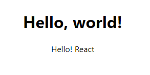

# JSX란?

```react
const element = <div>This is JSX</div>;
```

> 위의 태그 문법은  태그 문법은 문자열도, HTML도 아니다. JSX라 하는 **JavaScript를 확장한 문법**이다!<br/>자바스크립트 코드 안에서 UI 관련 작업을 할 때 시각적으로 더 도움이 되며 React와 함께 사용할 것을 권장한다.
>
> 해당 코드로 React “엘리먼트(element)” 를 생성한다. 생성된 element는 중괄호( {} )로 감싸서 사용한다.

```react
import './App.css';

// 추가
const name = 'world!';
const element = <h1>Hello, {name}</h1>;

function greeting(str) {
  return "Hello! " + str;
}

function App() {
  return (
    // 컴포넌트에 여러 요소가 있다면 반드시 부모 요소(ex. div)로 감싸야 한다.
    <div className='App'>
      { element }
      { greeting('React') }
    </div>
  );
}

export default App;
```

- JSX의 **중괄호 안**에는 **유효한 모든 자바스크립트 표현식**을 넣을 수 있다.
- 자동 세미콜론 삽입을 방지하기 위해 **괄호 안에서 작업**하는걸 추천한다.
- JSX도 결국 **표현식**이기 때문에, `if` 구문 및 `for` loop 안에 사용되고, 변수에 할당되고, 인자로서 받아들이고, 함수로부터 반환될 수 있다.



## JSX 속성 정의

> JSX는 **따옴표**를 이용해 **속성(문자열 리터럴)을 정의**할 수 있다.
>
> JSX는 HTML보다는 JavaScript에 가깝기 때문에, 프로퍼티를 정의할 때  `camelCase` 명명 규칙을 사용한다.

```react
const element1 = <div tabIndex="0"></div>;
const element2 = </img>;
```

## JSX는 주입 공격(XSS)을 방지한다.

- 기본적으로 React DOM은 JSX에 삽입된 모든 값을 렌더링 하기 이전에 **이스케이프** 하므로 코드에서 명시적으로 작성되지 않은 내용은 주입되지 않는다. 모든 항목은 렌더링 하기 이전에 문자열로 변환되기 때문이다. 이런 특성으로 인해 **XSS공격을 방지**할 수 있다.
  - 이스케이프란, <, 공백 등 과 같이 구문으로 분리되는 특정 문자들을 HTML로 변환하는 행위를 의미한다.<br/><는 `&lt`, 공백은  `&nbsp;`로 나타내면 HTML에서 텍스트로 인식되어 작성할 수 있다.

> XSS(cross-site scripting)란?
>
> - 웹페이지 관리자가 아닌 이가 악의적으로 **공격하려는 웹 페이지에 악성 스크립트를 삽입하는 기법**
> - 사이트에 접속한 사용자는 삽입된 코드를 실행하게 되며, 쿠키나 세션 토큰 등의 민감한 정보를 탈취당한다.
> - 보통 많은 웹사이트들이 XSS에 대한 방어 조치를 해두지 않아 공격을 받는 경우가 많다.

```react
const title = response.potentiallyMaliciousInput;
// 사용자 입력을 삽입하는 것은 안전하다.
const element = <h1>{title}</h1>;
```

## JSX는 객체를 표현한다.

아래 두 내용은 동일하다.

```react
const element = (
  <h1 className="greeting">
    Hello, world!
  </h1>
);
```

```react
const element = React.createElement(
  'h1',
  {className: 'greeting'},
  'Hello, world!'
);
```

