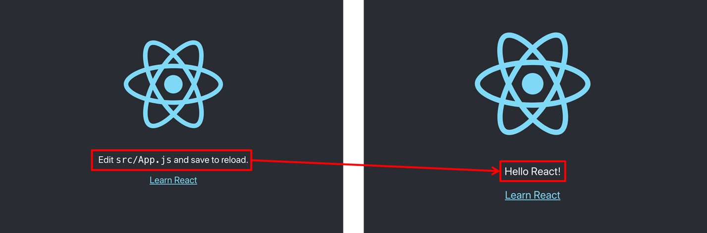

# 리액트 프로젝트 생성과 빌드

리액트 프로젝트를 만들기 위해서는 `create-react-app`을 이용한다.

```shell
npx create-react-app 프로젝트이름
cd 프로젝트이름
npm start
```

VSCode를 이용하여 생성한 폴더를 불러온다.

다음은 `src/App.js` 파일이다. <br/>여기서 `<p>` 태그 안에 있는 내용을 주석처리({`/* ... */}`)하고 **Hello, World!**를 작성해본다.

```react
import logo from './logo.svg';
import './App.css';

function App() {
  return (
    <div className="App">
      <header className="App-header">
        
        <p>
          {/* Edit <code>src/App.js</code> and save to reload. */}
          Hello, World! 
        </p>
        <a
          className="App-link"
          href="https://reactjs.org"
          target="_blank"
          rel="noopener noreferrer"
        >
          Learn React
        </a>
      </header>
    </div>
  );
}

export default App;
```

파일 내용을 변경하고 저장을 하게 되면 웹페이지가 자동으로 로드된다.



