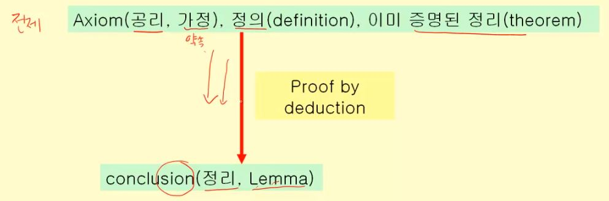
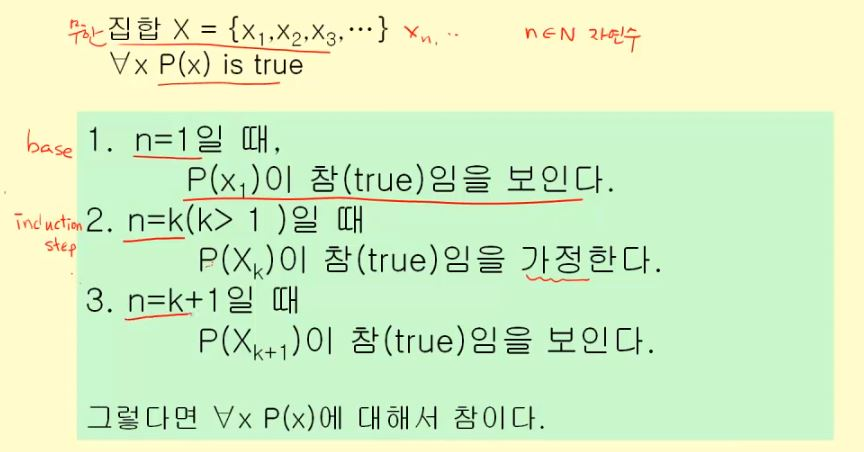
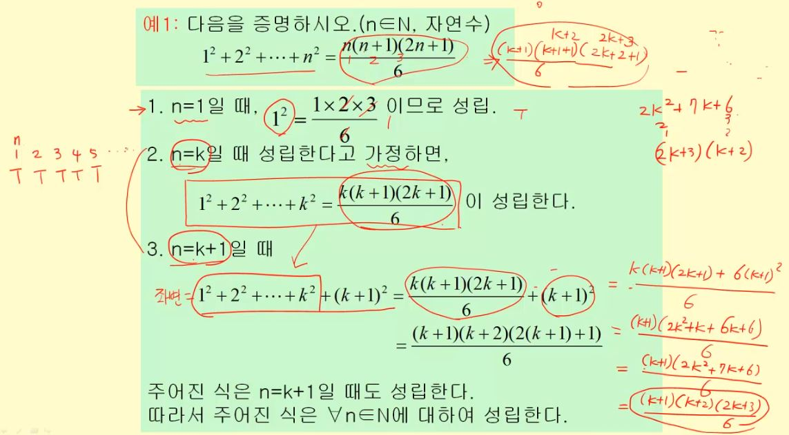
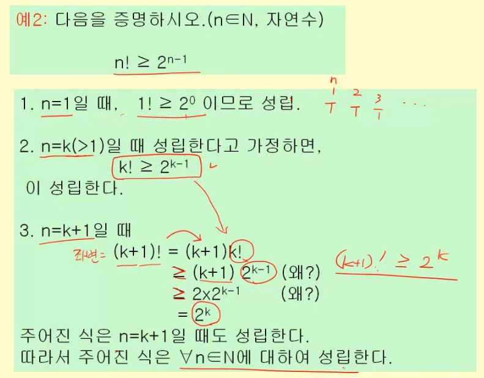
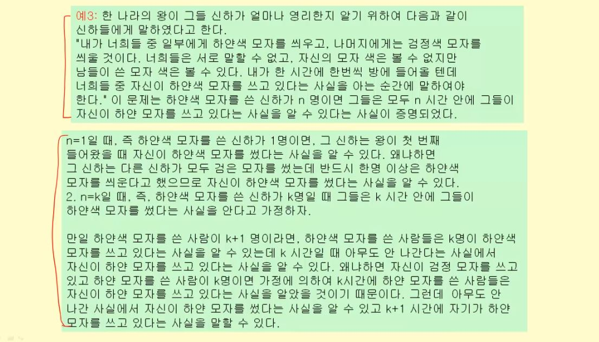
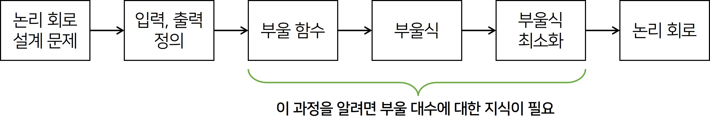
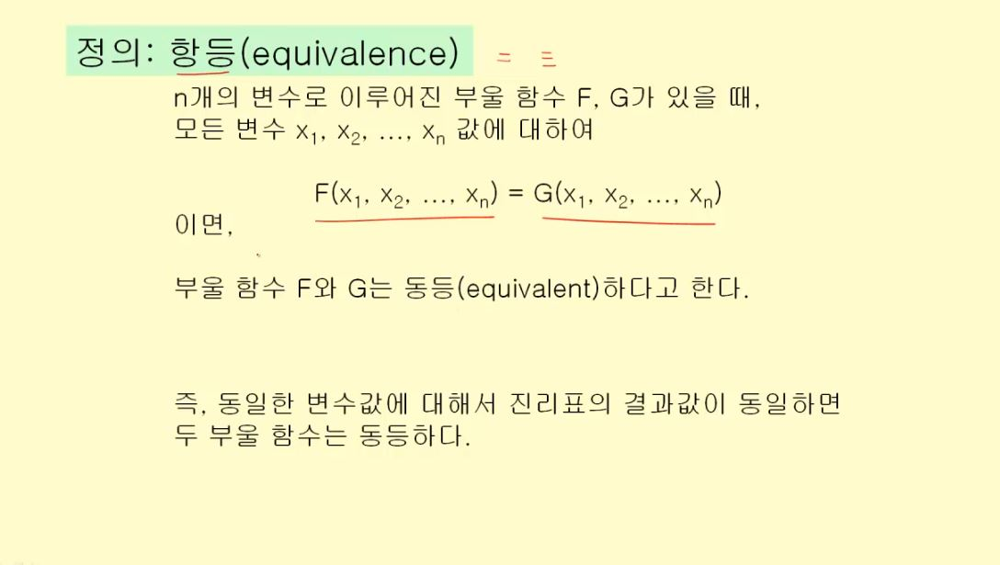
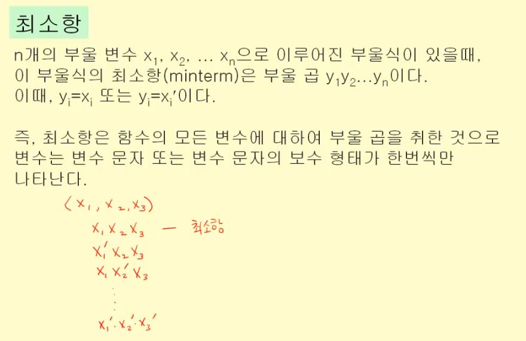

# 명제, 추론, 귀납, 부울대수

## 목차

- [명제란?](#명제란?)
- [명제의 논리적 표현](#명제의-논리적-표현)
- [연역법과 귀납법](#연역법과-귀납법)
- [수학적 귀납법](#수학적-귀납법)
- [부울대수](#부울대수)
- [논리회로 설계](#논리회로-설계)

## 명제란?

- 참(true) 혹은 거짓(false)을 판명할 수 있는 **선언적 문장** (declarative statement)

  > ※ **선언적 문장**이란? `~은 ~이다.`

Q. 다음 문장 중 선언적 문장인 것은?

```
1. 어제 비가 내렸다.
2. 물은 100도에서 끓는다.
3. 1 + 2 = 4
4. 지금 시간이 몇 시에요?
5. 내일까지 레포트를 내세요.
6. x + 1 = 2
7. 내일 비가 온다.
```

- **1번, 2번, 3번**의 문장은 참 거짓을 판별할 수 있는 명제다. (선언적 문장)
- **4번, 5번**과 같은 의문문, 명령문은 선언적 문장이 아니다.
- **6번**의 경우 x값에 따라 참 거짓이 달라지기 때문에 명제가 아니다.
- **7번**의 경우 비가 올 수도 안 올수도 있기 때문에(애매함) 명제라고 하기 힘들다.


### 명제의 참 거짓은 어떻게 판별할 수 있는가?

- 사실 명제 : **관찰, 측정, 실험**에 의해 참 거짓을 판별
- 논리 명제 : **수학, 형식**에 의해 참 거짓을 판별

> 우리가 **컴퓨터에서 다루게** 되는 명제는 **논리 명제**

### 복합(합성)명제란?

- 복합/합성 명제(compund proposition) : **단순 명제의 조합(연결)으로 만들어지는 명제**
- 조합은 명제의 **부정, 곱, 합, 조건명제, 쌍조건 명제** 등의 ***연산자***로 인해 이루어진다.
  - 일종의 문장에서의 <u>접속사</u> 역할
  - [연산자의 종류와 의미 정리](이산수학_기초.md#2강-명제와-연산자)

- **복합 명제의 값**은 **동치 관계와 진리표를 활용**해서 구할 수 있다.
  - [동치와 진리표 의미 정리](이산수학_기초.md#3강-역-이-대우)

> **[참고] 필요 충분 조건** 
>
> - `p → q` 일 때, p와 q **둘 다 참**이면 **p는 q이기 위한 충분조건이고 q는 p이기 위한 필요조건**이라 한다.<br/>
>   또한 `p → q`임과 **동시에** `q → p`가 **성립**하면 **p는 q이기 위한 필요충분 조건**이라 하며 **p와 q는 동치**가 된다.
> - A와 B의 집합 관계가 A ⊃ B이면 A는 B이기 위한 필요조건, B는 A이기 위한 충분조건이다.

🔼[위로](#목차)

## 명제의 논리적 표현

- 명제표현 : 논리적 기호로 명제를 표현하는 것 

### 명제의 구성

- 명제는 **주어(subject)**와 **술어(predicate)**로 구성되어 있다.
  ```
  예)
  "3은 6보다 작다"
  
  주어: 3은
  술어: 6보다 작다
  ```

- 명제는 **변수를 포함한 함수**로서 표현할 수 있다.

  ```
  예)
  "x에 2를 더하면 3이다."
  
  위 문장을 변수를 포함한 함수로 표현하면 다음과 같다.
  p(x) : x+2=3
  
  이 문장의 T/F 여부는 x값에 의해 결정된다.
  ```

우리는 x의 값을 표현하기 위해 x의 값을 한정할 수 있어야 한다. 이것이 바로 **한정사**

### 한정사

- 명제 함수 **p(x)의 정의역**은 **한정사를 사용하여 표현**할 수 있다.

- 한정사에는 다음의 **2가지 종류**가 존재

  - **All (전체 한정)**

    - **x가 갖는 모든 값에 대해서 p(x)가 참인 명제**를 p(x)의 전체 한정이라 한다.
    - `∀x p(x)` : p(x)가 가질 수 있는 값은 **모든 x**의 값이라는 의미

    ```
    p(x) : x² + 2x + 1 ≥ 0,
    x의 정의 구역: 실수
    
    p(x)는 (x+1)² ≥ 0 로 정리할 수 있다.
    => 그러면 ∀x p(x)는 참이다.
    ```

    ```
    p(x) : x² + 2x + 1 > 0,
    x의 정의 구역: 실수
    => 그러면 ∀x p(x)는 거짓이다.
    (x=-1이면 p(x)는 거짓이기 때문이다.)
    ```

  - **Some (존재 한정)**

    - **x가 갖는 값 중에서** p(x)가 참이 되게 하는 x가 존재하는 명제를 p(x)의 존재 한정이라 한다.
    - `∃x p(x)` : p(x)가 가질 수 있는 값은 **일부 x**의 값이라는 의미

    ```
    p(x) : x² + 1 ≤ 1,
    x의 정의 구역: 실수
    
    => 그러면 ∃x p(x)는 참이다.
    (x=0일 때 p(x)가 참이 되기 때문이다.)
    ```

    ```
    p(x) : x² + 1 < 1,
    x의 정의 구역: 실수
    
    => 그러면 ∃x p(x)는 거짓이다.
    (p(x)가 참이 되는 x의 값이 x의 정의 구역에서는 존재하지 않는다.)
    ```

### 논리적 기호로 명제를 표현

> 명제 : `~은 ~이다.`

- **장점**
  - 명제의 의미가 명료해진다.
  - 명제가 접속사로 인해 **복합명제**가 되어 **진리값에 의해** 명백히 판단될 수 있다.

- **문장의 논리적 표현**

  - 주어진 문장을 **논리적 기호로 표현하는 것**은 <u>수학이나, 논리 프로그래밍, 인공 지능 등의 분야</u>에서 매우 중요하다.
  - 지금까지 설명한 **명제 함수, 한정사**는 **문장을 논리적 기호로 표현하는데 사용**될 수 있다.

  ```
  예제1)
  "이 클래스의 모든 학생은 C 언어 인증 시험을 통과하였다."
  
  함수 C(x) : 학생 x는 C언어 인증 시험을 통과하였다.
  x의 정의 구역 : 이 클래스의 학생들
  ```

  - 하나의 동일한 명제는 여러가지로 표현 가능하다. <br/>우리는 이미 두 명제의 값이 같으면 두 명제는 **동일 명제**임을 배웠다.

  ```
  예제2) 예제1의 문장은 다음과 같이 표현할 수 있다.
  
  "모든 사람 x에 대하여, 만일 x가 이 클래스의 학생이면 x는 C언어 인증 시험을 통과하였다."
  
  함수 S(x) : x가 이 클래스의 학생이다. 
  함수 C(x) : 학생 x는 C언어 인증 시험을 통과하였다.
  x의 정의 구역 : 이 클래스의 학생들
  
  => 조건 명제로 표현 가능. ∀x(S(x) → C(x))
  ```

  ```
  예제3) 위의 예제의 문장은 다음과 같은 함수로 정의하여 표현할 수 있다.
  
  함수 Q(x, y) : 사람 x가 y를 통과하였다.
  =>  ∀x(S(x) → Q(x, C언어 인증 시험))
  ```

  ```
  예제4) "이 클래스를 듣는 어떤 학생은 독일을 방문한 적이 있다."
  
  이 문장은 다음과 같이 다시 쓸 수 있다.
  
  "이 클래스에는 x라는 학생이 있는데, 그 x라는 학생은 독일을 방문한 적이 있다."
  
  함수 S(x) : x가 이 클래스의 학생이다.
  함수 D(x) : x는 독일을 방문한 적이 있다.
  x의 정의 구역 : 이 클래스의 학생들
  
  => ∃x(S(x) ∧ D(x))
  ```

### 한정사를 이용한 명제의 부정

- **부분 부정** 

  ```
  "모든 컴퓨터하고가 학생들은 이산 수학을 듣는다."
  
  이것을 한정사를 이용하여 표현하면,
   p(x): x는 이산 수학을 듣는다.
   x의 정의 구역: 모든 컴퓨터학과 학생들
  => ∀x p(x)
  ```

  ```
  이 문장의 (부분) 부정은 
   "컴퓨터학과 학생이면서 이산 수학을 듣지 않는 학생도 있다."
  => ￢(∀x p(x)) = ∃x (￢p(x))
  ```

- **완전 부정**

  ```
  "컴퓨터학과 학생들 중 이산 수학을 듣는 사람이 존재한다."
  
  p(x): x는 이산 수학을 듣는다.
  x의 정의 구역: 컴퓨터학과 학생들
  => ∃x p(x)
  ```

  ```
  이 문장의 (완전) 부정은,
   "모든 컴퓨터학과 학생은 이산 수학을 듣지 않는다."
  => ￢(∃x p(x)) = ∀x (￢p(x))
  ```

### 중첩 한정사

- 필요한 경우에는 한 명제에서 2개 이상의 한정사를 사용할 수 있다.

  예) `∀x ∃y (x+y=0)`

```
예제2) 덧셈에 있어서 결합 법칙은 다음과 같이 표현할 수 있다.
∀x ∀y ∀z (x+(y+z) = ((x+y)+z)
```

```
예제3) "모든 실수 x,y에 대해서 x가 양수이고 y가 음수이면, x와 y의 곱은 음수이다."

논리 기호로 이 명제를 표현하면,
∀x ∀y ((x > 0) ∧ (y < 0) → (xy < 0))
```

```
예제4) 논리식 ∀x (M(x) ∨ ∃y (M(y) ∧ F(x,y)))을 문장으로 표현하라.

M(x): x가 삼성G6 폰을 가지고 있다.
F(x,y): x와 y가 친구이다.
x의 정의 구역: A학교의 학생들
y의 정의 구역: B학교의 학생들

"A학교의 모든 학생들은 삼성G6폰을 가지고 있거나, A학교 모든 학생들의 친구인 B학교 학생 중에서 삼성G6폰을 가지고 있는 학생이 있다."
```

> 위와 같이 명제를 **일상언어로 표현**하게 되면 **정확한 의미가 전달되기 어렵지만**, **논리식으로 표현**하면 의미가 오해없이 전달된다.

🔼[위로](#목차)

## 연역법과 귀납법

### 추론이란?

- Reasoning, inference
- 참으로 **알고 있는 명제(전제)**로부터 **새로운 참인 명제(결론)**를 찾는 과정 
  - 전제(premise) : 이미 True라고 알고 있는 명제
  - 결론(conclusion) : 새롭게 찾아내려고 하는 참인 명제
- **결론을 도출하는 추론의 과정이 과연 타당하냐가 중요!**

> 논리(logic) : 어떤 것이 올바른 초론이 되겠는가에 대한 규칙

### 추론의 방법

#### 연역법

- 형식 논리의 다음과 같은 명제의 틀에 기반을 두고 있다.

  ```
  If P, then Q
  P
  -------------
  ∴ Q
  
  => 만약 P(전제)가 True라면 Q(결론)도 True이다.
  ```

- 이것을 우리가 앞에서 배운대로 진리표로 표현하면 아래와 같다.

  | P → Q |  P   |  Q   |
  | :---: | :--: | :--: |
  |   T   |  T   |  T   |

- 연역법 추론의 예

  ```
  예1) 아리스토텔레스의 연역법
  
  All men is mortal. (모든 사람은 죽는다)
  Socrates is a man. (소크라테스는 사람이다)						 [전제]
  ---------------------------------------------------------------------
  Therefore, Socrates is mortal. (따라서 소크라테스는 죽는다)			[결론]
  ```

  ```
  예2)
  
  모든 컴퓨터공학과 학생들은 C언어를 수강한다.
  김철수는 컴퓨터공학과 학생이다.						[전제]
  -------------------------------------------------------
  그러므로 김철수는 C언어를 수강한다.					[결론]
  ```

  ```
  예3)
  
  모든 농구 선수들은 키가 크다.
  김철수는 농구 선수이다.				 [전제]
  -----------------------------------------
  그러므로 김철수는 키가 크다.			[결론]
  ```

  > 위 예제의 추론 방식이 올바른 추론일까??

- **연역법의 함정**

  - **과연 이 전제가 True인가?**

  - 만약 그렇지 않다면 연역의 논리를 따르고 있다고 하더라도 결론은 True가 될 수 없다.
  - 따라서 연역법에서는 전제가 과연 True냐가 키포인트!

- 수학

  - 수학의 이론은 **연역법에 의해** 만들어진 명제들로 이루어진다.
  - 수학은 공리 혹은 가정을 일단 True로 인정하는 것이 전제가 된다.
  - 혹은 이미 True라 증명된 정이에서부터 결론을 얻어낼 수 있다.

  

#### 귀납법

- **개별적인 사실**을 말하는 명제들로부터 일반적인 결론을 도출하는 방법

- 연역법과 추론의 방향이 다르다!

- 즉, 모든 원소에 대해서 True인 것을 보여주면 이 명제는 True다 라는 것을 보여줌.

  ```
  set, X = {x1, x2, x3, ... , Xn}
  명제 P(x, y) : x는 y이다.
  
  (모든 원소에 대해서 참인 경우)
  P(x1, y) is true
  P(x2, y) is true
  P(x3, y) is true
  ...
  P(Xn, y) is true
  
  ∴ ∀x p(x, y) is true. => 항상 True라고 인정하게 된다.
  ```

- 귀납법 예

  ```
  김철수, 이영희, 홍복동은 컴퓨터공학과 학생이다.
  김철수는 C언어를 수강하다
  이영희는 C언어를 수강하다
  홍복동는 C언어를 수강하다								[전제] - 모두 True
  ----------------------------------------------------------
  따라서 모든 컴퓨터공학과 학생들은 C언어를 수강한다.		 [결론]
  ```

  > "결론"은 모든 컴퓨터공학과 학생들의 집합에 대해 얘기하고 있는데,<br/> True로 밝혀진 "명제"들은 김철수, 이형희, 홍복동 제 사람에 대해서만 True임을 밝힌 것
  >
  > 따라서 **결론이 True라고 얘기할 수 없다.**

- 귀납법의 한계

  - 문제는 **현실적으로 집합의 모든 원소에 대해서** 참인 것을 **밝힐 수 없다**는 점

  - 따라서 도출된 결론은 기껏해야 **확률적인 결론일 수 밖에 없다.**

    `∀x p(x, y) is likely to be true.`

🔼[위로](#목차)

## 수학적 귀납법

> 우리가 증명하는데 굉장히 많이 사용하는 방법

- 귀납법의 한계를 극복하기 위해 사용

- **집합의 모든 원소에 대해서 명제가 성립하는 것을 보여준다.**

  따라서, 모든 경우에 명제가 성립하는 것을 증명할 수 있다.

- **구조**

  

  





> 수학적 귀납법은 수식을 증명하는 것 뿐만 아니라 일반적인 경우에 대한 증명에서도 사용할 수 있다.
>
> 

🔼[위로](#목차)

## 부울대수

논리회로를 설계하기 위해선 다음과 같은 과정을 거치게 된다.



> **수학 이론의 출발점**은 **공리**에서부터 시작된다.

### 공리 (Axium)란?

> 공리란 쉽게 말해 **정의**

- 증명 없이 참으로 받아들이는 명제<br/> 즉, 조건 없이 전제된 명제

- ~한 것은 기본적으로 인정하고 이야기를 전개시켜나가겠단 약속

- 집합 S = {0, 1}에 대해 다음의 **세 가지 연산**이 존재한다.

  - **보수 (complement)** : `'` 로 표시

    - **나머지 값, 반대 값**

    ```
    원소 0에 대하여 `0' = 1`, 원소 1에 대하여 `1' = 0`
    ```

  - **부울 합 (boolean sum)** : `+ (또는 OR)`로 표시

    ```
    1+1=1
    1+0=1
    0+1=1
    0+0=0
    ```

  - **부울 곱 (boolean product)** : `·` (또는 AND)로 표시 (`·`는 생략하기도 함)

    ```
    1·1=1
    1·0=0
    0·1=0
    0·0=0
    ```

  > 연산 우선순위 : **보수 >> 곱 >> 합**

### 부울 변수란?

- Boolean variable
- 집합 S = {0, 1}의 원소 값만을 갖는 변수

### 부울 함수란?

- Boolean function
- 0 또는 1의 입력값들에 대하여 0 또는 1의 출력값을 갖는 함수

- **차수 n의 부울 함수 (Boolean function)** 
  - 차수 n의 부울 함수란 **변수가 n개로 이루어졌을 때**를 의미
  - n-튜플 {(x₁, x₂, ⋯ , xn) | xⅰ ∈ X, 1 ≤ i ≤ n}의 입력 변수를 갖는 함수

### 부울 식이란?

- Boolean expression

- x₁, x₂, ⋯ , xn 가 부울 변수이면<br/>(1) 0, 1, x₁, x₂, ⋯ , xn 은 부울식이다.<br/>(2) E₁, E₂ 가 부울식이면,  E₁ ,  (E₁ · E₂),  (E₁ + E₂) 도 부울식이다.

  ```
  예) 부울 변수 x, y에 대해 다음은 부울 식이다.
  (1) x
  (2) y
  (3) x·y
  (4) x+y
  (5) x+y·0
  (6) (1+x)'
  ```

  > **부울 함수**는 부울 변수와 부울 연산자로 구성된 **부울 식**으로 표현할 수 있다.

- 부울식의 부울 변수에 **0, 1을 대입**하면 부울 함수 값을 얻을 수 있다.

  **예)** 부울 함수 F(x, y, z) = xy + z일 때 부울 함수 값을 다음 표와 같이 구할 수있다.

  입력값: x, y, z / 출력값: F(x, y, z)

  |  x   |  y   |  z   |  xy  |  z   | F(x, y, z) |
  | :--: | :--: | :--: | :--: | :--: | :--------: |
  |  1   |  1   |  1   |  1   |  0   |     1      |
  |  1   |  1   |  0   |  1   |  1   |     1      |
  |  1   |  0   |  1   |  0   |  0   |     0      |
  |  1   |  0   |  0   |  0   |  1   |     1      |
  |  0   |  1   |  1   |  0   |  0   |     0      |
  |  0   |  1   |  0   |  0   |  1   |     1      |
  |  0   |  0   |  1   |  0   |  0   |     0      |
  |  0   |  0   |  0   |  0   |  1   |     1      |

### 항등이란?

- equivalence
- 각 함수의 모양이 다르더라도 **입력값에 대한 값이 같다면** `항등` 이라 한다.



### 부울 대수의 법칙

|               항등성(identity)               |                  법칙                   |
| :------------------------------------------: | :-------------------------------------: |
|                  (x')' = x                   | 이중 보수 법칙 (double complement laws) |
|               x +x = x, xx = x               |       역동 법칙 (idempotent laws)       |
|              x + 0 = x, x1 = x               |        항등 법칙 (identity laws)        |
|              x + 1 = 1, x0 = 0               |       지배 법칙 (dominance laws)        |
|             x + x' = 1, xx' = 0              |                보수 법칙                |
|          x + y = y + x<br />xy = yx          |      교환 법칙 (commutative laws)       |
| x + (y + z) = (x + y) + z<br />x(yz) = (xy)z |      결합 법칙 (associative laws)       |
| x + yz = (x + y)(x + z)<br />x(yz) = xy + xz |      분배 법칙 (distributive laws)      |
|     (xy)' = x' + y'<br />(x + y)' = x'y'     |   드모르강의 법칙 (De Morgan's laws)    |

- **예제**: 분배법칙 x(y+z) = xy + xz가 성립하는 것을 보여라.

  식이 성립하는 것을 진리표를 이용하여 보일 수 있다.<br/>**좌변: x(y+z) = 우변: xy+xz**

  |  x   |  y   |  z   | y+z  |  xy  |  xz  | x(y+z) | xy+xz |
  | :--: | :--: | :--: | :--: | :--: | :--: | :----: | :---: |
  |  1   |  1   |  1   |  1   |  1   |  1   |   1    |   1   |
  |  1   |  1   |  0   |  1   |  1   |  0   |   1    |   1   |
  |  1   |  0   |  1   |  1   |  0   |  1   |   1    |   1   |
  |  1   |  0   |  0   |  0   |  0   |  0   |   0    |   0   |
  |  0   |  1   |  1   |  1   |  0   |  0   |   0    |   0   |
  |  0   |  1   |  0   |  1   |  0   |  0   |   0    |   0   |
  |  0   |  0   |  1   |  1   |  0   |  0   |   0    |   0   |
  |  0   |  0   |  0   |  0   |  0   |  0   |   0    |   0   |

- **부울대수 법칙으로 증명하는 방법**

  1. 연산의 정의에 의해 만들어진 **진리값을 이용해 좌우변이 같다**는 것을 보여주는 방법
  2. **이미 증명된 명제(규칙)을 사용**하여 보여주는 방법

  ```
  예제: 부울 대수의 법칙을 이용하여 다음을 증명하라.
  	x(x+y) = x
  
  x(x+y) = (x+0)(x+y)		# 항등법칙
  	   = x + 0y			# 분배법칙
  	   = x + y0			# 교환법칙
  	   = x + 0			# 지배법칙
  	   = x
  ```

>  **정의**에 의해 **새로운 명제(규칙)**을 증명해내고, 이 증명된 명제를 통해 **참인 명제**를 또 **도출**이 가능하다. <br/>그러다 **중요한 명제가 나오면** 해당 명제는 `정리`가 된다. 
>
> 이렇게 증명된 명제들은 **연역법**에 의해서 **수학의 이론 체계를 구성**하게 된다.

### 쌍대성의 원리 (duality principle)

- **대칭성의 원리**라고도 함.

- 부울 대수의 <u>모든 항등 법칙에 대하여</u> 다음 2개의 식이 쌍으로 존재한다. <br/> `x + 0 = x`, `x · 1 = x` <br/>이러한 쌍을 **쌍대(dual)**라고 한다.

  > 항등일 경우 합이 곱으로 곱이 합으로 바뀌어도 항등이 됨

- **부울식으로 표현된 함수들 사이에 항등성이 유지되면, 이들의 쌍대(dual)도 항등성을 유지한다.**

- 부울 대수의 쌍대는 `·`와 `+`를 교환하고, 0과 1을 교환하여 구할 수 있다.

  ```
  예시)
  (1) x(x+y) = x
  (2) (x+y) = x'y'
  ```

> 부울 함수값이 주어졌을 때 이 함수를 부울식으로 표현할 수 있다. (입력 → 출력)<br/>=> How? 최소항으로!

### 최소항

- 주어진 변수로 <u>만들 수 있는</u> 다양한 경우의 수.. 그들의 **하나하나**가 모두 **최소항** 이다.



- **논리합 형식 (disjunctive normal form)** : 곱들의 합

  - 부울 함수를 최소항들의 부울 합으로 나타내는 형식

  > **부울 함수의 부울식**은 함수의 값이 **1**이 되는 변수값의 조합들에 대하여 **최소항**들을 구하고 그 최소항들의 **부울 합(논리합 형식)을 취하면** 구할 수 있다.

- **예제)** 다음과 같은 값을 갖는 부울 함수를 부울식으로 표현하라

  논리합이기 때문에 1이 나오는 최소항을 모두 더한다! <br/>∴ F(x, y) = xy + x'y + x'y'

  |  x   |  y   |    F(x, y)    |
  | :--: | :--: | :-----------: |
  |  1   |  1   |  **1** => xy  |
  |  1   |  0   |       0       |
  |  0   |  1   | **1** => x'y  |
  |  0   |  0   | **1** => x'y' |

- **예제)** 부울 함수 F(x, y, z)가 다음의 진리표로 주어졌을 때 이 함수의 부울식을 구하라.

  ∴ F(x, y, z) = xyz' + x'yz

  |  x   |  y   |  z   |  F(x, y, z)   |
  | :--: | :--: | :--: | :-----------: |
  |  1   |  1   |  1   |       0       |
  |  1   |  1   |  0   | **1** => xyz' |
  |  1   |  0   |  1   |       0       |
  |  1   |  0   |  0   |       0       |
  |  0   |  1   |  1   |       0       |
  |  0   |  1   |  0   | **1** => x'yz |
  |  0   |  0   |  1   |       0       |
  |  0   |  0   |  0   |       0       |

🔼[위로](#목차)

## 논리회로 설계


🔼[위로](#목차)
