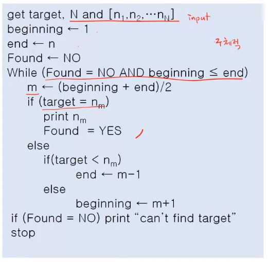
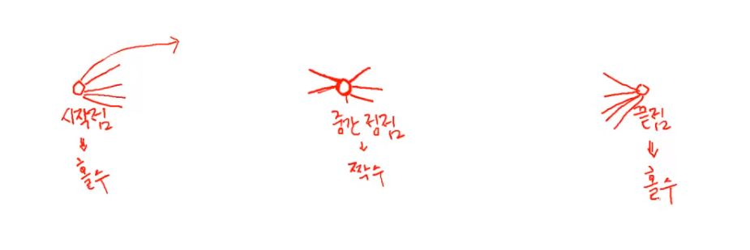
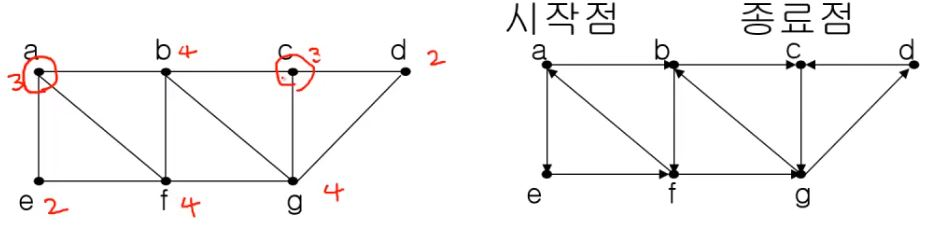
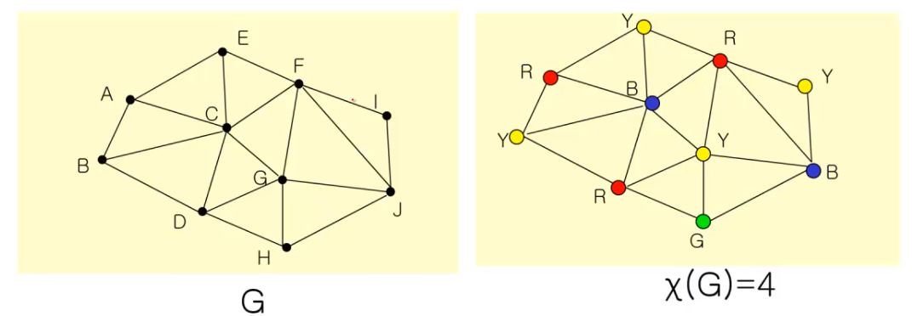

# 알고리즘, 그래프

## 목차

- [알고리즘이란](#알고리즘이란)
- [오일러 순환과 해밀턴 순환](#오일러-순환과-해밀턴-순환)
- [그래프 기본 용어](#그래프-기본-용어)
- [그래프 채색(coloring)](#그래프-채색(coloring))
- [최소 신장 트리](#최소-신장-트리)

## 알고리즘이란

> 문제를 해결하기 위한 **절차를 기술**한 것<br/>누구나 **동일한 입력값**이 주어지면 이 절차대로 실행하면 동일한 출력값을 얻을 수 있어야 한다.

### 알고리즘 정의

- **순서대로 정의된 절차**
  - <u>분명한 순서</u>가 있어야 한다.
  - 한 동작을 실행하면 <u>다음에 실행할 동작이 무엇인지 분명</u>해야 한다
- **명확성**
  - 모든 동작은 <u>명확하게 정의</u>되어야 한다.<br/>
  - 모든 동작은 <u>실행 가능</u>해야 한다.
- **반드시 원하는 결과가 나와야 한다.**
- **일정한 시간 안에 실행되어야 한다.**

> 일상에서 유사한 알고리즘으로 **요리법**을 들 수 있겠지만 요리법은 알고리즘이라고 할 수 없다.<br/>왜냐하면 '먹기 좋은 크기', '중간 센 불'과 같이 **주관적인 언어**가 들어가 있기 때문에 모든 사람의 요리 결과가 하상 동일하지 않다.

### 알고리즘을 어떻게 적을까?

보통 아래 그림과 같이 사용하는 **일반 언어**로 적어 본다. <br/>그러나 읽거나 이해하기 힘들다! 알고리즘의 **구조적인 특성**이 드러나있지 않기 때문이다.<br/>말하고자 하는 바를 명확히 알려면 한줄 한줄 제대로 다 따라가면서 읽어야 한다..


### 좀더 알기쉽게 적을 수는 없을까?

> **구조를 살려서 표현**하면 읽는 사람 입장에서 이해하기 쉽다! ⇨ 4가지 구조!
>
> **모든 언어(Java, C, Python 등)는 아래의 4가지 구조를 제공**하며 이 외 다른 프로그래밍 절차는 존재하지 않는다.

1. **순차적 구조(sequential structure)** : **기본적인 구조**로 각 단계별 순서대로 진행한다.

   

2. **분기 구조(branch)** : 조건에 따라 분기가 나눠진다.

   

3. **반복 구조(repetition)** : 어떤 조건을 만족하면 어떠한 절차를 반복한다.

   

4. **점프 구조(jump)** : 순차적으로 수행하다 어느 절차로 이동한다.

   

### 알고리즘 작성하기

그렇다면 우리는 알고리즘의 구조를 반영하여 적는다면 이해하기 쉬울 것이다.

- **알고리즘 기술 방법**
  - 플로우차트(flowchart)
    - 복잡해지면 도표가 많아져서 보기가 힘들어진다.
  - 프로그램 언어의 코드
    - 이것은 특정 프로그램 언어의 <u>문법을 알아야 된다</u>.
    - 또 코드 수준으로 자세히 적을 필요는 없다.
  - **수도코드(Pseudocode)**
    - 프로그램 언어의 코드 전 단계로 프로그램 언어들이 사용하는 구조를 그대로 이용한다.

> 플로우차트는 조금만 복잡해져도 표현 한계에 봉착한다. **수도코드로 쉽게 작성**하자!

- [위](#알고리즘을-어떻게-적을까?)에서 적었던 알고리즘을 수도 코드로 적어보면 다음과 같다.

  

### 수도 코드 작성법

1. 기본적인 룰은 없다.

2. block을 **명확히 표시**해야 한다. (block이란 한 조건에 따라붙는 조건)

   **들여쓰기**, { }를 통해 표시해도 되고, begin과 end를 통해 표현해주는 사람도 있다.

```
예시) 이진 탐색(binary search)

 만약 리스트의 키 값이 정렬되어 있다면 순차 검색 보다 빠른 시간 안에 검색을 할 수 있다.
 	{1, 3, 4, 5, 10, 13, 15, 20, 23, 32}
 먼저 찾고자 하는 키 값을 리스트의 중간에 위치한 값, 13과 비교한다.
 만약 찾고자 하는 키 값이 13보다 작으면 이 값은 13보다 왼쪽에 위치하고 있으며, 13보다 크다면 13의 오른쪽에 위치하고 있다.
 따라서 다음 단계에서 13보다 왼쪽에 있는 값들, 혹은 오른쪽에 있는 값들을 갖고 같은 절차를 반복한다.
```

- 다음과 같이 기술한 것은 **"abstract하게 기술되었다.(덜 구체적으로 기술)"**라고 표현한다.


- 위의 것보다 **더 구체적으로 기술**한 것은 다음과 같다.

  

### 알고리즘 검증이란?

> 모든 입력값에 대해 맞게 동작하여 **해당 알고리즘이 맞다는 것을 증명**하는 것

- **귀납법을 통해 증명**하게 되는데 이는 **몇 가지 사례에 대해 옳음을 보여야 한다**는 말과 같다.
- **일반적인 값**의 경우에 대해서 옳다는 것을 증명하고, **특수한 입력값(boundary condition)**에 대해서도 옳다는 것을 증명해야 한다.
  - 특수한 입력값은 리스트에 존재하지 않는 40과 같은 input을 의미한다.

🔼[위로](#목차)

## 오일러 순환과 해밀턴 순환

> 쾨니스버그의 다리 문제처럼 그래프를 이용해서 문제를 단순화할 수 있다. 우리는 그래프를 통해 알고리즘을 만들 수 있다. 

### 그래프 정의

그래프 G는 다음의 두 가지 집합으로 구성되며 **G = {V, E}**로 표시한다. <br/>여기서 V는 **정점(vertex)**들의 집합이며, E는 정점들을 연결하는 **선(edge)**들의 집합이다.


그래프는 전혀 낯선 정의가 아니다. 

- 예) 한 줄로 그리기 문제<br/>다음의 그래프 중 한 정점에서 시작해서 연결선을 한 번만 지나면서 그래프를 다 그릴 수 있는 것은 어느 것인가?
  

### 오일러 경로

- **오일러 경로(Eulerian path)** : 그래프 G의 모든 연결선을 한번만 방문하는 경로

- **오일러 순환(Eulerian cycle 혹은 circuit)** : 시작점과 끝점이 동일한 오일러 경로
- **오일러 그래프** : 오일러 순환이 존재하는 그래프

- **차수(degree)**

  : 정점 u에 접합된 연결선의 수<br/>: 차수는 `deg(u)`와 같이 표기하기도 한다.

  예시) `deg(v1) = 3`, `deg(v2) = 5`, `deg(v3) = 3`, `deg(v4) = 5`

  

> **[참고] What is 시작점, 중간점, 끝점 ???**
>
> 
>
> 1. 시작점
>
>    반드시 **홀수**<br/>나가는 연결선이 있는데 들어오는 연결선이 존재한다면 시작점이 아니다.<br/>시작점에서 나가질 못하기 때문이다.
>
> 2. 중간 정점
>
>    반드시 **짝수**<br/>들어왔다가 반드시 나가는 연결선까지 있어야 중간정점이 된다.<br/>더 이상의 연결선이 없으면 해당 자리에 계속 머무르게 되기 때문이다.
>
> 3. 끝점
>
>    반드시 **홀수**<br/>시작점과 같은 원리로 연결선이 홀수여야 한다.

### <정리> 오일러 경로를 갖기 위한 필요충분 조건

2개 이상의 정점을 갖는 루프가 없는 연결 그래프에서 **홀수 차수**(odd degree)를 갖는 정점이 **하나도 없거나 오직 두 개**(시작점, 끝점)만 존재해야 한다.

특히, 모든 정점이 **짝수 차수**를 가지면 **오일러 순환**이 존재하며, 이 그래프는 오일러 그래프이다.

- 예시1) b와 d에 연결된 정점은 홀수이므로 두 정점을 시작점과 끝점으로 하는 오일러 경로가 존재한다.


- 예시2) a와 c의 차수가 홀수이므로 이 둘이 시작점, 끝점이 된다.



- 예시3) 다음의 그래프는 오일러 경로를 갖고 있는가?

  오일러 경로가 존재하지 않는다.

  

### 오일러 경로의 알고리즘 복잡도

> 다항식의 복잡도를 이용해 쉽게 풀 수 있다.


### 해밀톤 경로

- **해밀톤 경로(Hamitonian path)** : 그래프 G에서 모든 정점을 정확히 **한 번만** 지나는 경로
- **해밀톤 순환(Hamitonian cycle 혹은 circuit)** : 시작점과 끝점이 같은 해밀톤 경로


> 오일러 순환 : '**선**'이 중요<br/>해밀톤 순환 : '**점**'이 중요

```
예)
해밀톤 순환은 1857년에 만들어진 lcosian 퀴즈 문제에서 비롯되었다.
이 퀴즈 문제는 12면체의 20개의 각 정점에 도시 이름을 적고, 어느 한 도시에서 출발하여
모서리를 따라서 다른 모든 19개의 도시를 방문하고 처음 출발했던 도시로 돌아오는 게임이다.
물론 각 도시는 단 한번만 방문할 수 있다.
```


### 해밀톤 순환을 찾는 알고리즘

> 유감스럽게도 해밀톤 순환을 찾는 알고리즘은 오일러 순환과는 다르게 **존재하지 않는다.**<br/>그러므로 우리는 해밀톤 순환을 찾기 위해 **모든 경우를 시도해 봐야 한다!**

- Exhaustive Search (전수 조사)
  - 즉, 모든 경우의 수에 대해 조사해봐야 한다.
- 탐색해야 되는 경로의 수
  - 트리의 leaf의 수
- Node의 수 : n

- 트리의 높이 : **n + 1**

- Leaf의 수 : **2ⁿ**


> 즉, 시간복잡도 `O(2ⁿ)` 가 된다!!

- **알고리즘 복잡도** : `O(Xⁿ)` (n : 정점의 수)
- 복잡도 함수는 다항식이 아니라 **지수식**이다.
- **몹시 어려운 문제** 라고 할 수 있다
- 유사한 복잡도 문제
  - 암호 해독, 바둑(, 장기, 체스 등), Bin packing 등
  - 바둑 또한 전수조사를 하여 최고의 수를 내야 하기 때문에 해밀톤 순환과 비슷하다고 볼 수 있다.

### 방문 판매원 문제 (TSP)

> 일반적으로 해밀톤 순환 문제는 **방문 판매원 문제(TSP)**라고 한다.

- traveling salesman problem
- 연결선에는 비용이 주어진다. (weighted edge)
- 일반적으로 완전 그래프
- 이 그래프에서 **비용이 최소가 되는 해밀톤 순환을 찾는** 문제


- TSP 알고리즘

  - `Exhaustive search` : 모든 해밀톤 순환을 찾아서 합한 비용이 가장 작은 순환을 선택

  - 단순 TSP 알고리즘

    ```
    1. 하나의 정점을 선택하여 출발점으로 한다.
    2. 이 정점에 연결된 연결선의 비용이 가장 작은 정점을 선택한다.
    3. 이 정점에서부터 아직 선택되지 않은 정점들 중에서 연결선의 비용이 가장 작은 정점을 선택한다.
    4. 모든 정점을 선택할 때까지 2와 3의 절차를 반복한다.
    ```

    

    > 비용을 생각하지 않았을 때의 경로 비용이 더 존재하기 때문에(파란색) **항상 최적의 해를 찾을 수 있다고 할 수 없다.**

🔼[위로](#목차)

## 그래프 기본 용어

### 정의

- 그래프는 **정점(Vertex)의 집합**과 **선(Edge)들의 집합**으로 구성되며 G = {V, E}로 표시한다
- 임의의 연결선 e = (u, v)에 대해서 정점 u와 v는 서로 **인접(adjacent)** 했다고 하며, e는 정점 u와 정점 v에 **접합(incident)** 한다고 말한다.
- 연결선의 두 끝점이 같은 정점이면 이 연결선을 **루프(loop)** 라고 한다.
- **단순 그래프(simple grape)** 
  - 루프나 다중 연결선이 없는 그래프
- **차수(degree)**
  - 정점 u에 접합된 연결선의 수
  - deg(u)와 같이 표시

- 그래프에서 **모든 정점의 차수의 합**은 **모든 연결선 수의 2배** 이다.

  

- 두 정점 u와 v사이에 연결선이 존재하면 두 정점은 **연결(connected)**되었다고 한다

  - 예) 연결 그래프와 비연결 그래프

    

- **길이(length)**: 두 정점의 경로를 구성하는 연결선의 수
- **거리(distance)**: 두 정점 간의 최단 경로의 길이

- **닫힌 경로(closed path)**

  - 시작점과 끝점이 같은 경로
  - 시작점에서 끝점으로 향할시 다시 시작점으로 돌아오는 경로

- **순환(사이클 cycle)**

  - 3개 이상의 연결선을 갖는 경로에서 어떤 연결선도 중복되지 않는 닫힌 경로

  

- **부분 그래프(subgraph)**

  - 그래프 G={V, E}가 있을때 V'⊆V이고, E'⊆E인 그래프 G'={V', E'}를 G의 부분그래프라고 한다

    

- **동형 그래프(isomorphic graph)** : 모양이 같다

  - 그래프 G = {V, E}와 G' = {V', E'} 에 대하여, 다음 조건을 만족하는 함수가 1:1관계의 함수이면 두 그래프 G와 G'는 동현 그래프라고 한다

    ```
    함수 f: v→ v' (v∈V, v'∈V')
    (x,y) ∈ E ↔ (f(x), f(y)) ∈ E'
    ```

  - 그리고 이 관계가 성립하는 함수 f를 **동형(isomorphic)**이라고 한다

  

  > 결국 둘은 같은 그래프라고 할 수 있다!

  

- **완전 그래프(complete graph)**

  - 그래프 G={V, E}가 모든 정점 사이에 연결선이 존재하면 G는 완전 그래프라고 한다.

    

- **이분 그래프(bipartite graph)**

  - 인접한 **정점끼리** 서로 다른 색으로 칠해서 모든 정점을 두 가지 색으로만 칠할 수 있는 그래프
  - 그래프 G={V, E}의 V가 X∩Y=∅인 두 부분 집합 X와 Y로 갈라지고, 연결선이 x∈X, y∈Y인 (x,y)의 쌍으로 이루어지면 G는 이분 그래프라고 한다.
  - 또한 X의 모든 정점과 Y의 모든 정점 사이에 연결선이 존재하면 G를 완전 이분 그래프(complete bipartite graph)라고 한다.

  

- **정규 그래프 (regular graph)**

  - 그래프 G={V, E}의 모든 정점의 차수가 같으면, G를 정규 그래프라고 한다.
  - 완전 그래프 또한 정규 그래프 이다.
  - 예) 차수가 4인 정규그래프 

  

- **평면 그래프(planar graph)**

  - 그래프 G=(V, E)의 연결선들이 서로 교차하지 않고 평면상에 그릴수 있는 그래프G를 평면그래프라고 한다.

  

- **비평면 그래프**

  - 평면그래프와 반대로 교차하지 않고는 그릴수 없는 그래프

  

- **면(face)**

  - 연결선에 따라 구분된 영역을 면(face)이라고 한다.

  

- **방향그래프 (directed graph)**

  - 그래프 G={V,E}에서 연결선의 두 정점이 순서쌍일때 G를 방향 그래프라고 한다.

  - 방향 그래프의 경우 방향으로 **화살표 모양**이 있다!

    

### 문제

- 다음의 명제는 True인가?

  "평균적으로, 남자는 여자 보다 74% 더 많은 이성 파트너를 갖는다."

  => 특별한 집단이 아닌 경우 **False** 이다!

  > 기존 명제는 모든 남자와 여자에 대해 조사를 한 것이 아닌 귀납법에 의해 정의된 명제이다. 귀납법의 오류가 발생한 것

  

🔼[위로](#목차)

## 그래프 채색(coloring)

- **그래프 채색이란**

  - 인접하고 있는 정점들은 서로 다른 색을 갖도록 하면서 그래프의 모든 정점에 색을 할당

- **색상수(chromatic number)**

  - 그래프 채색에 필요한 **최소한의** 색의 수
  - x(G)로 표시한다.

  

  ```
  예제) 완전 그래프 Kn의 색상수는 얼마일까?
  이분 그래프 Km,n의 색상수는 얼마일까?
  ```

  - x(k5) = 5 (정점이 5개인 완전그래프)
  - x(kn) = n

  

### Simple Coloring Algorithm

모든 경우에 대해 가장 적은 색상수 구하기

1. **모든 정점들의 순서**를 정한다: (V1, V2, ... , Vn)

2. **모든 색상들의 순서**를 정한다: (C1, C2, ... , Cn)

3. From V1 to Vn

   그래프 채색의 조건을 만족하는 색상중에서 **가장 낮은 번호의 색상을 선택**하여 Vi에 배정한다.


> **[문제점]**<br/>그래프에 색상을 정하는 **정점 순서에 따라** 답이 달라진다.
>
> => 결국 모든 경우에 대해 시도해봐야 한다는 것..<br/>가능한 한 최적의 해를 구하기 위해서는 Simple Coloring Algorithm의 1번 순서를 개선해야 한다.
>
> 

### Greedy Algorithm

- 결정을 할 때마다 최종 결과에 관계없이 **그 순간에서 최선의 선택**을 한다.
- 그 순간의 선택은 그 순간에서 최적의 선택이다.(locally optimal solution)
- 하지만, **최종의 결과가 최적이라는 보장은 없다**.(global optimal solution)

```
예제) 260원을 다음의 동전을 사용하여 교환한다면 가장 적은 수의 동전은 몇 개 인가?

방법: 가장 큰 수의 동전부터 교환해간다!!

1. 동전들: 100원, 50원, 10원
	100x + 50y + 10z = 260
	=> (100 × 2) + (50 × 1) + (10 × 1)
	=> 총 4개의 동전이 필요
	
2. 동전들: 170원, 100원, 50원, 10원
	170x + 100y + 50z + 10w = 260
	=> (170 × 1) + (50 × 1) + (10 × 4)
	=> 총 6개의 동전이 필요
	
즉, 가장 큰 동전으로 바꾸는 방법, 즉 매순간 최선의 선택을 할 수 있는 방법이 반드시 최적의 결과를 보장하지 않는다.
```

🔼[위로](#목차)

## 최소 신장 트리

### 신장트리(spanning tree)

- 그래프 G = {V, E} 에서 V의 **모든 정점을 포함**하면서 **순환(cycle)이 존재하지 않는 부분 그래프(subgraph)**를 신장 트리라고 한다

  

### 최소 신장 트리(MST)

- **Minimum Spanning Tree**
- 가중 그래프에서 **가중치의 합을 최소**로 하는 신장 트리
- 알고리즘 종류: Prim, Kruskal

### 프림(Prim) 알고리즘

- MST알고리즘 중 하나로 선택한 정점들에서 갈 수 있는 간선 중에서 <u>가장 낮은 가중치를 가진 간선을 선택</u>하여 아직 선택하지 못한 정점을 포함 하도록 하여 MST를 구하는 알고리즘


- **그리디 알고리즘**이긴 하지만 Prim 알고리즘은 모든 그래프에 대해서 **최종적으로 최적의 해를 찾아줌!**

  > [증명]
  >
  > 

- **시간 복잡도**

  

  - 각 정점에 대해서 단순하게 따지면 `O(V²)`
  - 좋은 data structure를 사용하면 `O(V*logE)`

### 크루스칼(Kruskal) 알고리즘

- MST알고리즘 중 하나로 간선들을 오름차순으로 정렬하여 가장 작은 가중치부터 고르는 알고리즘
- 단, 사이클이 생기지 않게 하기 위하여 **Union-Find알고리즘**을 이용함
- 프림과 동일하게 그리디알고리즘이지만 최종적으로 최적의 해를 찾아줌


- **시간 복잡도**

  

  - 정렬하는데 걸리는 시간 복잡도
    - Simple sort 를 사용하면 `O(E²)`
    - Quick sort / Merge sort 를 사용하면 `O(E * logE)`

  - 순환이 발생하지 않게 코드 작성(**핵심 요인**)
    - 단순하게 하면 정점 수 만큼 탐색 `O(E * V)`
      - 좋은 data structure를 사용하면 `O(E * logE)`

🔼[위로](#목차)
