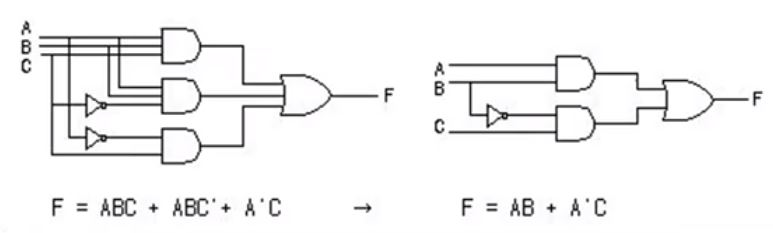
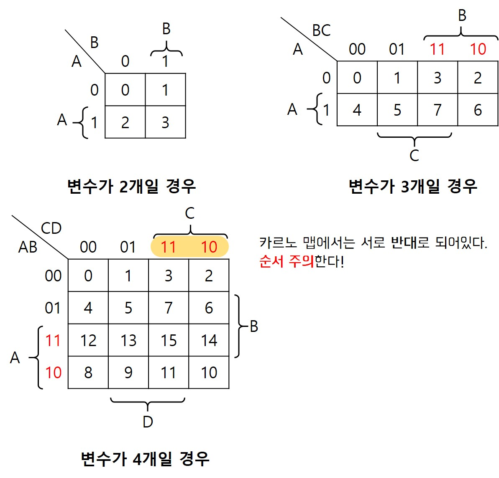
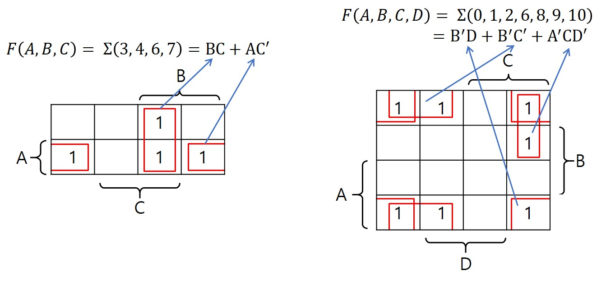
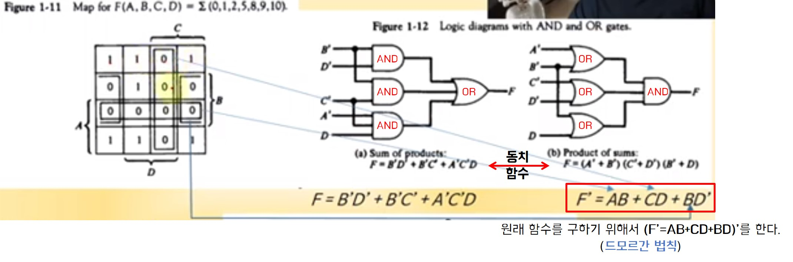
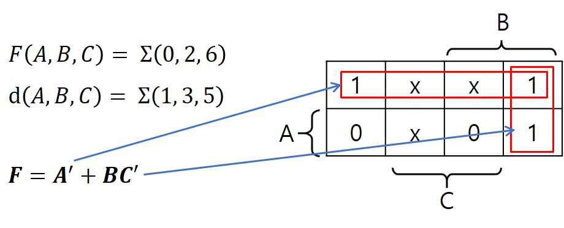

# 1장 디지털 논리 회로

## 목차

- [디지털 컴퓨터(Digitial Computer)](#디지털-컴퓨터digitial-computer)
- [논리 게이트](#논리-게이트)
- [부울 대수](#부울-대수)
- [맵의 간소화](#맵의-간소화)

## 디지털 컴퓨터(Digitial Computer)

### 정의

- 이진 시스템을 사용하여 계산을 수행하는 디지털 시스템
- 비트(1 or 0)의 그룹을 사용하여 숫자, 문자 및 기타 정보를 표시하거나 처리

### 컴퓨터 하드웨어

- CPU
  - 중앙처리장치
  - **컴퓨터 그 자체 (CPU = 컴퓨터)**
  - 산술 논리 처리와 데이터의 저장, 제어 기능 수행
- 주변장치
  - 메모리(RAM/ROM)
  - 저장 장치(Storage)
  - 입출력 장치(IO devices)

```
💡 CPU 자체가 곧 컴퓨터! 컴퓨터 성능에 대해 말하는 것은 CPU 관련 말하는 것이다.
   즉, CPU 제외 나머지 장치는 보조장치
```

### 컴퓨터 소프트웨어

- 운영체제 (OS)
- 시스템 프로그램
  - 유틸리티, 데이터베이스, Editor
  - **OS에 포함**되거나 연결되어 시스템 운영을 보조
  - 시스템 프로그램은 OS가 만들어질 때부터 소비된다. EX) Windows의 노트패드
- 응용 프로그램
  - EX) MSoffice, 웹, 게임 프로그램

🔼[위로](#목차)

## 논리 게이트

### 이진 정보의 표시

- 0과 1의 전압 신호
- (0V - 5V) 시스템
- (0.5V - 3V) 시스템

### 논리 게이트

- 기본 게이트 (AND, OR, NOT, Buffer)
- 진리표로 동작 정의


🔼[위로](#목차)

## 부울 대수

> 🔖 [이산수학 부울 대수 참고](../이산수학/명제,추론,귀납,부울대수,논리회로.md/#부울대수)

### 정의

- **이진 변수와 논리 동작을 취급하는 대수**

- 기본 대수 동작 : AND, OR, NOT

- 부울 대수의 예

  - 논리회로를 **부울식**으로 표현하거나 **진리표**로 표현 가능

  - 부울식 : F = x + y`z

  - 진리표

    

### 부울 대수의 사용 이유

- 변수 사이의 진리표 관계를 대수적으로 표시
- 논리도의 입출력 관계를 대수 형식으로 표시
- 같은 기능을 가진 **더 간단한** 회로 발견 (혹은 동치인 회로 찾기)
  - 경제적으로 더 이득

### 부울 대수의 기본 관계

- 항등원
- 역원
- 교환법칙
- 결합법칙
- 드모르강의 법칙

### 부울 대수의 간략화와 등가 회로



게이트 하나 당 비용이 들기 때문에 왼쪽 보다는 오른쪽의 회로가 더 좋은 회로이다.

### 부울 대수의 보수

- F = AB + C'D' + B'D
- F' = (A' + B')(C + D)(B + D')
  - **드모르간 법칙 사용**

🔼[위로](#목차)

## 맵의 간소화

### 맵 방식의 부울 수식 간소화

- **변수와 항이 많아지는 경우**, 맵 방식이 더 효율적이다.

- 부울 함수를 visual diagram을 통하여 간소화

- Karnaugh(카르노) map, Veitch diagram

- Minterm(민텀), Maxterm(맥스텀)을 이용한 간소화

  > 💡 **민텀**이란 모든 변수가 '한 번'씩 나타나 **곱의 형태를 이루는 항**을 의미한다.

  

  > 💡 **카르노 맵** : 민텀의 값을 모아서 **간략화**시킨 것
  >
  > - 각 변은 떨어져 있는 것이 아닌 **이어져 있는 것**
  > - 한 번 사용한 항을 중복해서 사용할 수 있다

  

### 논리합의 논리곱

- 1항의 간소화
- 0항의 간소화



> 📌 맵을 본 다음 어느 항을 사용하는 것이 더 간단한지 판단한 뒤 묶는다!

### 무정의 조건 (Don't Care Condition)

- 사용하지 않는 항을 활용하여 간소화
- 무정의 조건이 있다면 **최대한 사용할 것!** <br/>👉 사용한 것이 부울식이 더 간단하기 때문에 가능한 한 많이 사용한다.



> 📌 **Point!**
>
> - 무정의 조건은 **1 혹은 0으로 간주**해서 사용한다.
>
> - 카르노 맵에서는 **항을 많이 묶을수록 수식이 간단**해진다.
