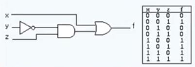

# 1장 디지털 논리 회로

## 목차

- [디지털 컴퓨터(Digitial Computer)](#디지털-컴퓨터digitial-computer)
- [논리 게이트](#논리-게이트)
- [부울 대수](#부울-대수)
- [맵의 간소화](#맵의-간소화)
- [조합회로](#조합회로)
- [플립플롭](#플립플롭)
- [순차회로](#순차회로)

## 디지털 컴퓨터(Digitial Computer)

### 정의

- 이진 시스템을 사용하여 계산을 수행하는 디지털 시스템
- 비트(1 or 0)의 그룹을 사용하여 숫자, 문자 및 기타 정보를 표시하거나 처리

### 컴퓨터 하드웨어

- CPU
  - 중앙처리장치
  - **컴퓨터 그 자체 (CPU = 컴퓨터)**
  - 산술 논리 처리와 데이터의 저장, 제어 기능 수행
- 주변장치
  - 메모리(RAM/ROM)
  - 저장 장치(Storage)
  - 입출력 장치(IO devices)

```
💡 CPU 자체가 곧 컴퓨터! 컴퓨터 성능에 대해 말하는 것은 CPU 관련 말하는 것이다.
   즉, CPU 제외 나머지 장치는 보조장치
```

### 컴퓨터 소프트웨어

- 운영체제 (OS)
- 시스템 프로그램
  - 유틸리티, 데이터베이스, Editor
  - **OS에 포함**되거나 연결되어 시스템 운영을 보조
  - 시스템 프로그램은 OS가 만들어질 때부터 소비된다. EX) Windows의 노트패드
- 응용 프로그램
  - EX) MSoffice, 웹, 게임 프로그램

🔼[위로](#목차)

## 논리 게이트

### 이진 정보의 표시

- 0과 1의 전압 신호
- (0V - 5V) 시스템
- (0.5V - 3V) 시스템

### 논리 게이트

- 기본 게이트 (AND, OR, NOT, Buffer)

- 진리표로 동작 정의

  <details>
      <summary>이미지 보기</summary>
      <div markdown="1">
          
      </div>
  </details>

🔼[위로](#목차)

## 부울 대수

> 🔖 [이산수학 부울 대수 참고](../이산수학/명제,추론,귀납,부울대수,논리회로.md/#부울대수)

### 정의

- **이진 변수와 논리 동작을 취급하는 대수**

- 기본 대수 동작 : AND, OR, NOT

- 부울 대수의 예

  - 논리회로를 **부울식**으로 표현하거나 **진리표**로 표현 가능

  - 부울식 : F = x + y`z

  - 진리표

    

### 부울 대수의 사용 이유

- 변수 사이의 진리표 관계를 대수적으로 표시
- 논리도의 입출력 관계를 대수 형식으로 표시
- 같은 기능을 가진 **더 간단한** 회로 발견 (혹은 동치인 회로 찾기)
  - 경제적으로 더 이득

### 부울 대수의 기본 관계

- 항등원
- 역원
- 교환법칙
- 결합법칙
- 드모르강의 법칙

### 부울 대수의 간략화와 등가 회로


게이트 하나 당 비용이 들기 때문에 왼쪽 보다는 오른쪽의 회로가 더 좋은 회로이다.

### 부울 대수의 보수

- F = AB + C'D' + B'D
- F' = (A' + B')(C + D)(B + D')
  - **드모르간 법칙 사용**

🔼[위로](#목차)

## 맵의 간소화

### 맵 방식의 부울 수식 간소화

- **변수와 항이 많아지는 경우**, 맵 방식이 더 효율적이다.

- 부울 함수를 visual diagram을 통하여 간소화

- Karnaugh(카르노) map, Veitch diagram

- Minterm(민텀), Maxterm(맥스텀)을 이용한 간소화

  > 💡 **민텀**이란 모든 변수가 '한 번'씩 나타나 **곱의 형태를 이루는 항**을 의미한다.

  <details>
      <summary>이미지 보기</summary>
      <div markdown="1">
          
      </div>
  </details>

  > 💡 **카르노 맵** : 민텀의 값을 모아서 **간략화**시킨 것
  >
  > - 각 변은 떨어져 있는 것이 아닌 **이어져 있는 것**
  > - 한 번 사용한 항을 중복해서 사용할 수 있다
  
  <details>
      <summary>이미지 보기</summary>
      <div markdown="1">
          
      </div>
  </details>

### 논리합의 논리곱

- 1항의 간소화
- 0항의 간소화

<details>
    <summary>이미지 보기</summary>
    <div markdown="1">
        
    </div>
</details>

> 📌 맵을 본 다음 어느 항을 사용하는 것이 더 간단한지 판단한 뒤 묶는다!

### 무정의 조건 (Don't Care Condition)

- 사용하지 않는 항을 활용하여 간소화

- 무정의 조건이 있다면 **최대한 사용할 것!** <br/>👉 사용한 것이 부울식이 더 간단하기 때문에 가능한 한 많이 사용한다.

  <details>
      <summary>이미지 보기</summary>
      <div markdown="1">
          
      </div>
  </details>

> 📌 **Point!**
>
> - 무정의 조건은 **1 혹은 0으로 간주**해서 사용한다.
>
> - 카르노 맵에서는 **항을 많이 묶을수록 수식이 간단**해진다.

🔼[위로](#목차)

## 조합회로

## 정의

- **입력과 출력을 가진 논리 게이트의 집합**
- 출력의 값은 입력의 0, 1의 조합에 의하여 결졍되는 함수의 결과로 표시
- **n개의 입력** 조합이 있을 경우 가능한 입력 조합 : **2ⁿ** 가지
  - 그만큼 출력 조합도 다양해진다.

## 조합 회로의 설계 절차

1. 해결할 문제의 제시

   > EX. 4개의 버튼 중 중 하나의 버튼을 눌렀을 때, 4가지 중 한 가지의 결과가 나온다.

2. 입력과 출력의 변수에 **문자 기호 부여**

3. 입력-출력 관계를 정의하는 **진리표 도출**

   - 어떤 입력이 들어왔을 때 어떠한 출력이 나오는지 정의

4. 각 출력에 대한 **간소화**된 **부울 함수** 도출

5. 부울 함수에 대한 **논리도 작성**

6. 논리도를 바탕으로 **회로 구현**

### 반가산기(Half adder)

- **2개의 비트값**을 산술적으로 가산

  - **2진수**로 표현한다! (1 or 0)

  ```
  S = x'y + xy' = x ⊕ y 👉 sum
  C = xy 👉 carry
  ```

  <details>
      <summary>이미지 보기</summary>
      <div markdown="1">
          
      </div>
  </details>

> 💡 **여러개의 자릿수**를 가지고 있는 **2진수를 덧셈**할 경우, 이전 자릿수에서 올라온 **캐리값을 포함하여 계산**한다.<br/>왜냐하면 오로지 2개의 비트값을 이용해서 계산하기 때문이다. 그리고 이것을 **전가산기**라고 부른다.

### 전가산기(Full adder)

- **캐리값을 포함**하여 **3비트** 가산

  - **반가산기 2개를 합쳐서** 3비트를 표현할 수 있다. 

  ```
  S = x ⊕ y ⊕ z
  C = xy + (x ⊕ y)z
  ```

  <details>
      <summary>이미지 보기</summary>
      <div markdown="1">
          
      </div>
  </details>

  > 📌 일일이 그리기 힘들어서 **Block diagram으로 표시**한다.

🔼[위로](#목차)

## 플립플롭

### 정의

- 1 비트의 디지털 정보를 저장하는 이진 셀(디지털 메모리)
- **동기식 순차회로의 기본적인 요소**로 사용, 조합회로와 함께 **순차회로를 구성**
- 입력의 상태가 변화를 일으키기 전까지는 **이전의 출력 상태를 그대로 유지**
  - 마치 상태를 기억하는 것과 같아서 메모리 소자로 많이 사용한다.

> 💡 플립플롭은 **Clock과 동기화**되어 있기 때문에 **입력이 바뀐다고 바로 출력이 바뀌지 않는다.**

### 종류

- SR-플립플롭

  - S와 R값이 들어왔더라도 **C값이 들어오지 않으면** Q값은 변하지 않는다.

  - 그러나 S와 R값이 **동시에 1**이라면 **Indeterminate**를 나타낸다. (출력값이 정해지지 않음)

    > 📌 그러므로 SR 플립플롭 사용 시 **S와 R값이 동시에 1이 되지 않도록 주의**한다.

- D-플립플롭

  - D값과 C값이 들어오면 **Q값은 D값과 동일**하다.

- JK-플립플롭

  - S와 R값이 모두 **동시에 1**이라면 **현재 Q출력의 반대값(Not Q)가 출력**된다.

- T-플립플롭

  - 어찌보면 JK 플립플롭의 단순화
  - T가 0이면 Q값 그대로, 1이면 Not Q가 출력된다. (**토글 동작**)

<details>
    <summary>이미지 보기</summary>
    <div markdown="1">
        
    </div>
</details>

### 모서리-변이형 플립플롭(Edge-triggered FF)

> 💡 여기서 말하는 **입력값이란 Clock 값**을 의미한다.

- 📌 입력값의 변화 **모서리에서만** 동작

  - Upward triggered FF : **입력값이 상향**일 경우에만 동작 (0 → 1)
  - Downward triggered FF : **입력값이 하향**일 경우에만 동작 (0 → 1)

  <details>
      <summary>이미지 보기</summary>
      <div markdown="1">
          
      </div>
  </details>

- **올바른 동작**을 위해서는 최소의 **신호 유지 시간 필요**

  - **Setup time** : 출력 **변화**를 위하여 **D 입력이 유지되어야** 하는 최소 시간
  - **Hold time** : 출력 **유지**를 위하여 **D 입력이 바뀌지 않아야** 하는 최소 시간
    - 만약 D 입력이 충분한 시간동안 유지되지 못한다면, Q 출력값은 직전 값의 형태로 바뀌게 된다.

  > 그러나 이 부분은 전자공학에서 신경을 써야하는 부분이다. 동작의 원리 정도만 이해하자.

🔼[위로](#목차)

## 순차회로

### 정의

- 플립플롭과 게이트 (또는 조합회로)를 **서로 연결**한 회로

- 클럭펄스에 의하여 동기화된 입력 순차에 의하여 제어

- **출력은 외부 입력과 플립플롭의 현 상태의 함수로 표기**

  - 즉,  Input에 대한 정해진 output이 나온다는 보장이 없다. 왜냐하면 다시 input으로 되는 output의 값에 따라 값이 바뀌기 때문이다.

  > 📌 그러므로 **입력이 어떤 순서로 들어갔는지가 중요**하다. (**순서에 따라 출력값이 달라진다.**)

  <details>
      <summary>이미지 보기</summary>
      <div markdown="1">
          
      </div>
  </details>

### 플립플롭의 입력식

- FF의 입력을 만들어내는 **조합 회로 부분**

- **부울 수식**에 의하여 표현

  <details>
      <summary>이미지 보기</summary>
      <div markdown="1">
          
      </div>
  </details>

- 상태표 (State Table), 상태도 (State Diagram)

  <details>
      <summary>이미지 보기</summary>
      <div markdown="1">
          
      </div>
  </details>

### 순차회로의 설계 예

- **2비트 2진카운터의 설계를 한다** 가정한다.

  > 📢 **JK 플립플롭**을 사용

  1. 상태도 or 상태표 작성

     - 매번 입력이 1이 들어가면 그때마다 한단계 넘어간다.

     > 👉 하나만 만들어도 되지만 가급적이면 **둘 다 만드는 것이 좋다.**

     <details>
         <summary>이미지 보기</summary>
         <div markdown="1">
             
         </div>
     </details>

  2. 순차회로 여기표(excitation table) 작성

  3. 플립플롭의 선택과 입력식 도출

  4. 회로도 구현

     <details>
         <summary>이미지 보기</summary>
         <div markdown="1">
             
         </div>
     </details>

> 설계를 하는 것은 책을 보면서 많이 연습해보는 것이 좋다!

🔼[위로](#목차)
