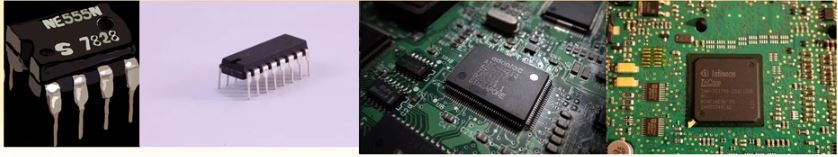

# 2장 디지털 부품

## 목차
- [집적회로(Integrated Circuits)](#집적회로integrated-circuits)
- [디코더(Decoders)](#디코더decoders)
- 멀티플렉서(Multiplexers)
- 레지스터(Registers)
- 시프트 레지스터(Shift Registers)
- 이진 카운터(Binary Counters)
- 메모리 장치(Memory Unit)`

## 집적회로(Integrated Circuits)

### 정의
- 집적 회로(IC)는 디지털 게이트(AND, OR 등)를 구성하는 전자 부품들을 포함하는 실리콘 **반도체 칩** (chip) 
- 칩 안의 많은 게이트들은 회로의 요구에 따라 서로 연결되어 있고, 외부 핀으로의 연결도 갖고 있다.
- 핀의 갯수는 칩의 크기에 따라 14개에서 100개 이상까지 다양하며, **칩 위의 번호**로 각 IC의 종류를 구별한다.
- 특정한 ic칩이 어떤 기능을 가지고 있는가를 알고싶다면 databook(pdf 파일)을 통하여 정보 확인이 가능하다.

```
💡 datasheet는 해당 ic칩의 크기, 동작원리, 등 모든 것을 가지고 있다. 
   그렇기 때문에 datasheet를 보면서 몇번 핀이 무슨 기능을 하는가를 알 수 있는 것!
```

### 직접 규모에 따른 분류
집적회로의 **집적도**가 얼마인가에 따라 구분한다.

- **소규모 집적 장치(SSI)** : 10개 이하의 독립적인 게이트가 하나의 칩에 들어 있고, 게이트의 입출력이 곧바로 외부 핀으로 연결 된다.

- **중규모 집적 장치(MSI)** : 10에서 200개 까지 게이트를 집적하고 있으며, 이것들은 디코더나 멀티플랙서, 가산기, 플립플롭 그리고 레지스터같은 기본적인 디지털 장치를 구현하고 있다.

- **대규모 집적 장치(LSI)** : 200에서 1000개까지의 게이트를 집적하고서 프로세서나 메모리 칩 같은 디지털 시스템을 형성한다. (램 뒤에 붙혀 있는 조그만한 회로)

- **초대규모 집적 장치(VLSI)** : 수천 개의 게이트를 하나의 칩에 집적하여 대형 메모리나 복잡한 마이크로 컴퓨터 칩을 형성한다. (cpu같은 것)



### 디지털 논리군에 따른 분류
디지털 집적 회로는 기능에 따라서 구분되기도 하지만, 그것을 <u>구현하는 데 적용된 기술</u>에 따라 **디지털 논리군**으로 분류된다. 대표적으로 **TTL(트랜지스터- 트랜지스터 논리)**가 가장 많이 사용되고 있는 논리군이다.

- **TTL(Transister-Transistor Login)**<br/>
: 일반 로직 회로부품<br/>
: AND, NOT 게이트가 일반적으로 트랜지스터로 만들어져 있다.

- **ECL(Emitter-Coupled Login)**<br/>
: 고속 논리 시스템용 부품(1~2ns 이하), 슈퍼컴퓨터용<br/>
: 즉, 굉장히 빠르다. (단, 그만큼 비쌈)

- **MOS(Motel Oxide Semiconductor)**<br/>
: 고밀도 집적회로용 부품<br/>
: 전력소모가 많음

- **CMOS(Complement Metal Oxide Semiconductor)**<br/>
: 고밀도 회로, 단순한 제조공정, **저전력 특성** (MOS보다 전력이 굉장히 적게 들어감)<br/>
: 이 기술 덕분에 적은 전력으로도 충분히 움직일 수 있게 만들 수 있다.<br/>
 ex) 핸드폰 배터리

🔼[위로](#목차)
