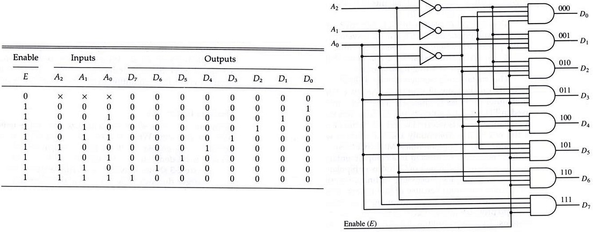
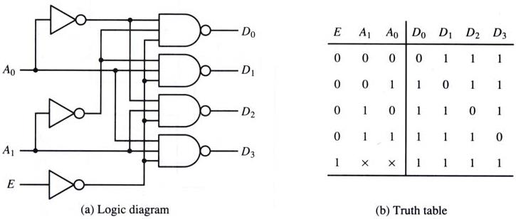
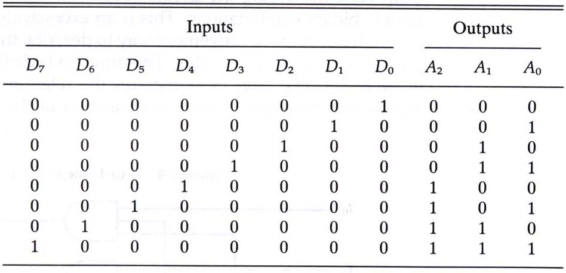
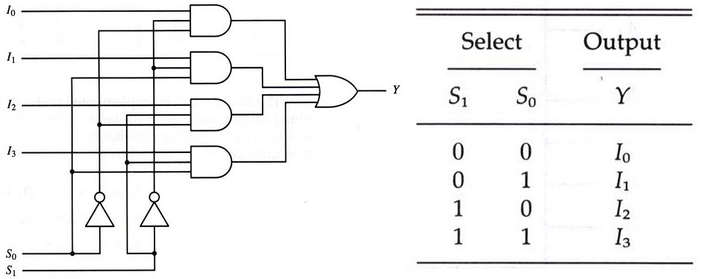
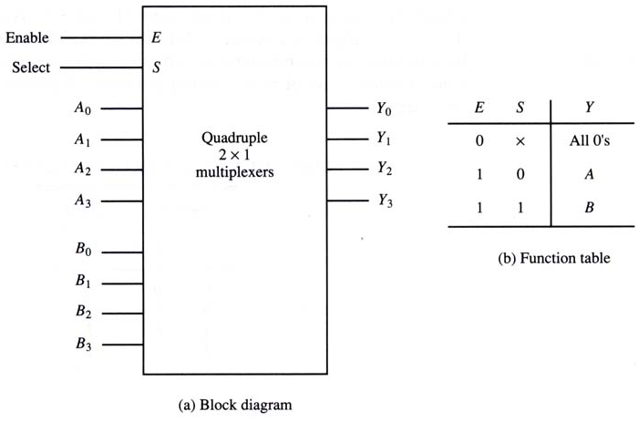
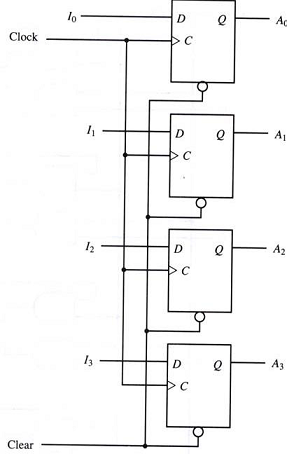
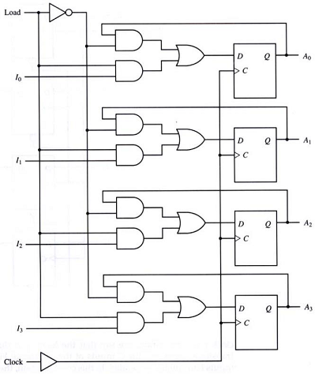

# 2장 디지털 부품

## 목차
- [집적회로(Integrated Circuits)](#집적회로integrated-circuits)
- [디코더(Decoders)](#디코더decoders)
- [멀티플렉서(Multiplexers)](#멀티플렉서multiplexers)
- [레지스터(Registers)](#레지스터registers)
- 시프트 레지스터(Shift Registers)
- 이진 카운터(Binary Counters)
- 메모리 장치(Memory Unit)`

## 집적회로(Integrated Circuits)

### 정의
- 집적 회로(IC)는 디지털 게이트(AND, OR 등)를 구성하는 전자 부품들을 포함하는 실리콘 **반도체 칩** (chip) 
- 칩 안의 많은 게이트들은 회로의 요구에 따라 서로 연결되어 있고, 외부 핀으로의 연결도 갖고 있다.
- 핀의 갯수는 칩의 크기에 따라 14개에서 100개 이상까지 다양하며, **칩 위의 번호**로 각 IC의 종류를 구별한다.
- 특정한 ic칩이 어떤 기능을 가지고 있는가를 알고싶다면 databook(pdf 파일)을 통하여 정보 확인이 가능하다.

```
💡 datasheet는 해당 ic칩의 크기, 동작원리, 등 모든 것을 가지고 있다. 
   그렇기 때문에 datasheet를 보면서 몇번 핀이 무슨 기능을 하는가를 알 수 있는 것!
```

### 직접 규모에 따른 분류
집적회로의 **집적도**가 얼마인가에 따라 구분한다.

- **소규모 집적 장치(SSI)** : 10개 이하의 독립적인 게이트가 하나의 칩에 들어 있고, 게이트의 입출력이 곧바로 외부 핀으로 연결 된다.

- **중규모 집적 장치(MSI)** : 10에서 200개 까지 게이트를 집적하고 있으며, 이것들은 디코더나 멀티플랙서, 가산기, 플립플롭 그리고 레지스터같은 기본적인 디지털 장치를 구현하고 있다.

- **대규모 집적 장치(LSI)** : 200에서 1000개까지의 게이트를 집적하고서 프로세서나 메모리 칩 같은 디지털 시스템을 형성한다. (램 뒤에 붙혀 있는 조그만한 회로)

- **초대규모 집적 장치(VLSI)** : 수천 개의 게이트를 하나의 칩에 집적하여 대형 메모리나 복잡한 마이크로 컴퓨터 칩을 형성한다. (cpu같은 것)


### 디지털 논리군에 따른 분류
디지털 집적 회로는 기능에 따라서 구분되기도 하지만, 그것을 <u>구현하는 데 적용된 기술</u>에 따라 **디지털 논리군**으로 분류된다. 대표적으로 **TTL(트랜지스터- 트랜지스터 논리)**가 가장 많이 사용되고 있는 논리군이다.

- **TTL(Transister-Transistor Login)**<br/>
: 일반 로직 회로부품<br/>
: AND, NOT 게이트가 일반적으로 트랜지스터로 만들어져 있다.

- **ECL(Emitter-Coupled Login)**<br/>
: 고속 논리 시스템용 부품(1~2ns 이하), 슈퍼컴퓨터용<br/>
: 즉, 굉장히 빠르다. (단, 그만큼 비쌈)

- **MOS(Motel Oxide Semiconductor)**<br/>
: 고밀도 집적회로용 부품<br/>
: 전력소모가 많음

- **CMOS(Complement Metal Oxide Semiconductor)**<br/>
: 고밀도 회로, 단순한 제조공정, **저전력 특성** (MOS보다 전력이 굉장히 적게 들어감)<br/>
: 이 기술 덕분에 적은 전력으로도 충분히 움직일 수 있게 만들 수 있다.<br/>
 ex) 핸드폰 배터리

🔼[위로](#목차)

## 디코더(Decoders)

### 정의
- N 비트의 이진 코드는 서로 다른 2ⁿ개의 원소 정보를 나타낼 수 있다.
- 디코더는 N 비트로 코팅된 이진 정보를 최대 2ⁿ개의 서로 다른 출력으로 바꾸어 주는 조합 회로이다.<br/> (ic칩에서 가장 많이 쓰인 조합회로)
  - 2개의 입력 ⇨ 4가지(2²) 출력 : 2x4 decoder
  - 3개의 입력 ⇨ 8가지(2³) 출력 : 3x8 decoder

> N개의 입력과 M(M ≤ 2ⁿ)개의 출력을 가지는 디코더를 N대M 라인 디코더 or NxM 디코더 라고 한다.


- 다음 사진은 3x8 디코더의 논리도에서 세 개의 입력 `A2, A1, A0`와 8개의 디코드된 출력을 보여준다. 보수화된 입력을 취하기 위해 3개의 인버터가 사용되며, 각 이진 조합에 해당하는 8개의 AND 게이트가 있다.
- 입력(`A2,A1,A0`)에 들어오는 값에 따라 결과가 1이되는 값이 **1개만** 존재하며 그 상태로 출력한다. (8개의 출력 중 1개의 출력만 사용)
- EX) 컴퓨터에서 여러 부품 중 하나를 골라야 하는 경우 Decoder 사용

### 👍 NAND 게이트로 이루어진 디코더가 더 효율적!
> 전부 0에서 1로 전환하는 것은 비효율적이다. 모든 것이 1이고 입력이 1이 되면 0이 출력되는 것이 훨씬 경제적이다.

- 보수화된 출력이 더 경제적임
- **대부분의 출력신호가 1로 유지**
- **CMOS 회로**의 영향으로 저전력 회로에 유리



```
💡 대부분의 대코더는 NAND 게이트로 이루어져 있다.
   그러므로 모든 디코더의 출력은 1이며, 본인이 선택한 것만 0이라는 것을 기억하자.
```

### 인코더
- 디코더와 반대 동작 수행
- 2ⁿ의 입력에 대하여 N 이진 코드 출력
- 한번에 하나의 입력만이 1의 값을 가질 수 있음
- EX)6을 넣으면 -> 110을 출력하는 것


- A0 = D1 + D3 + D5 + D7
- A1 = D2 + D3 + D6 + D7
- A2 = D4 + D5 + D6 + D7

### 📌 2진수 다룰 시 주의할 점
2진수 표현 시 비트가 낮은 순서가 아닌 **A2, A1, A0** 순으로 값을 작성해야 한다!!

즉, 입력순서와 출력순서는 **높은 비트**의 값이 먼저 나와야 한다.

**이것은 규칙이다.**


🔼[위로](#목차)

## 멀티플렉서(Multiplexers)

### 정의
> 기능적으로 디코더의 정반대

- N개의 선택 입력에 따라서 2ⁿ개의 출력을 **하나의 출력에 선택적으로 연결**
- 다중 입력 중 하나를 선택하여 출력으로 연결
- **네트워크 스위치(전화, LAN, WAN)의 기본 구조 요소**
- 멀티플렉서는 흔히 데이터 선택기라고도 하며 MUX 라고 쓴다.


- 위 그림은 `4 to 1 Line Multiplexers`로 `4x1 MUX`라고도 표현할 수 있다.
- 00이 입력되면 출력으로 I₀가 나온다는 의미


- 위 그림은 4비트를 가진 A그룹과 B그룹 중 하나를 선택하는, 즉 **4개의 2 x 1 멀티플렉서가 들어 있는 것을 보여준다.**
- 출력 Y는 A 혹은 B 중 하나에 의해 선택적으로 데이터가 출력된다.
  - Y0 = A0 or B0
  - 나머지도 마찬가지


🔼[위로](#목차)

## 레지스터(Registers)

### 정의
- N비트 데이터를 저장하는 반도체 소자로 구성된 단위 논리 집단
- 특정한 목적에 사용되는 일시적인 기억 장치
- 데이터를 읽고 쓰는 기능이 매우 빠르며, 중앙 처리 장치(CPU) 내부에 사용된다.

### 구성
- N비트 레지스터 : N비트의 **이진 정보(0 or 1)** 저장
- N개의 **플립플롭**과 **조합 회로**로 구성

### 기본 레지스터
- 클럭펄스 타이밍이 **상승 or 하강 곡선인 경우**에 입력값이 레지스터에 저장
- 레지스터에 값이 저장되어 있으면 **항상 출력에서 참조가 가능**
- Clear, Clock 입력 제공



- 위 그림은 입력과 출력이 4개인 레지스터이다. (당연히 플립플롭도 4개)
- Clock 펄스가 활성화 될 때마다 D플립플롭에 의해 입력 변수 I값들이 출력값으로 나오게 된다. 
- Clear 입력이 0이 될 경우, Clock 동작에 관계없이 레지스터의 모든 플립플롭 출력은 0이 된다.
- 새로운 이진 정보를 공통 Clock 신호에 의해 레지스터의 모든 비트가 동시에 로드되며, 레지스터의 내용이 변경되지 않아야 하는 경우에는 Clock 신호가 차단되어야 한다.

> 💡 레지스터 이름 = 플립플롭 출력

### 병렬로드 가능한 4비트 레지스터
- 4비트의 데이터를 동시에 입력 가능
- Load, Clock 입력 제공


- 클럭펄스가 들어와도 Load의 값이1이 되지 않으면 저장이 되지 않는다. and에 걸려 0으로 되기 때문이다.
- **오로지 Load 입력이 1일 때만 저장된다.**

🔼[위로](#목차)
